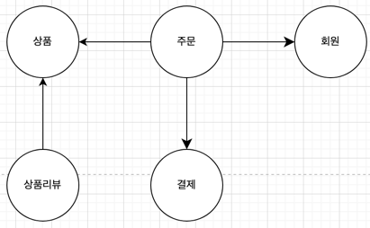
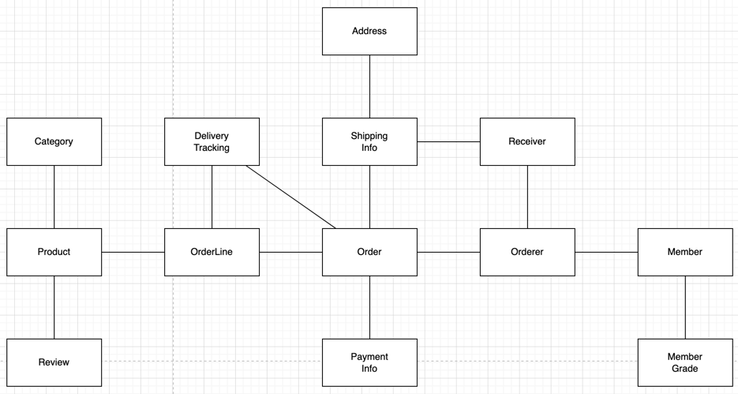
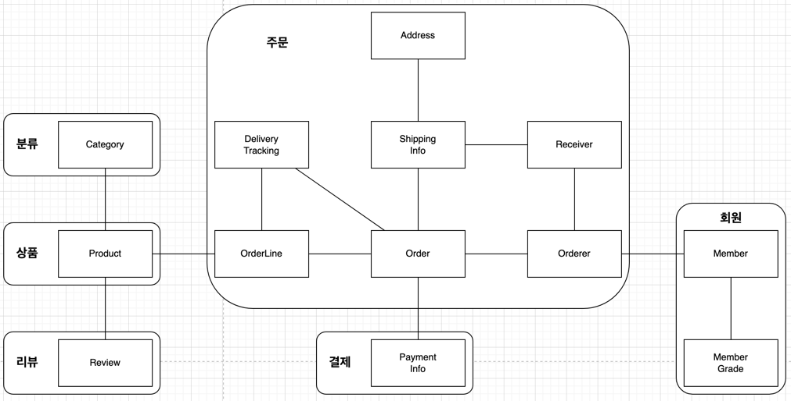
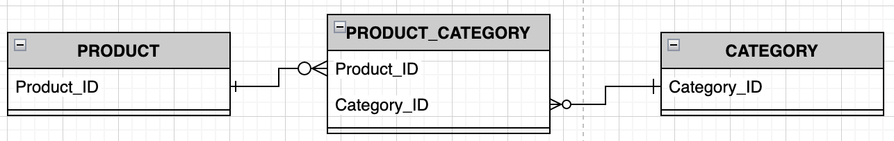

## 애그리거트

* 상위 수준 개념을 이용해서 전체 모델을 정리하면 전바적인 관계를 이해하는데 도움이 된다



* '쇼핑몰' 이라는 시스템을 개발할 때 위와 같은 전체 도메인 모델의 관계를 나타낼 수 있다



* 상위 수준의 모델을 개별 객체 단위로 표현
* 수많은 테이블이 하나의 ERD 에 표시되면 테이블간의 관계를 파악하고 데이터 구조를 이해하는데 어려움이 발생되는 것 처럼, 도메인 객체 모델이 복잡해지면 개별 구성요소 위주로 모델을 이해하게 되고 전반적인 구조나 큰 수준에서 도메인 간의 관계를 파악하기 어려워진다
    * 주요 도메인간의 관계 파악이 어렵다라는 의미는 코드를 변경하고 확장하는 것이 어려워 진다는 것을 의미한다
* 복잡한 도메인을 이해하고 관리하기 쉬운 단위로 만들때 상위 수준에서 모델을 애그리거트를 활용하여 관리하면 모델간의 관계를 파악하기 수월해진다
    * 애그리거트는 관련된 객체를 하나의 군으로 묶어준다.



* 애그리거트로 묶으면 모델간의 관계를 개별 모델 수준으로 표현하면서, 상위 수준에서의 이해도 가능하다
* 애그리거트는 모델을 이해하는데 도움을 주면서 일관성을 관리하는 기준이 된다
    * 일관성을 관리하기 때문에 복잡한 도메인을 단순한 구조로 만들어준다
    * 복잡도가 낮아지기 때문에 도메인 기능을 확장하고 변경하는 데 필요한 노력도 줄어든다
* 애그리거트는 관련된 모델을 하나로 모은것이기 때문에 하나의 애그리거트에 속한 객체는 유사하거나 동일한 라이프사이클을 가진다
    * 도메인 규칙에 따라 최초 객체 생성시점에 일부 객체를 만들 필요가 없을 경우가 있을 수 있지만, 애그리거트에 속한 구성요소는 대부분 함께 생성하고 함께 제거된다
* 애그리거트는 경계를 가지며, 한 애그리거트에 속한 객체는 다른 애그리거트에 속하지 않는다
    * 애그리거트는 독립된 객체 군이며, 각 애그리거트는 자기 자신을 관리할 뿐 다른 애그리거트를 관리하지 않는다
    * 이러한 경계를 설정할 때 기본이 되는 것은 도메인 규치고가 요구사항이다
        * 도메인 규칙에 따라 함께 생성되는 구성요소는 한 애그리거트에 속할 가능성이 높다
        * 함께 변경되ㅗ는 빈도가 높은 객체는 한 애그리거트에 속할 가능성이 높다
* '**A 가 B 를 가진다**' 고 해서 무조건 A와 B 가 하나의 애그리거트에 속하는 것을 의미하는 것은 아니다
    * 예를들어 위 이미지에서 상품과 리뷰에 해당된다
    * 상품 상세 페이지에는 상세 정보와 함께 리뷰 내용을 보여준다
    * 하지만 상품 또는 리뷰가 수정된다고 다른 도메인이 같이 변경되지는 않는다
    * 상품을 변경하는 주체가 상품 담당자라면 리뷰는 고객이다
    * 그렇다고 완전 영향이 없는건 아닌점이, 상품이 삭제되면 해당 상품에 속한 리뷰들도 다 삭제된다 (반대는 이뤄지지 않는다)
    
### 애그리거트 루트

* 주문 애그리거트는 다음을 포함한다
    * 총 금액이 totalAmounts 를 가지는 Order 엔티티
    * 개별 구매 상품의 개수인 quantity 와 금액인 price 를 가지고 잇는 OrderLine 벨류
* 구매할 상품의 개수 변경시 OrderLine 의 quantity 를 변경 및 totalAmounts 를 변경해야 한다
    * 예제에서는 setter 의 후처리로 totalAmounts 계산 로직을 돌리는데, kotlin 에서는 getter 를 사용하면 충분할듯 (java 에서도 메서드를 사용하거나)
* 애그리거트는 여러 객체로 구성되기 때문에 한 객체만 상태가 정상이어서는 안되며, 관련된 모든 객체가 정상이어야 한다
    * 즉, 관련된 어떠한 객체 하나가 변하면 다른 연관된 객체가 그에 따라 맞게 변경되어야 한다
* 애그리거트에 속한 모든 객체가 일관된 상태를 유지하려면 애그리거트 전체를 관리할 주체가 필요한데, 이 책임을 지는 객체가 애그리거트의 루트 엔티티이다
    * 루트 엔티티는 애그리거트의 대표 엔티티로 애그리거트에 속한 객체는 애그리거트 루트 엔티티에 직접 또는 간접적으로 속한다

### 도메인 규칙과 일관성

* 애그리거트 루트는 애그리거트에 속한 객체를 포함하는 것이 전부가 아닌, 애그리거트의 일관성이 깨지지 않도록 하는 것이 핵심이다
    * 이를 위해 애그리거트 루트는 애그리거트가 제공해야 할 도메인 기능을 구현한다
* 애그리거트 루트가 제공하는 메서드는 도메인 규칙에 따라 애그리거트에 속한 객체의 일관성이 깨지지 않도록 구현해야 한다
* 애그리거트 루트가 아닌 다른 객체가 애그리거트에 속한 객체를 직접 변경하면 안된다
    * 애그리거트 루트가 강제하는 규칙을 적용할 수 없게되며, 모델의 일관성을 깨뜨리는 원인이 된다

```java
public class Order {
    // 에그리거트 루트
    
    public void changeShippingInfo(ShippingInfo newShippingInfo) {
        verifyNotYetShipped();
        // 애그리거트의 일관성이 깨지지 않도록 도메인에 정해진 규칙을 체크하고 상태를 변경해야 한다
        setShippingInfo(newShippingInfo);
    }
    
    public void verifyNotYetShipped() {
        if (state != (PAYMENT_WAITING && WAITING)) throw new IllegalStateException("already shipped");
    }
}

...

ShippingInfo = si = order.getShippingInfo();
si.setAddress(newAddress);
// 애그리거트 루트인 order 에서 ShippingInfo 를 가져오고, 해당 객체의 정보를 직접 변경하는데
// 이러면 Order 내부에 있는 규칙을 무시하고 변경이 가능하게 되므로 직접 변경하면 안된다

...
        
ShippingInfo = si = order.getShippingInfo();

if (state != (PAYMENT_WAITING && WAITING)) throw new IllegalStateException("already shipped");
si.setAddress(newAddress);
// 응용 서비스에서 위와 같이 상태 변경에 대한 체크를 한 후 직접 변경을 할 수 있지만,
// 중복되는 코드가 늘어나고, 관리해야 할 코드가 늘어나고, 변경시 모두 다 변경해야 정상 동작하는 코드가 된다
```

* 불필요한 중복을 피하고 애그리거트 루트를 통해서만 도메인 로직을 구현하게 만들려면 도메인 모델에 대해 다음 두가지를 습관적으로 적용해야 한다
    1. 단순히 필드를 변경하는 set 메서드를 public 범위로 만들지 않는다
        * 습관적으로 작성하는 public set 메서드를 피해야 한다.
        * public set 을 이용할 때 해당 필드에 값을 할당하고 끝나는 경우가 많다
        * public set 은 중요 도메인의 의미나 의도를 표현하지 못하고 도메인 로직이 도메인 객체가 아닌 응용 영역이나 표현 영역으로 분산되게 만드는 원인이 된다
    1. 벨류 타입은 불변으로 구현한다
        * 벨류 타입을 불변 타입으로 구현하면, 객체의 값을 변경할 수 없으므로 애그리거트 루트에서 벨류 객체를 구해도 값을 변경할 수 없기 때문에 애그리거트 외부에서 벨류 객체를 변경할 수 없게 된다
        * 애그리거트 외부에서 내부 상태를 함부로 바꾸지 못하게 함으로써 애그리거트의 일관성이 깨질 가능성이 줄어든다
        * 애그리거트의 불변 객체를 변경하기 위해서는 애그리거트 루트가 제공하는 메서드에 새로운 벨류 객체를 전달하여 변경하는 방법밖에 없다
    
### 애그리거트 루트의 기능 구현

* 애그리거트 루트는 애그리거트 내부의 다른 객체를 조합해서 기능을 완성한다
  
```java
public class Member {
    private Password password;
    
    public void changePassword(String currentPassword, String newPassword) {
        if (!password.match(currentPassword)) throw new PasswordNotMatchException();
        this.password = new Password(newPassword);
    }
}
```

* 애그리거트 루트가 구성요소의 상태만 참조하는 것이 아닌, 기능 실행을 위임하기도 한다

```java
public class OrderLines {
    private List<OrderLine> lines;
    
    public int getTotalAmounts() {...}
    public void changeOrderLines(List<OrderLine> newLines) {
        this.lines = newLines;
    }
}

public class Order {
    private OrderLines orderLines;
    
    public void changeOrderLines(List<OrderLines> newLines) {
        orderLines.changeOrderLines(newLines);
        this.totalAmounts = orderLines.getTotalAmounts();
        // 애그리거트 루트가 아닌, 기능 실행을 위임하여 (구현 기술의 제약/내부 모델링 등의 이슈로 인해)
        // 별도의 클래스에 기능 실행을 위임할 수 있다
    }
}

...

OrderLines lines = order.getOrderLines();
lines.changeOrderLines(newOrderLines);
// 외부에서 애그리거트 내부 상태 변경이 가능하며, 이렇게 변경만 하면 order 의 totalAmounts 의 변경이 이뤄지지 않게되므로
// 상태 불일치가 발생할 수 있음
// 애초에 OrderLines 를 불변 객체로 구현하여 애그리거트 외부에서 OrderLine 목록을 변경할 수 없도록 하면 위와 같은 이슈가 발생하지 않음

// 또는 팀 표준/구현 기술의 제약 등으로 OrderLine 을 불변으로 구현할 수 없다면 changeOrderLines 메소드를 protected 로 구현함으로써
// 도메인간에는 같은 패키지이므로 변경이 가능하고, 외부에서는 변경이 불가능하게 할 수 있다
```

### 트랜잭션 범위

* 트랜잭션 범위는 작을수록 좋다
* DB 테이블 기준으로 1 개의 테이블에 트랜잭션이 걸린것과 3 개의 테이블에 트랜잭션이 걸린것의 차이는 크다
    * 3 개가 락이 걸려서 다른 수행에 대한 락이 걸려서 처리량이 떨어질 경우가 많기 때문에
* 한 트랜잭션에서는 한 개의 애그리거트만 수정해야 한다
    * 한 트랜잭션에 두 개 이상의 트랜잭션이 생기면 충돌이 발생할 가능성이 더 높아지기 때문에 전체 처리량이 떨어진다
    * 즉, 한 트랜잭션에서 한 애그리거트만 수정되어야 한다
        * 한 트랜잭션에 두 개의 애그리거트가 수정되면, 해당 애그리거트는 자신의 책임 범위를 벗어난 다른 애그리거트의 상태까지 관리해야 하는 상황이 된다
        * 이렇게 한 애그리거트가 다른 애그리거트의 기능에 의존하기 시작하면 애그리거트 간 결합도가 높아지게 되므로, 애그리거트는 서로 최대한 독립적이어야 한다
        * 결합도가 높아지면 향후 수정 비용이 증가하게 된다
    * 한 애그리거트에서 다른 애그리거트를 수정해야만 한다면, 다른 애그리거트를 직접 수정하지 않고 응용 서비스에서 두 애그리거트를 수정하도록 구현 해야 한다
    
```java
public class Order {
    private Orderer orderer;
    
    public void shipTo(ShippingInfo newShippingInfo) {
        ...
        setShippingInfo(newShippingInfo);
        orderer.getCustomer().changeAddress(newShippingInfo.getAddress);
        // customer 는 다른 order 와 다른 애그리거트이다
    }
}
// 위와 같이 Order 라는 애그리거트에서 customer(user) 애그리거트의 값을 수정하면 결합도가 높아지게 된다

public class ChangeOrderService {
    // 두 개 이상의 애그리거트를 변경해야 한다면, 응용 서비스에서 각 애그리거트의 상태를 변경한다
    @Transactional
    public void changeShippingInfo(OrderId id, ShiipingInfo newShippingInfo) {
        Order oder = orderRepository.findById(orderId);
        order.shipTo(newShippingInfo);
        order.getOrderer().getCustomer().changeAddress(newShippingInfo.getAddress());
    }
}
```

* 한 트랜잭션에서 한 개의 애그리거트를 변경하는 것을 권장하지만, 다음과 같은 상황에서는 두 개 이상의 애그리거트 변경을 구려할 수 있다
    1. 팀 표준
        * 팀이나 조직의 표준에 따라 사용자 useCase 와 관련된 응용 서비스의 기능을 한 트랜잭션으로 실행해야 하는 경우
        * DB 가 다른 경우 글로벌 트랜잭션을 반드시 사용하도록 규칙을 정한 경우
    1. 기술 제약 
        * 한 트랜잭션에 두 개 이상의 애그리거트를 수정하는 대신 도메인의 이벤트와 비동기를 사용하는 방식을 사용하는데, 기술적으로 이벤트 방식을 도입할 수 없는 경우
    1, UI 구현의 편리
        * 운영자의 편리함을 위해 주문 목록 화면에서 여러 주문의 상태를 한 번에 변경하고 싶은 경우등과 같이, 특정 권한이나 상황 등에서 여러 애그리거트를 수정하는 경우
    
### 레파지토리와 애그리거트

* 애그리거트는 개념상 완전한 한 개의 도메인 모델을 표현하므로 객체의 영속성을 처리하는 레파지토리는 애그리거트 단위로 존재한다
    * Order 와 OrderLine 이 물리적으로 다른 DB 테이블에 저장된다고 해서 Order 와 OrderLine 에 대한 레파지토리를 각각 만들지 않고, Order 에 대한 레파지토리만 존재한다
* 어떠한 기술을 사용해서 레파지토리를 구현하냐에 따라 애그리거트의 구현도 영향을 받는다
* 애그리거트는 개념적으로 하나이므로 레파지토리는 애그리거트 전체를 저장소에 영속화해야 한다
    * 예를들어서 Order 라는 애그리거트를 저장할 떄 루트와 매핑되는 테이블뿐만 아니라 속해있는 모든 구성요소를 위한 테이블에 데이터를 저장해야 한다
* 애그리거트를 구하는 레파지토리 메소드는 완전한 애그리거트를 제공해야 한다
    * 예를들어 Order 를 조회하면, 그와 관련된 OrderLine, Orderer 등과 같은 관계된 모든 구성요소는 Order 에 포함되어야 한다
    * 레파지토리가 완전한 애그리거트를 제공하지 않으면, 애그리거트의 기능을 실행하는 도중 `NullPointerException` 과 같은 문제가 발생한다
* 애그리거트의 상태가 변경되면 모든 변경을 원자적으로 저장소에 반영해야 한다
    * 여러 애그리거트가 변경되었으나, 일부만 저장소에 저장되면 일관성이 깨지게 된다
    
## ID 를 이용한 애그리거트 참조

* 한 객체가 다른 객체를 참조하는 것처럼 애그리거트도 다른 애그리거트를 참조할 수 있다
* 애그리거트 간의 참조는 필드를 통해 쉽게 구현할 수 있다
    * JPA 를 사용한다면 `@ManayToOne`/`@OneToMany`/`@ManyToMany`/`@OneToOne` 등과 같은 어노테이션을 활용할 수 있다

```java
public class Order {
    private Orderer orderer;
    ...
}

public class Orderer {
    private Member member;
    // 위와 같이 Order 라는 애그리거트 안에서 Member 애그리거트를 참조할 수 있다
    ...
}
// Order 애그리거트

Public class Member {
    ...
}
// Member 에그리거트
```

* 애그리거트 참조를 사용하면 다른 애그리거트의 데이터를 객체 탐색을 통해 쉽게 조회할 수 있으나, 다음과 같은 문제가 야기될 수 있다
    1. 편한 탐색 오용
        * 한 애그리거트 내부에서 다른 애그리거트 객체에 접근할 수 있으면 다른 애그리거트의 상태를 쉽게 변경할 수 있게 된다
        * 애그리거트가 관리하는 범위는 자기 자신으로 한전지어야 하지만, 다른 애그리거트를 변경할 수 있게 되면 애그리거트 간의 의존 결합도를 높여서 결과적으로 애그리거트의 변경을 어렵게 만든다
    1. 성능에 대한 고민
        * JPA 를 사용할 경우 참조한 객체를 Lazy 로딩과 Eager 로딩 중 선택하여 로딩할 수 있으며, 이는 다양한 경우를 고려해서 연관 매핑과 JPQL/Criteria 쿼리의 로딩 전략을 결정해야 한다
    1. 확장 어려움
        * 초기에는 단일 DBMS 를 사용하였으나, 서비스의 확장에 의해 도메인별로 시스템을 분리할 수 있고 하위 도메인마다 다른 DBMS 를 사용할 가능성이 높아진다
        * 이렇게 도메인마다 다른 DBMS 를 가지게 되면, 다른 애그리거트를 참조하기 위해 JPA 와 같은 단일 기술을 사용할 수 있게 됨을 의미하게 된다
* 이러한 문제점을 완화할 때 사용할 수 있는 것이 ID 를 이용해서 다른 애그리거트를 참조하는 것이다

```java
public class Order {
    private Orderer orderer;
    ...
}

public class Orderer {
    private MemberId memberId;
    // id 를 이용해서 다른 애그리거트를 참조할 수 있다
    // 이러한 id 참조는 DB 테이블의 외래키를 사용해서 참조하는 것과 비슷하다
    // 단, 애그리거트 내의 엔티티를 참조할 때는 객체 레퍼런스로 참조한다
    ...
}
// Order 애그리거트

Public class Member {
    private MemberId memberId;
    ...
}
// Member 에그리거트
```

* ID 참조를 사용하면 모든 객체가 참조로 연결되지 않고 하나의 애그리거트에 속한 객체들만 참조로 연결된다
    * 이는 애그리거트의 경계를 명확히 하고 애그리거트 간 물리적인 연결을 제거하기 때문에 모델의 복잡도를 낮춰준다
    * 또한 애그리거트간의 의존을 제거하므로 응집도를 높여주는 효과도 존재한다
* 다른 애그리거트를 직접 참조하지 않으므로, 참조시 지연/즉시 로딩에 대한 고민도 필요없어지므로 구현에 대한 복잡도도 낮아진다
    * 참조하는 애그리거트가 필요하면 응용 서비스에서 해당 애그리거트의 아이디를 이용해서 로딩하기만 하면 된다 (필요할 때 로딩하므로 지연 로딩을 하는 것과 동일한 결과를 만든다)
* ID 참조 방식을 사용하면 복잡도를 낮추면서 하나의 애그리거트에서 다른 애그리거트의 상태를 변경하는 것을 원천적으로 방지할 수 있다
* 애그리거트별 다른 구현 기술을 사용할 경우에도 ID 를 이용해서 조회만 알맞은 서비스를 통해서 받아오기만 하면 되기 때문에 확장에도 용이하다

```java
public class ChangeOrderService {
    @Transactional
    public void changeShippingInfo(OrderId id, ShippingInfo newShippingInfo) {
        Order order = orderRepository.findById(orderId);
        order.changeShippingInfo(newShippingInfo);
        
        Customer customer = customerRepository.findById(order.getOrderder().getCustomerId());
        // Order 애그리거트에서 CustomerId 를 통해 customer 를 조회하여 서비스 로직을 실행한다
        // Order 와 Customer 의 물리적인 DB 가 다르더라도, 참조가 id 만 되어 있으므로 조회만 하면 각 애그리거트를 조회하여 프로세스가 동작될 수 있다
        customer.changeAddress(newShippingInfo.getAddress());
    }
}
```

### ID 를 이용한 참조와 조회 성능

* 다른 애그리거트를 ID 로 참조하면 참조하는 여러 애그리거트를 읽어야 할 때 조회 속도가 문제가 될 수 있다
    * 주문을 조회할 때, 해당 주문의 상품이 필요하다면 주문 애그리거트와 상품 애그리거트를 따로 조회를 할 것이다
    * 이는 하나의 DBMS 에 저장되어 있다면, 조인을 이용하면 한번에 데이터를 가져올 수 있지만 주문을 조회 후 상품의 수 만큼 조회하는 현상이 발생하게 된다 (N+1 문제)
* ID 참조 방식을 사용하면서 N+1 문제가 발생하지 않도록 하려면 전용 조회 쿼리를 사용하면 된다
    * 예를들어 데이터 조회를 위한 별도 DAO 를 만들고 DAO 의 조회 메서드에서 세타 조인을 이용해서 한 번의 쿼리로 필요한 데이터를 로딩하면 된다

```java
@Repository
public class JpaOrderViewDao implements OrderViewDao {
    @PersistenceContext
    private EntityManager em;
    
    @Override
    public List<OrderView> selectByOrderer(String ordererId) {
        String selectQuery = 
                "select new com.package.application.dto.OrderView(o, m, p) " +
                "from Order o join o.orderLines ol, Member m, Product p " +
                // 위와 같이 Order, Member, Product 를 세타 조인함으로써 필요한 모든 데이터를 한 번의 쿼리로 로딩한다
                "where o.orderer.memberId.id = :ordererId " +
                "and o.orderer.memberId = m.id " +
                "and index(ol) = 0 " +
                "and ol.productId = p.id " +
                "and order b by o.number.number desc";
        TypedQuery<OrderView> query = em.createQuery(selectQuery, OrderView.class);
        query.setParameter("ordererId", ordererId);
        return query.getResultList();
    }
}
// 위 방법 말고 fetch join 이나, @NamedEntityGraphs 등으로도 해결할 수 있다
```

* 만약 애그리거트마다 서로 다른 저장소를 사용하는 경우에는, 한 번의 쿼리로 관련 애그리거트를 모두 조회할 수 없다
    * 이때는 캐시를 적용하거나, 조회 전용 저장소를 따로 구성하는 방법등이 존재한다
    
## 애그리거트 간 집합 연관

* `1:N`/`M:N` 과 같은 컬렉션을 이용한 연관일 때 애그리거트 간 집합 연관이라고 한다
    * 예를들면 카테고리(1)과 상품(N)의 관계가 있다
    * Set 등과 같은 컬렉션으로 주문에서 상품을 표현할 수 있다
* 개념적으로 존재하는 애그리거트 간의 1:N 연관을 실제 구현에 반영하는 것이 요구사항을 충족하는 것과 상관없는 경우가 종종 존재한다
    * 위 상황에서 하나의 카테고리에 속한 상품 리스트가 페이징 되어서 보여야 한다는 요구사항이 있는 경우에 문제가 발생한다
    
```java
public class Category {
    private Set<Product> products;
    
    public List<Product> getProducts(int page, int size) {
        List<Product> sortedProducts = sortById(this.products);
        return sortedProducts.subList((page - 1) * size, page * size);
    }
    // 실제 페이지 이동시 마다 DBMS 의 모든 Product 를 full scan 한다
    // 상품이 아주 많다면 조회시 성능에 심각한 문제가 발생할 수 있으며,
    // 애그리거트 간에 1:N 연관이 있더라도 이러한 성능상의 문제때문에 1:N 연관을 실제 구현하여 반영하는 경우가 드물다
}

public class Product {
    private CategoryId category;
}

public class ProductListService {
    public Page<Product> getProductOfCategory(Long categoryId, int page, int size) {
        Category category = categoryRepository.findById(categoryId);
        List<Product> products = productRepository.findByCategoryId(category.getId(), page, size);
        int totalCount = productRepository.countsByCategoryId(category.getId());
        
        return new Page(page, size, totalCount, products);
    }
    // 위와 같이 product 를 category 로 조회하여 N:1 관계로써 구하면 product 를 category 에 속한 모든 상품을 게속 조회 할 필요가 없게 된다
}
```

* `M:N` 연관은 개념적으로 양쪽 애그리거트에 컬렉션으로 연관을 만든다
    * 위와 같은 상황에서 하나의 상품에는 여러 카테고리가 속할 수 있으며, 반대로 하나의 카테고리에 속한 상품이 여러개 일 수 있을 때 `N:M` 연관이 된다
    * 상품에 속한 카테고리는 상품 상세에서만 필요한 정보이므로, 카테고리에서 상품으로의 집합 연관은 필요하지 않다
    * 즉, 상품에서 카테고리로의 집합 연관만 존재하면 된다 (개념적으로는 양방향 `M:N` 이지만, 실제로는 상품 -> 카테고리의 관계만 필요하다)
* RDBMS 에서 `M:N` 연관을 구하려면 조인 테이블을 사용한다



```java
@Entity
public class Product {
    @EmbeddedId
    private ProductId id;
    
    @ElementCollection
    @CollectionTable(name = "product_category", joinColumns = @JoinColumn(name = "product_id"))
    private Set<categoryId> categoryIds;
}

@Repository
public class JpaProductRepository implements ProductRepository {
    @PersistenceContext
    private EntityManager entityManger;
    
    @Override
    public List<Product> findByCategoryId(CategoryId categoryId, int page, int size) {
        TypedQuery<Product> query = entityManager.createQuery(
                "select p from Product p " +
                "where :categoryId member of p.categoryIds order by p.id.id desc",
                // JPA 의 member of 연산자를 이용해서 특정 Category 에 속한 Product 목록을 구현할 수 있다
                Product.class
        );
        query.setParameter("categoryId", categoryId);
        query.setFirstResult((page - 1) * size);
        query.setMaxresults(size);
        
        return query.getResultList();
    }
}
```

### 애그리거트를 팩토리로 사용하기

* 온라인 쇼핑몰에서 특정 상점이 더 이상 물건을 등록하지 못하도록 차단되어 있다는 가정하에, 상품 등록 기능을 구현한 응용 서비스는 다음과 같은 차단에 대한 처리가 필요하다

```java
public class RegisterProductService {
    public ProductId resisterNewProduct(NewProductRequest req) {
        Store account = accountRepository.findStoreById(req.getStoreId());
        
        if (!account.isBlock()) throw new StoreBlockedException();
        
        ...
        // 차단이 안되어 있다면 상품 등록 처리
        
        return id;
    }
    // Product 생성 가능 여부를 판단하는 코드와 Product 생성 코드가 분리되어 있다
    // 이는 중요한 도메인 로직 처리가 응용 서비스에 노출되어 있는 형태이다
    // Store 가 Product 를 생성할 수 있는지 여부를 판단하고 Product 를 생성하는 것은
    // 논리적으로 하나의 도메인 기능인데 이 도메인 기능을 응용 서비스에서 구현하고 있는 것이다
}

public class Store extends Member {
    public Product createProduct(ProductId, ...) {
        if (isBlocked()) throw new StoreBlockedException();
        return new Product(newProductId, ...);
    }
    // 해당 함수가 Store 에서 Product 를 생성하는 팩토리 역할을 한다
    // 팩토리 역할을 하면서 도메인 로직도 같이 구현되어 있다
}

public class RegisterProductService {
    public ProductId registerNewProduct(NewProductRequest req) {
        ...
        Product product = store.createProduct(productId, ...);
        productRepository.save(product);
        ...
    }
}
// 위와 같은 형태로 구현하면 응용 서비스에서 더 이상 store 의 상태를 확인하지 않는다
// store 내부에서 확인여부를 확인하는 도메인 로직이 변경되더라도 Store 자체만 변경하면 된다 (응용 서비스는 영향을 받지 않는다)
```

* 애그리거트가 가지고 있는 데이터를 이용해서 다른 애그리거트를 생성해야 한다면 애그리거트에 팩토리 메서드를 구현하는 것을 고려하면 좋다
    * 애그리거트 팩토리에 다른 중요한 도메인 로직을 함께 구현도 가능하다
