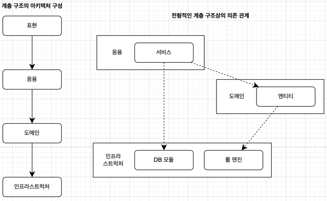
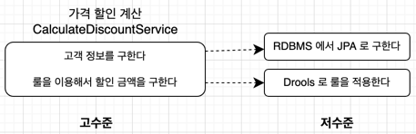
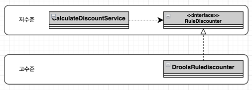
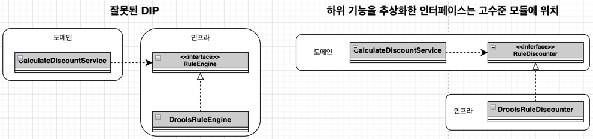
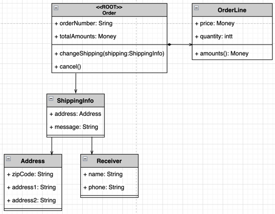
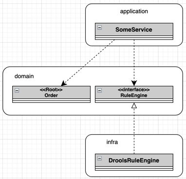
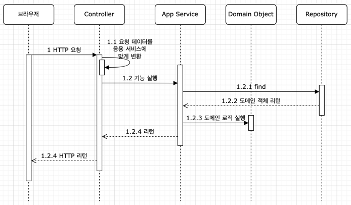
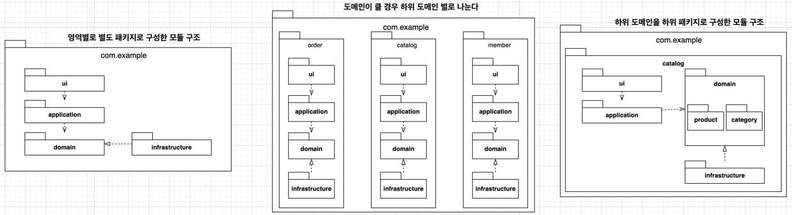

### 네 개의 영역

* 아키텍처를 설계할 떄 출현하는 전형적인 영역이 `표현`/`응용`/`도메인`/`인프라스트럭처` 네개의 영역이다
  * `표현` 영역은 사용자의 요청을 받아 응용 영역에 전달하고 응용 영역의 처리 결과를 다시 사용자에게 보여주는 역할을 한다
    * 스프링 MVC 프레임워크가 표현 영역을 위한 기술에 해당한다
    * 웹 애플리케이션에서 표현 영역의 사용자는 웹 브라우저를 사용하는 사람일 수 있고, REST API 를 호출하는 외부 시스템일 수도 있다
    * 웹 애플리케이션에서 표현 영역은 HTTP 요청을 응용 영역이 필요로 하는 형식으로 변환해서 응용 영역에 전달하고 응용 영역의 응답을 HTTP 응답으로 변환해서 전송한다
  * 표현 영역을 통해 사용자의 요청을 전달받는 `응용` 영역은 시스템이 사용자에게 제공해야 할 기능을 구현한다
    * 응용 영역은 기능을 구현하기 위해 도메인 영역의 도메인 모델을 사용한다
    * 응용 서비스는 로직을 직접 수행하기보다는 도메인 모델에 로직 수행을 위임한다
  * `도메인` 영역은 도메인 모델을 구현한다
    * 도메인 모델은 도메인의 핵심 로직을 구현한다
  * `인프라스트럭처` 영역은 구현 기술에 대한 것을 다룬다
    * 해당 영역은 RDBMS 연동을 처리하고, 메시지 큐에 메시지 전송/수신하는 기능을 구현하고, 데이터베이스 연동을 처리한다
* 도메인/응용/표현 영역은 구현 기술을 사용한 코드를 직접 만들지 않고 인프라스트럭처 영역에서 제공하는 기능을 사용해서 필요한 기능을 개발한다
  * 예를 들어 응용 영역에서 DB 에 보관된 데이터가 필요하면 인프라스트럭처 영역의 DB 모듈을 사용해서 데이터를 읽어온다
  * 외부 메일을 발송해야 하면 인프라스트럭처가 제공하는 SMTP 연동 모듈을 이용해서 메일을 발송한다
  
### 계층 구조 아키텍처

* 네 영역을 구성할 때 많이 사용하는 아키텍처가 계층 구조의 아키텍처이다
* 표현 영역과 응용 영역은 도메인 영역을 사용하고, 도메인 영역은 인프라스트럭처 영역을 사용한다
  * 복잡도에 따라 응용과 도메인을 분리하거나 한 계층으로 합친다
* 계층 구조는 상위 계층에서 하위 계층으로만 의존하고 하위 계층은 상위 계층에 의존하지 않는다
  * 구현의 편리함을 위해 계층 구조를 유연하게 적용할 수 있다
  * 응용 계층이 외부 시스템과의 연동을 위해 더 아래 계층인 인프라스트럭처 계층에 의존할 수 있다
  * 계층 구조에 따르면 도메인과 응용 계층은 룰 엔진과 DB 연동을 위해 인프라스터럭처 모듈에 의존하게 된다
  


* 응용 영역과 도메인 영역ㅇ든 DB 나 외부 시스템 연동을 위해 인프라스트럭처의 기능을 사용하므로 이러한 계층 구조를 사용하는 것은 직관적으로 이해하기 쉽다
* 하지만 표현/응용/도메인 계층이 상세한 구현 기술을 다루는 인프라스트럭처 계층으 종속된다는 점은 짚어야 한다
  * 인프라스트럭처에서 실제 로직이 들어가 있더라도, 해당 서비스를 사용하는 응용에서 인프라스트럭처에 필요한 값을 설정하고 넘긴다면 결국 인프라스트럭처에 강하게 의존하게 된다
  * 이럴경우 인프라스트럭처가 변경되거나 다른 외부 서비스를 사용하게 되면 응용(강하게 의존하는 모든)도 같이 수정되어야 한다
  * 이렇게 의존하면 '테스트의 어려움' 과 '기능 확장의 어려움' 이라는 단점이 발생한다

```java
public class DroolsRuleEngine {
    // 인프라스트럭처
    private KieContrainer kContainer;
    
    public DroolsRuleEngine() {
        KieService ks = KieService.Factory.get();
        kContainer = ks.getKieClasspathContainer();
    }
    
    public void evaluate(String sessionName, List<?> facts) {
        KieSession kSession = kContainer.newKieSession(sessionName);
        try {
            facts.forEach(x -> kSession.insert(x));
            kSession.fireAllRules();
        } finally {
            kSession.dispose();
        }
    }
}

public class CalculateDiscountService {
    // 응용
    private DroolsRuleEngine ruleEngine;
    
    public CalculateDiscountService() {
        ruleEngine = new DroolsRuleEngine();
    }
    
    public Money calculateDiscount(OrderLine orderLines, String customerId) {
        Customer customer = findCustomer(customerId);
        
        MutableMoney money = new MutableMoney(0);
        // Drools 에 특화된 코드 - 연산 결과를 받기 위해 추가한 타입
        List<?> facts = Array.asList(customer, money);
        facts.addAll(orderLines);
        // Drools 에 특화된 코드 - 룰에 필요한 데이터 (지식)
        ruleEngine.evaluate("discountCalculation", facts);
        // Drools 에 특화된 코드 - Drools 의 세션 이름 ("discountCalculation")
        return money.toImmutableMoney();
    }
}
// CalculateDiscountService 라는 응용은 DroolsRuleEngine 이라는 인프라스트럭처의 Drools 라는 간접적인 의존을 가지게 된다
// DroolsRuleEngine 의 arguments 가 변하거나 로직 변경 시 CalculateDiscountService 도 같이 변경해야할 수 있으며
// CalculateDiscountService 를 테스트 하기 위해서는 DroolsRuleEngine 이 모두 정상적인 설정이 되어야만 한다
```

### DIP



* 고수준 모듈(의미 있는 단일 기능을 제공하는 모듈)
  * 여기에서는 CalculateDiscountService 이며, '가격 할인 계산' 이라는 기능을 구현한다
  * 고수준 모듈을 구현하려면 고객 정보를 구해야 하고 룰을 실행해야 하는데, 이러한 두 기능이 하위 기능이다
* 저수준 모듈(하위 기능을 실제로 구현한 모듈)
  * 여기에서는 JPA 로 고객 정보를 읽어오는 모듈과 Drools 로 룰을 적용하는 모듈이 해당한다
* 고수준 모듈이 제대로 동작하려면 저수준 모듈을 사용해야 한다
  * 고수준 모듈이 저수준 모듈을 사용하면 계층 구조 아키텍처에서 언급했던 **구현 변경의 어려움**과 **테스트의 어려움**이 발생한다
* DIP 는 저수준 모듈이 고수준 모듈에 의존하도록 바꿈으로써 위의 두가지 어려움을 해결하고자 한다
  * 추상화한 인터페이스를 활용함으로써 저수준 모듈이 고수준 모듈에 의존하도록 할 수 있다

```java
// CalculateDiscountService 라는 응용에서 룰 적용은 Drools 이든 java 로 직접 구현이든 상관없이
// '고객 정보와 구매 정보에 룰을 적용해서 할인 금액을 구한다' 만 중요하다

public interface RuleDiscounter {
  // '고객 정보와 구매 정보에 룰을 적용해서 할인 금액을 구한다' 를 추상화한 인터페이스
  public Money applyRules(Customer customer, List<OrderLine> orderLines);
}

public class CalculateDiscountService {
  // 응용
  // 해당 응용에서 Drools 에 의존하는 코드를 포함하지 않고, 단지 RuleDiscounter 를 적용한다 라는 것만 알고있다
  private RuleDiscounter ruleDiscounter;

  public CalculateDiscountService(RuleDiscounter ruleDiscounter) {
    this.ruleDiscounter = ruleDiscounter;
  }

  public Money calculateDiscount(OrderLine orderLines, String customerId) {
    Customer customer = findCustomer(customerId);
    return ruleDiscounter.applyRules(customer, orderLines);
  }
}

public class DroolsRuleDiscounter implements RuleDiscounter {
    // 인프라스트럭처
    // RuleDiscounter 를 상속받음으로써 구현해야 할 실제 로직을 인프라스트럭처에서 작성하고
    // 응용에서는 결과만 받음으로써 인프라스트럭처가 응용을 의존하도록 구현할 수 있다
    private KieContainer kContainer;
  
    public DroolsRuleDiscounter() {
      KieService ks = KieService.Factory.get();
      kContainer = ks.getKieClasspathContainer();
    }
  
    @Override
    public Money applyRules(Customer customer, List<OrderLine> orderLines) {
        KieSession kSession = kContainer.newKieSession("discountSession");
        try {
            ...
            kSession.fireAllRules(); 
        } finally {
            kSession.dispose();
        }
        
        return money.toImmutableMoney();
    }
}
```



* 위와 같은 형태로 `CalculateDiscountService` 는 더이상 `Drools` 에 의존하지 않게된다
  * 룰을 추상화한 `RuleDiscounter` 인터페이스에 의존할 뿐이다
  * 또한, '룰을 이용한 할인 금액 계산' 은 고수준 모듈의 개념이므로 `RuleDiscounter` 인터페이스는 고수준 모듈에 속한다
* 기존에는 고수준 모듈이 저수준 모듈에 의존하였으나, 반대로 의존하게끔 하여 Dependency Inversion Principle(DIP, 의존 역전 원칙) 이라 한다

```java
RuleDiscounter ruleDiscounter = new DroolsRuleDiscounter();
// 사용할 저수준 객체 생성
CalculateDiscountService discountService = new CalculateDiscountService(ruleDiscounter);
// 생성자 방식으로 주입

RuleDiscounter ruleDiscounter = new SimpleRuleDiscounter();
CalculateDiscountService discountService = new CalculateDiscountService(ruleDiscounter);
// 위와 같이 구현 기술이 변경되면 객체 생성하는 부분만 수정함으로써 교체가 된다
```

* 의존 주입을 지원하는 스프링과 같은 프레임 워크를 사용하면 설정 코드를 수정해서 쉽게 구현체를 변경할 수 있다

```java
public class CalculateDiscountService {
    private CustomerRepository customerRepository;
    private RuleDiscounter ruleDiscounter;
    
    public CalculateDiscountService(
            CustomerRepository customerRepository,
            RuleDiscounter ruleDiscounter
    ) {
        this.customerRepository = customerRepository;
        this.ruleDiscounter = ruleDiscounter;
    }
    
    public Money calculateDiscount(OrderLine orderLines, String customerId) {
        Customer customer = findCustomer(customerId);
        return ruleDiscounter.applyRules(customer, orderLines);
    }
    
    private Customer findCustomer(String customerId) {
        Customer customer = customerRepository.findById(customerId);
        // 아래 테스트 코드에서
        // when(stubRepo.findById("noCustomerId")).then(null);
        // 를 설정하였으므로, customerId 에 "noCustomerId" 로 오면 null 이 리턴된다
        if (customer == null) throw new NoCustomerException();
        return customer;
    }
}

public class CalculateDiscountServiceTest {
    @Test(expect = NoCustomerException.class)
    public void noCustomer_thenExceptionShouldBeThrown() {
        CustomerRepository stubRepo = mock(CustomerRepository.class);
        when(stubRepo.findById("noCustomerId")).then(null);
        
        RuleDiscounter stubRule = (customer, lines) -> null;
        
        CalculateDiscountService calculateDiscountService = new CalculateDiscountService(stubRepo, stubRule);
        calculateDiscountService.calculateDiscount(someLines, "noCustomerId");
    }
    // Mock 프레임워크를 활용하여 주입될 객체에 다른 mock 객체를 넣음으로써
    // 테스트를 수행하는 데 필요한 기능만 수행하게 설정할 수 있다
}
```

* 위와 같이 실제 구현 없이 DIP 를 적용하여 고수준 모듈이 저수준 모듈에 의존하지 않게 구현되어 있기 때문에 실제 구현 없이 테스트가 가능하다

#### DIP 주의사항

* DIP 를 잘못 생각하면 단순히 인터페이스와 구현 클래스를 분리하는 정도로 받아들일 수 있다
  * DIP 의 핵심은 고수준 모듈이 저수준 모듈에 의존하지 않도록 하는 것이다



* 왼쪽의 경우 도메인 영역은 구현 기술을 다루는 인프라스트럭처 영역에 의존하고 있다
  * 이는 고수준 모듈이 저수준 모듈에 의존하고 있으며, RuleEngine 인터페이스는 고수준 모듈인 도메인 관점이 아닌 `RuleEngine` 이라는 저수준 모듈 관점에서 도출된 것이다
* DIP 를 적용할 때 하위 기능을 추상화한 인터페이스는 고수준 모듈 관점에서 도출한다
  * `CalculateDiscountService` 입장에서 봤을 때 할인 금액을 구하기 위해 룰 엔진을 사용하지는지, 직접 연산하는지 여부는 중요하지 않고 규칙에 따라 계산된 결과가 필요할 뿐이다
  * 즉, 오른쪽 그림처럼 '할인 금액 계산' 을 추상화한 인터페이스는 저수준 모듈이 아닌 고수준 모듈에 위채해야 한다
  
### DIP 와 아키텍처

* 인프라스트럭처 영역은 구현 기술을 다루는 저수준 모듈이고 응용 영역과 도메인 영역은 고수준 모듈이다
  * 아키텍처 수준에서 DIP 를 적용하면 인프라스트럭처 영역이 응용과 도메인 영역에 의존하는 구조가 된다
* 인프라스트럭처에 위치한 클래스가 도메인이나 응용 영역에 정의한 인터페이스를 상속받아 구현하는 구조가 되므로 도메인과 응용 영역에 대한 영향을 주지 않거나 최소화하면서 구현 기술을 변경하는 것이 가능하다

### 도메인 영역의 주요 구성요소

* 도메인 영역의 모델은 도메인의 주요 개념을 표현하며 핵심이 되는 로직을 구현한다
  * 엔티티와 벨류 타입은 도메인 영역의 주요 구성요소이다
  
| 요소 | 설명 |
| ---- | ---- |
| 엔티티 | 고유의 식별자를 가지는 객체로 자신의 라이프사이클을 가진다. 회원/주문/상품 등과 같이 도메인의 고유한 개념을 표현한다. 도메인 모델의 데이터를 포함하며 해당 데이터와 관련된 기능을 함께 제공한다 |
| 벨류 | 고유의 식별자를 가지지 않는 객체로 주로 개념적으로 하나의 도메인 객체의 속성을 표현할 때 사용된다. 배송지 주소 표현을 위한 주소(Address) 나 구매 금액(Money) 등과 같은 타입이 벨류 타입이다. 엔티티의 속성으로 사용될 뿐만 아니라 다른 벨류 타입의 속성으로도 사용될 수 있다 |
| 애그리거트 | 관련된 엔티티와 벨류 객체를 개념적으로 하나로 묶은 것이다. 예를들어서 주문과 관련된 `Order 앤티티`,`OrderLine 벨류`, `Orderer 벨류` 객체를 '주문' 애그리거트로 묶을 수 있다 |
| 레파지토리 | 도메인 모델의 영속성을 처리한다. DBMS 테이블에서 엔티티 객체를 로딩하거나 저장하는 기능을 제공한다. |
| 도메인 서비스 | 특정 엔티티에 속하지 않은 도메인 로직을 제공한다. '할인 금액 계산' 은 상품, 쿠폰, 회원 등급, 구매 금액 등 다양한 조건을 이용해서 구현하는데, 이렇게 도메인 로직이 여러 엔티티와 벨류를 필요할 경우 도메인 서비스에서 로직을 구현한다 |

#### 엔티티와 벨류

* 실제 도메인 모델의 엔티티와 DB 관계형 모델의 엔티티는 같은 것이 아니다
  * 가장 큰 차이점은 도메인 모델의 엔티티는 데이터와 함께 도메인 기능을 함께 제공한다
  
```java
public class Order {
    // 주문 도메인 모델의 데이터
    private Orderer orderer;
    // 두개 이상의 데이터가 개념적으로 하나인 경우 벨류 타입을 이용해서 표현
    ...
    
    // 도메인 모델 엔티티는 도메인 기능도 함께 제공
    public void changeShippingInfo(ShippingInfo newShippingInfo) {
        ...
    }
}

public class Orderer {
    private String name;
    private String email;
    ...
}
// 벨류타입
```

* 도메인 모델의 엔티티는 단순히 데이터를 담고 있는 데이터 구조라기보다는 데이터와 함께 기능을 제공하는 객체이다
  * 도메인 관점에서 기능을 구현하고 기능 구현을 캡슐화해서 데이터가 임의로 변경되는 것을 막는다
* 도메인 모델의 엔티티는 두개 이상의 데이터가 개념적으로 하나인 경우 벨류 타입을 이용해서 표현할 수 있다
  * RDBMS 와 같은 관계형 데이터베이스는 벨류 타입을 제대로 표현하기 힘들다
* 벨류는 불변으로 구현하는 것을 권장하며, 이는 엔티티의 벨류 타입 데이터를 변경할 때 객체 자체를 완전히 교체한다는 것을 의미한다
  * 예를들어 '배송지 변경' 을 통해 '주소' 를 변경한다면, 기존 데이터에 덮어씌우는 것이 아닌 변경된 데이터로 새로 변경하는 것이다
  
#### 애그리거트

* 도메인이 커질수록 개발할 도메인 모델도 커지면서 많은 엔티티와 벨류가 출현하며, 엔티티와 벨류가 많아질수록 모델은 점점 더 복잡해진다
* 도메인 모델이 복잡해지면 개발자가 전체 구조가 아닌 한개 엔티티와 벨류에만 집중하게 되는 경우가 발생한다
  * 이렇게 상위 수준에서 모델을 관리하기보다 개별 요소에만 초점을 맞추다 보면 큰 수준에서 모델을 이해하지 못해 큰 틀에서 모델을 관리할 수 없는 상황이 올 수 있다
* 도메인 모델에서 전체 구조를 이해하는 데 도움이 되는 것이 애그리거트이다
  * 관련 객체를 하나로 묶은 군집을 애그리거트라고 한다
  * 예를들어 '주문' 이라는 애그리거트가 있으면, `주문`/`배송지 정보`/`주문자`/`주문 목록`/`총 결제 금액` 등과 같은 하위 모델로 구성될 수 있으며, 이러한 하위 개념을 표현한 모델을 하나로 묶어서 `주문` 이라는 상위 개념으로 표현할 수 있다
* 애그리거트를 활용하면 관련 객체를 묶어서 객체 군집 단위로 모델을 바라볼 수 있게 된다
  * 개별 객체 간의 관계가 아닌 애그리거트 간의 관계로 도메인 모델을 이해하고 구현할 수 있게 되며, 이를 통해 큰 틀에서 도메인 모델을 관리할 수 있다
* 애그리거트는 군집에 속한 객체들을 관리하는 루트 엔티티를 가진다
  * 루트 엔티티는 애그리거트에 속해 있는 엔티티와 벨류 객체를 이용해서 애그리거트가 구현해야 할 기능을 제공한다
  * 애그리거트를 사용하는 코드는 애그리거트 루트가 제공하는 기능을 실행하고 애그리거트 루트를 통해서 간접적으로 애그리거트 내의 다른 엔티티나 벨류 객체에 접근하게 된다
  * 이는 애그리거트의 내부 구현을 숨겨서 애그리거트 단위로 구현을 캡슐화할 수 있도록 돕는다



* 위와 같이 Order 가 애그리거트에 속한 객체를 관리하며, Root 이다
* 루트인 Order 는 주문 도메인 로직에 맞게 애그리거트의 상태를 관리한다
* 애그리거트를 구현할 때 어떻게 구성했느냐에 따라 구현이 복잡해지기도 트랜잭션 범위가 달라지기도 선택한 구현 기술에 따라 구현 제약이 생기기도 한다

```java
public class Order {
    ...
  
    public void changeShippingInfo(ShippingInfo newShippingInfo) {
        checkShippingInfoChangeable();
        this.shippingInfo = newShippingInfo;
    }
    
    private checkShippingInfoChangeable() {
        // 배송지 정보를 변경할 수 있는지 여부를 확인하는 모데인 규칙 구현
    }
}
// 위와 같이 주문 애그리거트는 Order 를 통하지 않고 ShippingInfo 를 변경할 수 있는 방법을 제공하지 않는다
// 즉, 배송지를 변경하려면 루트 엔티티인 Order 르 사용해야 하므로 배송지 정보를 변경할 때에는 Order 가 구현한 도메인 로직을 항상 따르게 된다
```

#### 레파지토리

* 애그리거트 단위로 도메인 객체를 저장하고 조회하는 기능을 정의한 것을 '라파지토리' 라고 한다

```java
public interface OrderRepository {
    public Order findByNumber(OrderNumber number);
    public void save(Order order);
    public void delete(Order order);
}
```

* 위와 같이 주문 애그리거트를 위한 레파지토리르 구성할 수 있다
  * 현재 `Order` 는 애그리거트에 속한 모든 객체를 포함하고 있으며, 결과적으로 해당 레파지토리를 통해 애그리거트 단위로 저장하고 조죄함을 확인할 수 있다
* 도메인 모델을 사용해야 하는 코드는 레파지토리를 통해 도메인 객체를 구한 다음 도메인 객체의 기능을 실행하게 된다
* 도메인 모델 관점에서 OrderRepository 는 도메인 객체를 영속화하는 데 필요한 기능을 추상화한 것으로 고수준 모듈에 속한다



* 응용 서비스와 레파지토리는 다음과 같은 밀접한 연관이 있다
  * 응용 서비스는 필요한 도메인 객체를 구하거나 저장할 때 레파지토리를 사용한다
  * 응용 서비스는 트랜잭션을 관리하는데, 트랜잭션 처리는 레파지토리 구현 기술에 영향을 받는다
  
### 요청 처리 흐름



1. 위와 같이 표현 영역에 사용자의 요청이 오면, 데이터 형식이 올바른지 확인 후 응용에 필요한 데이터 형태로 변환 및 전달을 한다
1. 응용 서비스에서 데이터 조회, 도메인 로직 실행 등을 거치고 결과물을 HTTP 로 응답한다

### 인프라스트럭처 개요

* 표현 영역, 응용 영역, 도메인 영역을 지원한다
* 도메인 객체의 영속성 처리, 트랜잭션, SMTP 클라이언트, REST 클라이언트 등 다른 영역에서 필요로 하는 프레ㅐ임워크, 구현기술, 보조 기능을 지원한다
* 도메인 영역과 응용 영역에서 인프라스트럭처의 기능을 직접 사용하는 것보다 이 두 영역에 정의한 인터페이스를 인프라스트럭처 영역에서 구현하는 것이 시스템을 더 유연하고 테스트하기 쉽게 만들어준다
  * 무조건 인프라스트럭처에 대한 의존을 없애는 것이 좋은 것이 아니다
    * 스프링을 사용할 경우 응용  서비스는 트랜잭션 처리를 위해 스프링이 제공하는 `@Transactional` 을 사용하는 것이 편리하다
    * 영속성 처리를 위해 JPA 를 사용할 경우 `@Entity`/`@Table` 과 같은 어노테이션을 도메인 모델 클래스에 사용하는 것이 XML 매핑 설정보다 편하다
  * 인프라스트럭처에 대한 의존을 완전히 없애도록 구현하는 것이 더 복잡하고 어려울 수 있다

### 모듈 구성

* 아키텍처의 각 영역은 별도 패키지에 위치한대
* 패키지 구성 규칙에는 정답이 없지만, 영역별로 모듈이 위치할 패키지를 구성하는 것도 하나의 방법이다



* 각 애그리거트와 모델과 레파지토리는 같은 패키지에 위치시킨다
  * `Order`/`OrderLine`/`Orderer`/`OrderRepository` 등은 com.example.order.domain 패키지에 위치키신다
* 도메인이 복잡하면 도메인 모델과 도메인 서비스를 다음과 같이 별도 패키지에 위치시킬 수 있다
  * com.example.order.domain.order: 애그리거트 위치
  * com.example.order.domain.service: 도메인 서비스 위치
* 응용 서비스도 도메인 별로 패키지를 구분할 수 있다
  * com.example.catalog.application.product
  * com.example.catalog.application.category
* 모듈 구조를 얼마나 세분화해야 하는지에 대해 정해진 규칙은 없으나, 한 패키지에 너무 많은 타입이 몰려서 코드를 찾을 때 불편하지 않을 정도로만 구성하면 된다
