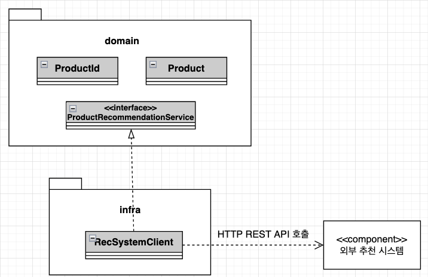
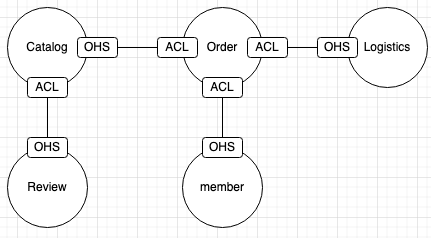

### 도메인 모델과 경계

* 도메인 모델을 만들 때 빠지기 쉬운 함정은 도메인을 완벽하게 표현하는 단일 모델을 만드는 시도를 하는 것이다
  * 한 도메인은 다시 여러 하위 도메인으로 구분되기 때문에 한 개의 모델로 여러 하위 도메인을 모두 표현하려고 시도하면 모든 하위 도메인에 맞지 않는 모델을 만들게 된다
* 논리적으로 같은 존재처럼 보이지만 하위 도메인에 따라 다른 용어를 사용하는 경우도 있다
  * 카탈로그 도메인에서 상품이 검색 도메인에서는 문서로 불리기도 한다
  * 시스템을 사용하는 사람을 회원 도메인에서는 회원이라고 하지만, 주문에서는 주문자라고 하며, 배송 도메인에서는 보내는 사람이라고 부른다
* 하위 도메인마다 같은 용어라도 의미가 다르고 같은 대상이라도 지칭하는 용어가 다를 수 있기 때문에 한 개의 모델로 모든 하위 도메인을 표현하려는 시도는 올바른 표현 방법이 아니며 불가능하다
* 하위 도메인마다 사용하는 용어가 다르기 때문에 올바른 도메인 모델을 개발하려면 하위 도메인마다 모델을 만들어야 한다
  * 여러 하위 도메인의 모델이 섞이기 시작하면 모델의 의미가 약해지고, 여러 도메인의 모델이 얽혀 있기 때문에 각 하위 도메인별로 다르게 발전하는 요구사항을 모델에 반영하기 어려워진다
* 모델은 특정한 컨텍스트하에 완전한 의미를 가진다

### Bounded Context

* 구분되는 경계를 가지는 컨텍스트를 Bounded Context 라고 한다
  * Bounded Context 는 용어를 기준으로 구분한다
  * 예를들어 카탈로그 컨텍스트와 재고 컨텍스트는 서로 다른 용어를 사용하므로 이 용어를 기준으로 컨텍스트를 분리할 수 있다
  * Bounded Context 는 실제로 사용자에게 기능을 제공하는 물리적 시스템으로 도메인 모델은 이 Bounded Context 안에서 도메인을 구현한다
* Bounded Context 가 정해지는 기준은 여러가지가 있으며, 기업의 팀 조직 구조에 따라 결정되는 경우가 존재한다
  * 주문을 처리하는 팀, 결제 금액 계ㅒ산 로직을 구현하는 팀이 별도로 존재한다면, 각 팀별 Bounded Context 가 존재하게 된다
  * 용어가 명확하게 구분되지 않은 경우 두 하위 도메인을 한 Bounded Context 에서 구현하기도 한다
  * 작은 규모의 회사는 전체 시스템을 구현하면서 여러 하위 도메인을 한 개의 Bounded Context 에서 구현할 수 있다
* 여러 하위 도메인을 하나의 Bounded Context 에서 개발할 때 하위 도메인의 모델이 뒤섞이지 않도록 주의해야 한다
  * 하나의 프로젝트에 각 하위 도메인의 모델이 위치하면 전체 하위 도메인을 위한 단일 모델을 만들게 되면 개별 하위 도메인을 제대로 반영하지 못해서 하위 도메인별 기능 확장이 어렵게 된다
  * 한 개의 Bounded Context 에서 여러 하위 도메인을 포함하더라도 하위 도메인마다 구분되는 패키지를 갖도록 구현해야 모델끼리 뒤섞이지 않아서 하위 도메인마다 Bounded Context 를 가지는 효과를 낼 수 있다
* Bounded Context 는 도메인 모델을 구분하는 경계가 되기 때문에 Bounded Context 는 구현하는 하위 도메인에 알맞은 모델을 포함한다
  * 같은 사용자라 하더라도 주문과 회원이 가지는 모델이 달라진다
    * 회원의 멤버는 애그리거트 루트이지만, 주문의 Orderer 는 벨류가 된다
  * 같은 상품이여도 카탈로그와 재고 컨텍스트는 각 컨텍스트에 맞는 모델을 가진다
    * 카탈로그의 상품은 상품이 속할 카테고리와 연관을 가지지만, 재고의 상품은 카탈로그의 카테고리와 연관을 가지지 않는다
  
### Bounded Context 구현

* Bounded Context 가 도메인 모델만 포함하지는 않는다
  * 도메인 모델뿐 아니라 도메인 기능을 사용자에게 제공하는데 필요한 표현 영역, 응용 서비스, 인프라 영역 등 모두 포함한다
  * 도메인 모델의 데이터 구조가 변하면 DB 테이블 스키마도 함께 변경해야 하므로, 해당 테이블도 Bounded Context 에 포함된다
* 모든 Bounded Context 를 반드시 DDD 로 개발할 필요는 없다
  * 상품의 리뷰와 같이 복잡한 도메인 로직을 가지지 않는 것들은 CRUD 방식으로 구현해도 좋다
* 서비스-DAO 구조를 사용하면 도메인 기능이 서비스에 흩어지게 되지만, 도메인 기능 자체가 단순하면 서비스-DAO 로 구성된 CRUD 방식을 사용해도 코드를 유지보수하는 데 문제되지 않는다
* 하나의 Bounded Context 에서 두 방식을 혼합해서 사용할 수 있다
  * 대표적으로 Command Query Responsibility Segregation (CQRS) 방식이 존재한다
    * 상태를 변경하는 명령 기능과 내용을 조회하는 쿼리 기능을 위한 모델을 구분하는 패턴
* 하나의 Bounded Context 에 서로 다른 구현 기술을 사용할 수도 있다
* Bounded Context 는 반드시 사용자에게 보여지는 UI 를 가져야 하는 것은 아니다

### Bounded Context 간 통합

* 기존 카탈라고 시스템 개발 팀과 추천 시스템 개발 팀이 새로 생겨서 추천 시스템을 만든다면, 카탈로그 하위 도메인에는 기존 카탈로그를 위한 Bounded Context 와 추천을 위한 Bounded Context 가 생긴다
* 사용자가 카탈로그 Bounded Context 에 추천 제품 목록을 요청하면 카탈로그 Bounded Context 는 추천 Bounded Context 로부터 추천 정보를 받아와 추천 제품 목록을 제공한다
  * 카탈로그 컨텍스트와 추천 컨텍스트의 도메인 모델은 서로 다르다
  * 카탈로그는 제품을 중심으로 도메인 모델을 구현하지만 추천은 추천 연산을 위한 모델을 구현한다
* 카탈로그 시셑ㅁ은 추천 시스템으로부터 추천 데이터를 받지만, 카탈로그 시세템에서는 추천의 도메인 모델을 사용하기보다는 카탈로그 도메인 모델을 사용해서 추천 상품을 표현해야 한다
  * 카탈로그의 모델을 기반으로 하는 도메인 서비스를 이용해서 상품 추천 기능을 표현해야 한다
* 도메인 서비스를 구현한 클래스는 인프라스트럭처 영역에 위치한다

* 위와 같이 외부 추천 시스템이 제공하는 REST API 를 이용해서 특정 상품을 위한 추천 상품 목록을 로딩한다
* RecSystemClient 는 REST API 로부터 데이터를 읽어와 카탈로그 도메인에 맞는 모델로 변환한다
  * 두 모델 간의 변환 과정이 복잡하다면 변환 처리를 위한 별도로 클래스를 만들고 이 클래스에서 변환을 처리해도 된다
* REST API 를 호출하는 것은 두 Bounded Context 를 직접 통합하는 방법이다
  * 직접 통합대신 메시지 큐 등을 이용한 간접 통합 방식도 가능하다
  * 이러한 메시지를 이용한 방식이라도 메시지의 데이터 구조를 맞춰야 하므로, 각 Bounded Context 를 담당하는 팀은 서로 데이터에 대한 합의가 필요하다
* 어떠한 도메인 관점에서 모델을 사용하느냐에 따라 두 Bounded Context 의 구현 코드가 달라지게 된다
  * 큐를 제공하는 주체에 따라 큐에 담기는 내용이 달라진다
  
##### 마이크로서비스와 Bounded Context

* 애플리케이션을 작은 단위로 나누어 개발하는 아키텍처 스타일이다
* 이러한 작은 단위는 Bounded Context 와 잘 어울린다
  * 각 Bounded Context 는 모델의 경계를 형성하는데, 마이크로서비스로 구현하면 자연스럽게 컨텍스트별로 모델이 분리된다
  * 즉, 마이크로서비스로 구현하면 Bounded Context 마다 구현하게 된다
  * 자연스럽게 코드 수준에서 모델을 분리해서 각 Bounded Context 모델이 섞이지 않게 해준다
  
### Bounded Context 간 관계

* Bounded Context 간에는 다양한 방식으로 관계를 가진다
  * 가장 흔한 관계는 한쪽에서 API 를 제공하고 다른 한쪽에서 그 API 를 호출하는 관계이다
  * 대표적으로 REST API 가 있다
* 이 관계에서 API 를 사용하는 Bounded Context 는 API 제공하는 Bounded Context 에 의존하게 된다
  * 제공하는 API 는 상류 컴포넌트이고, 사용하는 Bounded Context 는 하류 컴포넌트가 된다
  * 이는 제공하는 Bounded Context 가 변경되면 사용하는 Bounded Context 도 변경되어야 한다
    * 즉, 상류 컴포넌트를 변경하기 위해서는 하류 컴포넌트와의 협업이 필요하다
* 상류 팀이 다수의 하류 팀이 존재한다면, 여러 하류팀의 요구사항을 수용할 수 있는 API 를 서비스 형태로 공개하여 서비스의 일관성을 유지할 수 있다
  * 이를 서비스를 공개 호스트 서비스라고 한다
* 하류 컴포넌트는 상류 서비스의 모델이 자신의 도메인 모델에 영향을 주지 않도록 보호해 주는 완충 지대를 만들어야 한다
  * 이는 위의 이미지에 있는 ResSystemClient 와 같은 외부 시스템과의 연동을 처리하는 것이 될 수 있다
  * 이를 모델이 깨지는 것을 막아주는 안티코럽션 계층이라 하며, 두 Bounded Context 간의 모델 변환을 처리하기 때문에 내 도메인 모델을 유지할 수 있다
* 두 Bounded Context 가 같은 모델을 공유하는 경우가 존재하며, 이를 공유 커널(Shared Kernel) 이라 한다
  * 공유 커널의 장점은 중복을 줄여준다는 것이다
  * 하지만 Bounded Context 간에 공유하기 때문에 특정 팀에서 함부로 변경을 할 수 없다
* 두 Bounded Context 간에 통합하지 않는 독립 방식(Separate Way) 관계도 존재한다
  * 이는 Bounded Context 간에 통합을 하지 않으므로 서로 독립적으로 모델을 발전시킨다
  * 이러한 독립 방식의 통합은 수동으로 이뤄질 수 있다

### 컨텍스트 맵

* 컨텍스트 맵은 Bounded Context 간의 관계를 표시한 것이다
* Bounded Context 영역에 주요 애그리거트를 함께 표시하면 모델에 대한 관계가 더 명확히 들어난다
* 컨텍스트 맵은 시스템의 전체 구조를 보여준다
* 이러한 컨텍스트 맵을 그리는 규칙은 따로 없다
  * 아래 이미지처럼 간단한 도형과 선 등을 이용해서 컨텍스트간에 관계를 이해할 수 있는 수준에서 그리면 된다

* OHS(오픈 호스트 서비스)
* ACL(안티코럽션 계층)