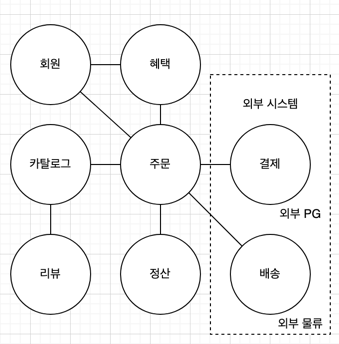
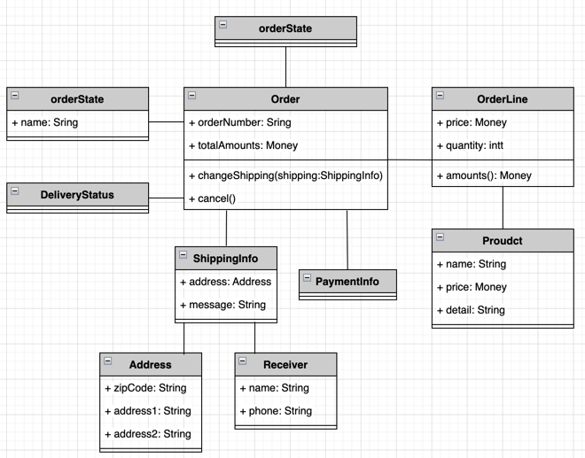
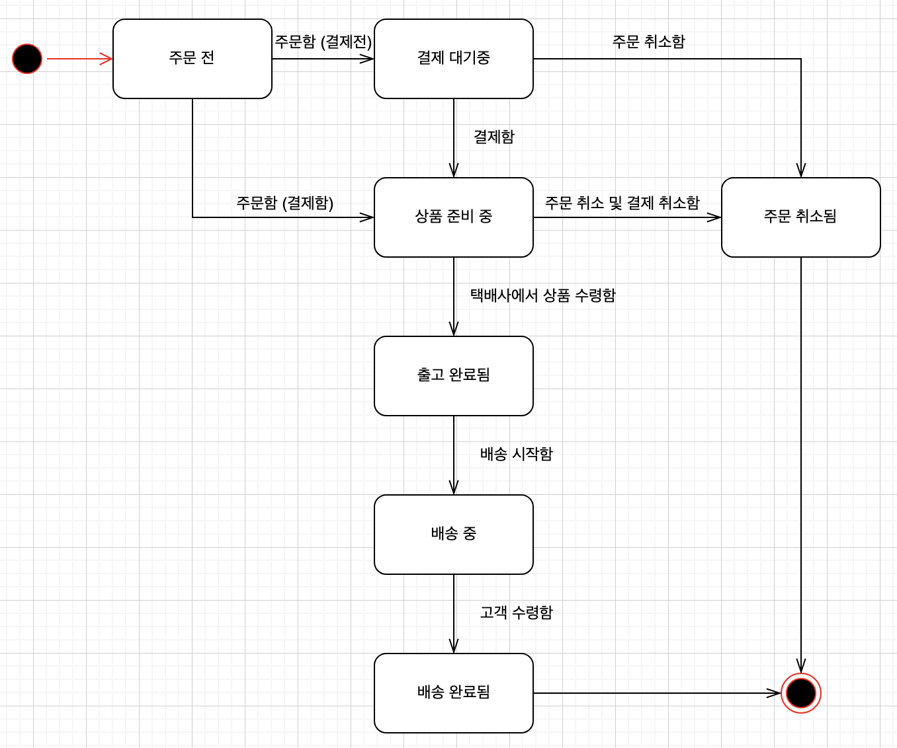

## 도메인

* '서점' 이라는 시스템을 구현한다고 할 때 아래와 같은 기능들이 제공될 수 있다
    1. 책 검색
    1. 책 목차, 서평 등의 정보 조회
    1. 장바구니 담기, 조회
    1. 구매 및 쿠폰, 결제방법
    1. 배송 추적 등
* 개발자의 입장에서 위의 기능들을 구현하여 소프트웨어로 만들 수 있다
* 이 중 '온라인 서점' 과 같이 소프트웨어로 해결하고자 하는 문제 영역, 즉 도메인에 해당한다
* 도메인은 몇 개의 하위 도메인으로 나눌 수 있다

* 위와 같이 도메인은 여러 하위 도메인으로 구성되며, 모든 하위 도메인을 필수로 구현해야 하지 않고 외부 시스템을 사용할 수 있다
* 하나의 하위 도메인은 다른 하위 도메인과 연동하여 완전한 기능을 제공한다
* 도메인마다 고정된 하위 도메인이 존재하는 것은 아니다
    * 모든 소핑몰이 회원에게 혜택을 제공하거나 정산을 시스템적이 아닌 수동으로 처리할 수도 있다
* 하위 도메인을 어떻게 구성할지 여부는 상황에 따라 달라진다
    * 기업 고객을 대상으로 대형 장비를 판매하는 곳은 온라인으로 카탈로그를 제공하고 주문서를 받는 정도만 필요할 것이다
    * 의류 등과 같이 일반 고객을 대상으로 할 경우에는 결제/배송/혜택/회원관리 등과 같은 기능들이 필요할 것이다
    
### 도메인 모델

* 도메인 모델은 특정 도메인을 개념적으로 표현한 것이다
    * 주문 도메인을 예를들면, 온라인 쇼핑몰에서 주문을 하려면 상품을 몇 개 살지 선택하고 배송지를 입력한다
    * 선택한 상품 가격을 이용해서 총 지불 금액을 계싼하고 금액 지불을 위한 결제 수단을 선택한다
    * 주문한 뒤에도 배송 전이면 배송지 주소를 변경하거나 주문을 취소할 수 있다
    

* 위 이미지와 같은 형태의 객체 기반 주문 도메인 모델을 구성할 수 있다
* 이러한 도메인 모델을 사용하면 여러 관계자들이 동일한 모습으로 도메인을 이해하고 도메인 지식을 공유하는 데 도움이 된다
* 도메인을 이해하려면 도메인이 제공하는 기능과 도메인의 주요 데이터 구성을 파악해야 하는데, 객체 모델은 기능과 데이터를 함께 보여주므로 도메인을 모델링하기에 적합하다

* 도메인 모델 뿐 아니라 위와 같은 상태 다이어그램을 활용해서 주문의 상태 전이를 모델링 할 수 있다
* 도메인 모델을 표현할 때 클래스 다이어그램이나 상태 다이어그램과 같은 UML 표기법 뿐 아니라 그래프 등과 같은 것들로 표현 가능하다

#### 하위 도메인과 모델

* 같은 용어라도 각 하위 도메인마다 다루는 영역이 다르기 때문에 의미가 달라질 수 있다
* 도메인에 따라 용어가 결정되므로, 여러 하위 도메인을 하나의 다이어그램에 모델링하면 안된다.
* 즉, 모델의 각 구성요소는 특정 도메인을 한정할 때 비로소 의미가 완전해지기 떄문에, 각 하위 도메인을 별도로 모델을 만들어야 한다

### 도메인 모델 패턴

| 계층 (Layer) | 설명 |
| ---- | ---- |
| 사용자인터페이스(UI) 또는 표현(Presentation) | 사용자의 요청을 처리하고 사용자에게 정보를 보여준다. 여기에서 사용자는 소프트웨어를 사용하는 사람뿐 아니라 외부 시스템도 사용자가 될 수 있다 |
| 응용(Application) | 사용자가 요청한 기능을 실행한다. 업무 로직을 직접 구현하지 않으며, 도메인 계층을 조합해서 기능을 실행한다 |
| 도메인 | 시스템이 제공할 도메인의 규칙을 구현한다 |
| 인프라스트럭처(Infrastructure) | 데이터베이스나 메시징 시스템과 같은 외부 시스템과의 연동을 처리한다 |

* 도메인 계층의 도메인의 핵심 규칙을 구현한다
  * 주문 도메인의 경우 '출고 전에 배송지를 변경할 수 있다'/'주문 취소는 배송 전에만 할 수 있다' 등의 규칙을 구현한 코드가 도메인 계층에 위치하게 된다
  * 예를들어 예제 코드의 `order/domain` 의 `Order.kt` 와 같이 도메인 안에 핵심 규칙을 구현한다
  

#### 개념 모델과 구현 모델

* 개념 모델
  * 순수하게 문제를 분석한 결과물이다
  * 데이터베이스, 트랙잭션 처리, 성능, 구현 기술등과 같은 것들을 고려하고 있지 않기 때문에 실제 코드를 작성할 때 개념 모델 자체로 사용할 수 없다
  * 구현 가능한 형태의 모델로 전환하는 과정이 필요하다
* 개념 모델을 처음부터 완벽하게 하기에는 불가능에 가까우며, 개발을 진행하면서 관계자들은 해당 도메인을 더 잘 이해하게 되고, 나중에는 새로운 통찰을 얻으며 완전 다른 의미로 해석이 되는 경우도 존재한다
* 즉, 처음에 완벽한 도메인을 만들더라도 도메인에 대한 지식이 쌓이면 모델을 보온하거나 수정하는 일이 발생한다
* 따라서 처음부터 완벽하게 만드는 것 보다는, 전박적인 개요를 알 수 있는 수준으로 개념 모델을 작성해야 한다
* 프로젝트 초기에는 개요 수준의 개념 모델로 도메인에 대한 전체 윤곽을 이해하는데 집중하고 구현하는 과정에서 개념 모델을 구현 모델로 점진적으로 발전시켜 나가야 한다

### 도메인 모델 도출

* 도메인을 모델링할 때 기본이 되는 작업은 모델을 구성하는 핵심 구성요소, 규칙, 기능을 찾는 것이다
  * 이러한 과정은 요구사항에서 출발한다
  * 주문 도메인과 관련된 몇가지 요구사항을 살펴보자
    1. 최소 한 종류 이상의 상품을 주문해야 한다
    1. 한 상품을 한 개 이상 주문할 수 있다
    1. 총 주문 금액은 각 상품의 구매 가격 합을 모두 더한 금액이다
    1. 각 상품의 구매 가격 합은 상품 가격에 구매 개수를 곱한 값이다
    1. 주문할 때 배송지 정보를 반드시 지정해야 한다
    1. 배송지 정보는 이름, 전화번호, 주소로 구성된다
    1. 출고를 하면 배송지 정보를 변경할 수 없다
    1. 출고 전에 주문을 취소할 수 있다
    1. 고객이 결제를 완료하기 전에는 상품을 준비하지 않는다
  * 위 요구사항을 통해 주문은 `출고 상태로 변경하기`/`배송지 정보 변경하기`/`주문 취소하기`/`결제 완료로 변경하기` 의 네가지 기능을 도출할 수 있다
  * b,d 요구사항은 주문 항목이 어떠한 데이터로 구성되는지 알려준다
  * 이러한 요구사항을 따르는 주문 항목을 표현하는 OrderLine 을 표현할 수 있다 (이는 `order/domain` 의 `OrderLine.kt` 에 구현하였다)
    * 해당 도메인에는 주문할 상품, 상품의 가격, 구매 개수를 포함하고 있어야 한다
    * 또한 각 구매 항목의 구매 가격도 제공해야 한다
