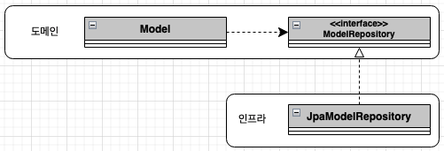
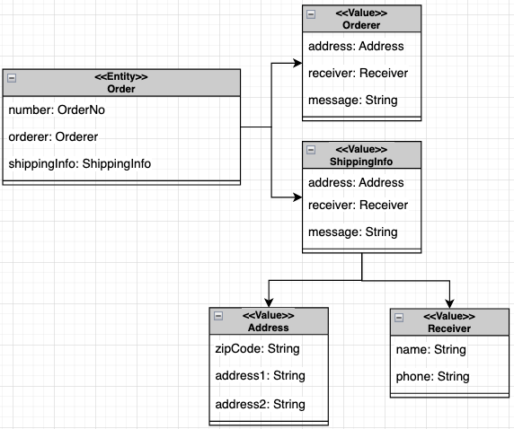

### 모듈 위치



* 위와 같이 레파지토리를 구현한 클래스는 인프라스트럭처 영역에 속한다

### 레파지토리 기본 기능 구현

* 레파지토리의 기본 기능은 다음과 같다
    1. 아이디로 애그리거트 조회
    1. 애그리거트 저장
* 인터페이스는 애그리거트 루트를 기준으로 작성한다
    * 주문 애그리거트는 Order 라는 루트 엔티티와 OrderLine, Orderer, ShippingInfo 등 다양한 객체를 포함한다
    * Order 가 루트이므로, Order 를 기준으로 레파지토리를 작성한다

```java
public interface OrderRepository {
    public Order findById(OrderNo no);
    public void save(Order order);
    
    public List<Order> findByOrdererId(String ordererId, int startRow, int size);
    // id 가 아닌 다른 형태로 조회 하는 등의 별도 쿼리를 작성할 수 있다
    
    public void delete(Order order);
}

pakcage com.example.order.infra;

@Repository
public class JpaOrderRepository implements OrderRepository {
    @PersistenceContext
    private EntityManager entityManager;
    
    @Override
    public Order findById(OrderNo id) {
        return entityManager.find(Order.class, id); }
    
    @Override
    public void save(ORder order) {
        entityManager.save(order);
    }
    
    @Override
    public List<Order> findByOrdererId(String ordererId, int startRow, int fetchSize) {
        TypedQuery<Order> query = entityManager.createQuery(
            "select o from Order o " +
            "..."
        );
        query.setParameter(...);
        
        return query.getResultList();
    }
    // 위와 같이 쿼리를 직접 장성하여 요청할 수 있다
    
    @Override
    public void remove(Order order) {
        entityManager.remove(order);
        // 삭제 처리
    }
}

public class ChangeOrderService {
    @Transactional
    public void changeShippingInfo(OrderNo no, ShippingInfo newShippingInfo) {
        Order order = orderRepository.findById(no);
        order.changeShhippingInfo(newShippingInfo);
        // 해당 메서드는 스프링 프레임워크 트랜잭션 관리 기능을 통해 트랜잭션 범위에서 실행된다
        // 메서드 실행이 긑나면 트랜잭션을 커밋하면서, 해당 태른잭션 범위 안에서 변경된 객체의 데이터를
        // JPA 는 확인한 후 UPDATE 쿼리를 실행한다
    }
}
```

### 매핑 구현

#### 엔티티와 벨류 기본 매핑 구현

* 애그리거트와 JPA 매핑을 위한 기본 규칙은 다음과 같다
  * 애그리거트 루트는 엔티티이므로 @Entity 로 매핑 설정을 한다
  * 한 테이블에 엔티티와 벨류 데이터가 같이 있다면, 벨류는 @Embeddable 로 매핑 설정을하고 벨류 타입 프로퍼티는 @Embedded 로 매핑 설정을 한다



* 루트 엔티티는 Order 이며, Orderer 와 ShippingInfo 는 벨류이고, Address 와 Receiver 는 ShippingInfo 에 포함된다

#### 기본 생성자

* 엔티티와 벨류의 생성자는 객체를 생성할 때 필요한 것을 전달받는다
  * Receiver 벨류 타입과 같이 생성 시점에 수취인 이름과 연락처를 생성자 파라미터로 전달받고 더이상 수정 할 필요가 없는 불변 객체이므로, setter 는 제공되지 않는다
* JPA 의 @Entity 와 @embeddable 로 클래스를 매핑하려면 기본 생성자를 제공해야 한다
  * JPA 프로바이더는 DB 에서 데이터를 읽어와 매핑된 객체를 생성할 때 기본 생성자를 사용해서 객체를 생성한다
  * 이러한 기술적인 제약으로 Receiver 와 같은 불변 타입은 기본 생성자가 필요 없어도 기본 생성자를 추가해줘야 한다
    * kotlin 에서는 타입을 val 로 한 생성자로 정의하면 no argument constructor + no setter 도 존재 같이 커버된다
    * 참고로 하이버네이트는 클래스를 상속한 프록시 객체를 이용해서 지연 로딩을 구연하고, 프록시 클래스에서 상위 클래스의 기본 생성자를 호출할 수 있으므로 지연 로딩 대상이 되는 @Entity 와 @Embeddable 의 기본 생성자는 private 이 아닌 protected 이여야 한다
  
#### 필드 접근 방식 사용

* JPA 는 필드와 메서드의 두 가지 방식으로 매핑을 처리할 수 있다
  * 메서드 방식을 사용하기 위한 프로퍼티인 get/set 메서드를 구현해야 한다
  * 엔티티에 프로퍼티를 위한 공개 get/set 메서드를 추가하면 도메인의 의도가 사라지고 객체가 아닌 데이터 기반으로 엔티티를 구현할 가능성이 높아진다
  * 특히, set 은 외부에서 객체의 값을 변경할 수 있으므로, set 메서드 대신 메서드의 의도가 잘 나타내는 기능을 제공해야 한다
* JPA 구현체인 하이버네이트는 @Access 를 이용해서 명시적으로 접근 방식을 지정하지 않으면 @Id 나 @EmbeddedId 가 어디에 위치했느냐에 따라 접근 방식을 결정한다
  * id 어노테이션이 필드에 위치하면 필드 접근자 방식을, get 메서드에 존재하면 메서드 접근 방식을 선택한다
  
```java
@Entity
@Access(AccessType.PROPERTY)
public class Order {
    ...
    
    @Column(name = "state")
    @Enumerated(EnumType.STRING)
    public OrderState getState() {
        return state;
    }
    
    public void setState(OrderState state) {
        this.state = state;
    }
    // 위와 같이 공개 setter 는 외부에서 마음대로 값을 변경 할 수 있다
  
    public void cancel() {
        this.state = CANCEL;
    }
    // 위와 같이 별도의 의도가 드러나는 메서드를 제공해야 한다
}
```
  
#### AttributeConverter 를 이용한 벨류 매핑 처리

* int, long, String, LocalDate 와 같은 타입은 DB 테이블의 한 개 컬럼과 매핑된다
* 벨류 타입의 프로퍼티를 한 개 컬럼에 매핑해야 될 때도 존재한다

```java
// JPA 2.0 이전 버전에서는 컬럼과 매핑하기 위한 프로퍼티를 따로 추가하고 get/set 메서드에서 실제 벨류 타입과 변환 처리를 해야 했다

// JPA 2.1 에서는 DB 컬럼과 벨류 사이의 변환 코드를 모델에 구현하지 않고 AttributeConverter 를 사용해서 변환을 처리할 수 있다
public interface AttributeConverter<X, Y> {
    // X 는 타입 파라미터의 벨류 타입이며, Y 는 DB 타입이다
    public Y convertToDatabaseColumn (X attribute);
    // 벨류 타입을 DB 컬럼 값으로 변환하는 기능을 구현
    public X convertToEntityAttribute (Y dbData);
    // DB 컬럼 값을 벨류로 변환하는 기능을 구현
}
// 위와 같이 인터페이로 벨류 타입과 컬럼 데이터 간의 변환 처리를 위한 기능을 정의하고 있다

@Converter(autoApply = true)
public class MoneyConverter implements AttributeConverter<Money, Integer> {
    @Override
    public Integer convertToDatabaseColumn(Money money) {
        return momeny != null ? null : money.getValue();
    }
    
    @Override
    public Money convertToEntityAttribute(Integer value) {
      return momeny != null ? null : new Money(value);
    }
}

@Entity
public class Order {
    ...
  
    @Column(name = "total_amounts")
    @Convert(converter = MoneyConverter.class)
    // 위와 같이 적용 할 converter 를 지정하면, 해당 컨버터로 DB 와 값 타입 간에 컨버팅이 진행된다
    private Money totalAmounts;
}
```

#### 벨류 컬렉션 - 별도 테이블 매핑

* Order 엔티티는 한개 이상의 OrderLine 을 가질 수 있다
  * 이렇게 여러개의 벨류 타입을 가지는 경우에는 컬렉션을 이용해서 나타낼 수 있으며, 별도 테이블에 보관한다
  * 벨류 컬렉션을 저장하는 `ORDER_LINE` 테이블은 외부키를 이용해서 엔티티에 해당하는 `PURCHASE_ORDER` 테이블을 참조한다
  * 이 외부키는 커렉션이 속할 엔티티를 의미하고, List 타입의 컬렉션은 인덱스 값이 필요하므로 `ORDER_LINE` 테이블에는 인덱스 값을 저장하기 위한 컬럼(id) 가 존재한다
  * 벨류 컬렉션은 별도 테이블로 매핑할 때는 @ElementCollection 과 @CollectionTable 을 함께 사용한다
  
#### 벨류 컬렉션 - 한 개 컬럼 매핑

* 벨류 컬렉션을 별도 테이블이 아닌 한 개 컬럼에 저장할 수 있다
  * AttributeConvert 를 사용하면 벨류 컬렉션을 한 개 컬럼에 쉽게 매핑할 수 있다
  * 단, AttributeConvert 를 사용하려면 벨류 컬렉션을 표현하는 새로운 벨류 타입을 추가해야 한다
  
```java
public class EmailSet {
    private Set<Email> emails = new HashSet<>();
    
    private EmailSet() {}
    private EmailSet(Set<Email> emails) { this.emails.addAll(emails); }
  
    public Set<Email> getEmails() {
        return Collections.unmodifiableSet(this.emails);
    }
}

@Converter
public class EmailSetConverter implements attributeConverter<EmailSet, String> {
    @Override
    public String convertToDatabaseColumn(EmailSet attribute) {
          return attribute == null ? null :
                  attribute.getEmails()
                          .stream()
                          .map(Email::toString)
                          .collect(Collectors.joining(","));
    } 
    
    @Override
    public EmailSet convertToEntityAttribute(String dbData) {
        if (dbData == null) return null;
        else {
            String[] emails = dbData.split(",");
            Set<Email> emailSet = Arrays
                    .stream(emails)
                    .map(value -> new Email(value)).collect(toSet());
            return new EmailSet(emailSet);
        }
    }
}

public class SomeEmails {
    @cColumn(name = "emails")
    @Convert(convert = EmailSetConverter.class)
    private EmailSet emails;
}
```

#### 벨류를 이용한 아이디 매핑

* 식별자는 문자열이나 숫자와 같은 기본 타입이기 때문에 주로 String/Long 타입을 이용해서 식별자를 매핑한다
* 기본 타입으로 식별자를 설정할 수 있으나, 식별자라는 의미를 부각시키기 위해 별도 식별자 벨류 타입을 만들어서 설정할 수 있다ㅏㅏㅏㅏ
  * 벨류 타입을 식별자로 매핑하면 @Id 대신 @EmbeddedId 어노테이션을 이용해야 한다
  * 벨류 타입으로 식별자를 구현하면 식별자에 기능을 추가할 수 있다
  
```java
@Entity
public class Order {
    @EmbeddedId
    // 벨류 타입 식별자는 @EmbeddedId 을 사용해야 한다
    private OrderNo number;
}

@Embeddable
public class OrderNo implements Serializable {
    // JPA 에서 식별자는 Serializable 타입이어야 하므로 식별자로 사용될 벨류 타입은 해당 인터페이스를 상속받아야 한다
    @Column(name = "order_number")
    private String number;
    
    public boolean is2ndGeneration() {
        return number.startWith("N");
    }
    // 식별자에 대한 별도의 기능을 추가할 수 있다
}
```