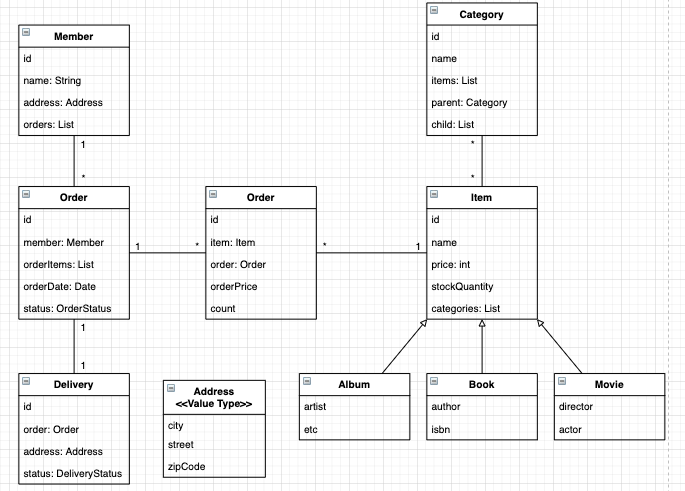

## 요구사항

* 회원 기능
    * 회원 등록
    * 회원 조회
* 상품 기능
    * 상품 등록
    * 상품 수정
    * 상품 조회
* 주문 기능
    * 상품 주문
    * 주문 내역 조회
    * 주문 취소
* 기타 요구사항
    * 상품의 종류는 도서, 음반, 영화
    * 상품을 카테고리로 구분할 수 있다.
    * 상품 주문 시 배송 정보를 입력할 수 있다.

## 도메인 설계




* 회원/주문/상품의 관계
    * 회원은 여러 상품을 주문 할 수 있다.
    * 한번 주문할 때 여러 상품을 선택할 수 있다.
        * 주문-상품 -> n:m
        * n:m 을 주문-주문상품-상품(물품) 으로 1:n n:1 관계로 변경하였다.
* 상품 분류
    * 상품은 도서/음반/영화로 구분된다.
    * '상품' 이라는 공통 속성을 사용하므로 상속 구조로 표현하였다.
* 회원
    * 주문한 상품과 임베디드 타입인 Address 를 가진다.
* 주문
    * 한번에 여러 상품을 주문할 수 있다. (1:n)
    * 주문 상태는 열거형으로 사용하였다.
* 주문상품
    * 주문한 상품에 대한 정보를 가진다.
* 상품
    * 상품에 대한 저보를 가진다.
    * 상품을 주문하면 재고수량 (stockQuantity) 가 줄어든다.
    * DTYPE 을 통해 각 상품의 종류를 구분한다.
* 배송
    * 주문시 배송 정보를 생성하며, 주문과 배송은 1:1 관계이다.
* 카테고리
    * 상품과 n:m 관계를 가진다.

### Repository

* 대부분 데이터 접근 계층은 CRUD (등록/조회/수정/삭제) 를 반복해서 개발한다.
* 반복되는 문제를 해결하려면 제네릭과 상속을 적절히 사용해서 공통 부분을 처리하는 부모 클래스를 만들어서 처리할 수 있다.
    * 이러한 방식을 GenericDAO 라고 한다.
    * 하지만 이 방법은 공통 기능을 구현한 부모 클래스에 너무 종속되고 구현 클래스 상속이 가지는 단점에 노출된다.
* 스프링 데이터 JPA 가 이러한 반복되는 CRUD 문제를 해결해준다.
    * Repository 를 개발할 떄 인터패ㅔ이스만 작성하면 실행 시점에 스프링 데이터 JPA 가 구현 객체를동적으로 생성해서 주입해준다.
    * 데이터 접근 계층을 개발할 때 구현 클래스 없이 인터페이스만 작성해도 개발을 완료할 수 있다.
    
```java
public interface EntityRepository extends JpaRepository<Entity, Long> {
    // JpaRepository<Entity, 식별자 타입>
    // 기본적인 CRUD (save, findOne, findAll ...) 은 JpaRepository 에서 제공한다.
    Entity findByField(String field);
    // findByField 와 같이 직접 작성한 공통으로 처리할 수 없는 메소드는
    // 스프링 데이터 JPA 가 메소드 이름을 분석해서 JPQL 을 실행한다.
    // select e from Entity e where field = :field
}
```
