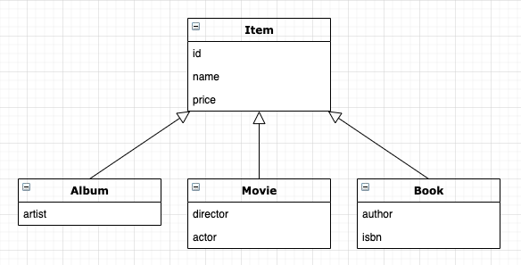

## 예외 처리

* JPA 표준 예외들은 javax.persistence.PersistenceException 의 자식 클래스이고, RuntimeException 의 자식이다.
    * 즉, 모든 JPA 예외는 언체크 예외이다.

### JPA 표준 예외

* 트랙잭션 롤백을 표시하는 예외
   * 이러한 예외가 발생하면, 트랜잭션을 강제로 커밋해도 트랜잭션이 커밋되지 않고, RollbackException 이 발생한다.
    
| 예외 | 설명 |
| ---- | ---- |
| EntityExistsException | EntityManager.persist(..) 호출 시 이미 같은 엔티티가 존재할 경우 발생 |
| EntityNotFoundException | EntityManager.getReference(...) 를 호출 후 해당 엔티티를 사용하였으나, 엔티티가 존재하지 않으면 발생 <br/> refresh(..), lock(..) 에서 발생할 수 있다. |
| OptimisticLockException | 낙관적 락 충돌 시 발생 |
| PessimisticLockException | 비관적 락 충돌 시 발생 |
| RollbackException | EntityTransaction.commit() 실패 시 발생 <br/> 롤백이 표시되어 있는 트랜잭션 커밋 시에도 발생 |
| TransactionRequiredException | 트랜잭션이 필요할 때 트랜잭션이 없으면 발생 <br/> 트랜잭션 없이 엔티티를 변경할 때 주로 발생 |

* 트랜잭션 롤백을 표시하지 않는 예외
    * 개발자가 트랜잭션을 커밋할지 롤백할지 판단해서 처리할 수 있다.
    
| 예외 | 설명 |
| ---- | ---- |
| NoResultException | Query.getSingleResult() 호출 시 결과가 없을 때 발생 |
| NonUniqueResultException | Query.getSingleResult() 호출 시 결과가 둘 이상일 때 발생 |
| LockTimeoutException | 비관적 락에서 시간 초과 시 발생 |
| QueryTimeoutException | 쿼리 실행 시간 초과 시 발생 |

### 스프링 프레임워크의 JPA 에외 변환

* 서비스 계층에서 JPA 예외를 직접 사용하면 JPA 에 의존하게 된다.
    * 스프링 프레임워크는 이러한 문제를 해결하기 위해 데이터 접근 계층에 대한 예외를 추상화하여 개발자에게 제공한다.
* EntityExistsException -> DataIntegrityViolationException
* EntityNotFoundException -> JpaObjectRetrievalFailureException
* OptimisticLockException -> JpaOptimisticLockingFailureException
* PessimisticLockException -> PessimisticLockingFailureException
* RollbackException -> kkkTransactionSystemException
* TransactionRequiredException -> InvalidDataAccessApiUsageException
* NoResultException -> EmptyResultDataAccessException
* NonUniqueResultException -> IncorrectResultSizeDataAccessException
* LockTimeoutException -> CannotAcquireLockException
* QueryTimeoutException -> kQueryTimeoutException
* PersistenceException -> JpaSystemException
* java.lang.IllegalStateException -> InvalidDataAccessApiUsageException
* java.lang.IllegalArgumentException -> InvalidDataAccessApiUsageException

### 스프링 프레임워크에 JPA 얘외 변환 적용

* JPA 예외를 스프링 프레임워크의 추상화된 예외로 변환할 때는 PersistenceExceptionTranslationPostProcessor 를 스프링 빈으로 등록하면 된다.
    * @Repository 어노테이션을 사용한 곳에 예외 변환 AOP 를 적용하면 스프링 프레임워크의 추상화된 예외로 변환된다.

```xml
<bean class="...PersistenceExceptionTranslationPostProcessor" />
```

```java
@Bean
public PersistenceExceptionTranslationPostProcessor exceptionTranslation(){
    return new PersistenceExceptionTranslationPostProcessor();
}

...

@Reposiroy
public class NoResultExceptionTestRepository {
    ...
    
    public Entity findMember() {
        return em.createQuery("select e from Entity e")
                .getSingleResult();
        // 해당 쿼리에 조회된 결과가 없다면 kNoResultException 이 발생한다.
        // 하지만, 해당 예외가 findMember 를 바쪄나갈 때 APO 에 의해 EmptyResultDataAccessException 예외로 변환해서 반환한다.
    }

    public Entity findMember2() throws javax.persistence.NoResultException {
        // AOP 에 의해 변환된 예외가 아닌, JPA 예외를 받고 싶다면 throws 에 해당하는 예외를 명시하면 된다.
        return em.createQuery("select e from Entity e")
                .getSingleResult();
    }
}
```

### 트랜잭션 롤백 시 주의사항

* 트랜잭션을 롤백하는 것은 데이터베이스의 반영사항만 롤백하는 것이다.
    * 즉, 자바 객체까지 원상복구 되지 않는다.
    * 엔티티가 수정된 상태로 롤백이 된다면, 영속성 컨텍스트에는 수정된 엔티티가 그대로 존재하게 된다.
    * 따라서 롤백된 엔티티를 그대로 사용하는 것은 위험하다.
* 해결방법
    * 새로운 영속성 컨텍스트를 생성
    * EntityManager.clear() 를 통해 초기화 후 사용
* 이러한 이슈로 인해 스프링 프레임워크가 해결하는 방식
    * 기본 전략인 영속성 컨텍스트 전략은 문제가 발생하면 AOP 종료 시점에 트랜잭션을 롤백하면서 영속성 컨텍스트도 종료한다.
    * OSIV 등과 같이 영속성 컨텍스트의 범위를 트랜잭션 범위보다 넓게 사용 할 경우에 문제가 발생한다.
        * 이럴때는 트랜잭션 롤백시 영속성 컨텍스트를 초기화 한다.
    * [더 자세한 내용](https://docs.spring.io/spring-framework/docs/current/javadoc-api/org/springframework/transaction/support/AbstractPlatformTransactionManager.html#doRollback-org.springframework.transaction.support.DefaultTransactionStatus-)

## 엔티티 비교

* 1차 캐시는 영속성 컨텍스트와 생명주기를 같이하며, 1차 캐시에 영속성 컨텍스트 내부에 엔티티 인스턴스를 보관한다.
    * 1차 캐시에 데이터가 있으면, 데이터베이스에 접근하지않고 데이터를 바로 조회할 수 있다.
    * 1차 캐시의 가장 큰 장점은 애플리케이션 수준의 반복 가능한 읽기가 있다.
        * 같은 영속성 컨텍스트 내부라면, 같은 데이터에 대해서는 주소값이 같은 같은 데이터가 반환된다.
        * 즉, 동일성 (==) 와 동등성 (equals), 데이터베이스 동등성(@Id) 의 비교가 같다.
        * 반대로 이야기하면, 트랜잭션이 다르다면 다른 객체를 반환한다.
            * 하지만 데이터베이스 동등성(@Id) 은 같다.
* 트랜잭션이 어러개가 있다면, 먼저 시작된 트랜잭션을 이어서 받아 사용한다.
    * 물론 다른 전략으로 설정을 변경할 수 있다.
    
```java
@Transacional
public void someFunction() {
    Entity entity = Entity(1L);
    em.persist(entity);
    
    Entity otherEntity = em.find(1L);
    
    AssertTrue(entity == otherEntity);
}
```

## 프록시 심화 주제

* 프록시는 원본 엔티티를 상속받아서 만들어진다.
    * 원본 엔티티를 사용하다가 프록시로 변경하여도, 비즈니스 로직에 변경이 필요없다.

### 영속성 컨텍스트와 프록시

```java
Entity refEntity = em.getReference(Entity.class, 1L);
Entity entity = em.find(Entity.class, 1L);
// 위 2개의 결과는 프록시는 같은 프록시 객체를 반환한다.
// 즉, find 로 객체를 조회하더라도, 같은 객체를 이전에 프록시 객체가 영속성 컨텍스트에 존재한다면 프록시 객체를 반환한다.

...
Entity entity = em.find(Entity.class, 1L);
Entity refEntity = em.getReference(Entity.class, 1L);
// 하지만, 반대로 객체를 찾은 후 같은 객체를 프록시 객체로 조회한다면
// 프록시 객체가 아닌 영속성 컨텍스트에 존재하는 실 객체가 리턴된다.
```

### 프록시 타입 비교

* 프록시 객체는 원본 엔티티를 상속 받아 만들어지므로, 프록시의 타입을 비교할 때 **==** 비교가 아닌 **instancof**로 비교해야 한다.

```java
...
Entity ref = em.getReference(Entity.class, 1L);

print(ref == Entity.class); // false
print(ref instanceof Entity.class); // true
```

### 프록시 동등성 비교

* 프록시의 타입 비교는 == 비교 대신 instanceof 를 사용해야 한다.
* 프록시 멤버변수에 직접 접근해서는 안되고, 접근자 메소드를 사용해야 한다.
    * 프록시는 실제 데이터를 가지고 있지 않고 있으며, 그렇기에 직접 접근하면 null 이 리턴된다.

### 상속관계와 프록시



```java
Book book = new Book(1L);
em.persist(book);

Item proxyItem = em.getReference(Item.class, book.getId());
// Item 객체를 Book 기반으로 조회했지만, Item 엔티티를 기준으로 프록시 객체로 조회하였으므로
// Item 엔티티를 기반으로 프록시 객체가 생성된다.

if (proxyItem instanceof book) {
    // 즉, 해당 if 분기는 false 를 리턴하면서 아래 로직은 실행되지 않는다.
    Book convertBook = (Book) proxyItem;
    // 또한, proxyItem 은 Item 기준으로 생성되었기 때문에 다운캐스팅 시 ClassCastException 이 발생한다.
    print(convertBook.getAuthor());
}

// 결론적으로 프록시를 부모 타입으로 조회하면 부모의 타입을 기반으로 프록시가 생성되는 문제가 생한다.
// instanceof 연산을 사용할 수 없다.
// 하위 타입으로 다운캐스팅을 할 수 없다.

...

@Entity
public class Entity {
    ...
    
    @ManyToOne(fetch = FetchType.LAZY)
    private Item item;
    
    ...
}

Entity entity = em.find(Entity.class, 1L);
// entity 의 item 은 프록시 객체로 로딩되고
// 위의 문제들이 여기에서 발생할 수 있다.
// 이러한 상속관계의 프록시 문제는 JPQL 로 대상을 직접 조회하거나, 위 문제가 발생하기 전에 프록시를 해제하면 된다.
// 프록시 해제는 내부 객체를 조회하거나, 하이버네이트의 unProxy 와 같은 기능을 사용하면 된다.
```

### 기능을 위한 별도의 인터페이스 제공


```java
public interface TitleView {
    String getTitle();
}

@Inheritance(strategy = InheritanceType.SINGLE_TABLE)
@DiscriminatorColumn(name = "DTYPE")
public abstract class Item implements TitleView {
    ...
    
    // getTitle 구현은 Item 을 사용한 엔티티에서 구현한다.
}

@Entity
public class kOrderItem {
    ...
    
    @ManyToOne(fetch = FetchType.LAZY)
    private Item item;
    
    ...
    
    public void someFunc() {
        print(item.getTitle());
    }
}
```

* 인터페이스를 제공하고 각각의 클래스가 기능을 구현하면 다형성을 활용하는 방법이 좋을 수 있다.
* 상속받은 엔티티가 프록시여부인지 확인할 필요가 없다.

### 비지터 패턴


* 비지터 패턴은 visitor 와 visitor 를 받아들이는 대상 클래스로 구성된다.

```java
public interface Visitor {
    void visit(Book book);

    void visit(Album album);

    void visit(Movie movie);
}

public class fooVisitor implements Visitor {
    @Override
    public void visit(Book book) {
        ...
        // 여기에 전달받는 클래스에 해당하는 로직을 구현한다.
    }
    
    ...
}
// 위와 같은 visitor 를 구현한 클래스만 만들고, 비즈니스 로직에서 필요한
// visitor 만 넘겨주면 사용이 가능하므로, 확정성에서도 유리하다.

...
public abstract class Item {
    ...
    
    public abstract void accept(Visitor visitor);
}

...

public class Book extends Itemk {
    ...
    
    @Override
    public void accept(Visitor visitor) {
        visitor.visit(this);
        // Book 객체가 프록시를 넘기더라도, 프록시가 accept 를 실행하고,
        // 원본 엔티티 의 accept 를 실행한다.
        // 원본 엔티티는 this 를 넘기므로, 해당 클래스의 구현된 visitor 를 실행한다.
        // 즉, visitor 패턴을 사용하면 프록시 걱정 없이 우너본 엔티티에 접근할 수 있다.
        // 또한, instanceof 나 타입캐스팅 없이도 구현이 가능하다.
    }
}

...

Item item = em.find(Item.class, 1L);
item.accept(new fooVisitor.class);
item.accept(new barVisitor.class);
// 모든 로직 처리는 visitor 에게 위임하고, visitor 를 구현한 객체들은 자기 자신을 visitor 에게 전달해주기만 한다.
```

* 비지터 패턴 장점
    * 프록시에 대한 걱정없이 안전하게 원본 엔티티에 접근이 가능하다.
    * instanceof 와 타입캐스팅 없이 코드를 구현할 수 있다.
    * 알고리즘과 객체 구조를 분리해서 구조를 수정하지 않고 새로운 동작을 추가할 수 있다.
* 비지터 패턴 단점
    * 너무 복잡하고 더블 디스패치를 사용하기 때문에 이해하기 어렵다.
        * [더블 디스패치](https://multifrontgarden.tistory.com/133)
    * 객체 구조가 변경되면 모든 Visitor 를 수정해야 한다.
