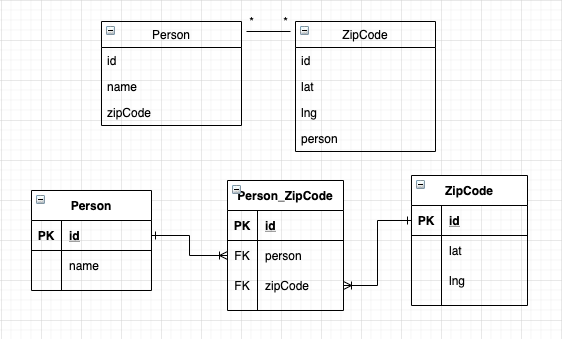
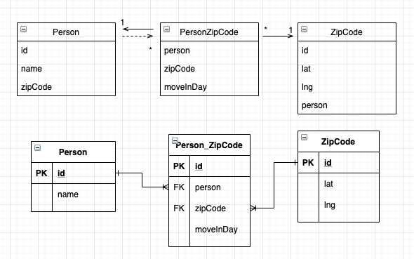

# 다대다



* 사람당 최소 1개 이상의 집에 속해있다는 가정을 하면 위와 같은 관계가 나온다.
* 다대다의 경우 관계형 데이터베이스에서 정규화된 2개의 테이블로 표현할 수 없고, 연결 테이블을 사용해야 한다.
* JPA 에서는 2개의 엔티티로 표현할 수 있으며, @ManyToMany 로 매핑하면 된다.

```java
@Entity
public class Person {
    ...
    
    @ManyToMany
    @JoinTable(name = "Person_ZipCode", joinColumns = @JoinColumn(name = "person"), inverseJoinColumns = @JoinColumn(name = "zipCode"))
    private List<ZipCode> zipCodes = new ArrayList<ZipCode>();
    
    ...
}

...

Pserson pserson = em.find(Person.class, 1);
List<ZipCode> zipCodes = person.getZipCodes();
for (ZipCode zipCode: zipCodes) {
    ...
    // 객체 그래프 탐색이 가능하다.
    // 해당 탐색을 사용할 때, 해당하는 데이터를 찾는 select 쿼리를 실행한다.
    // ManyToMany 의 기본 동작이 Lazy 로 동작하기 때문이다.
}
```

* @JoinTable 의 속성

| 속성 | 기능 |
| ---- | ---- |
| name | 연결 테이블을 지정한다. |
| joinColumns | 현재 방향인 사람 테이블과 매핑할 조인 컬럼 정보를 지정한다. |
| inverseJoinColumns | 반대 방향인 우편번호와 매핑할 조인 컬럼 정보를 지정한다. |

```java
@Entity
public class ZipCode {
    ...
    
    @ManyToMany(mappedBy = "zipCodes")
    private List<Person> people = new List<Person>();
    // 양방향으로 매핑할 경우, 위 필드를 추가해주면 된다.
    // mappedBy 를 지정한 곳(사용한 곳이 아니다)이 연관관계의 주인이다.
    // 양방향일 경우, 연관관계 편의 메소드를 통해 관리하는 것이 편리하다.
}
```

* 간단하게 다대다 매핑을 설정 할 수 있지만, 만약 해당 우편번호에 입주한 날짜가 추가된다고 가정해보자.



* person 이나, zipCode 에 속한 값이 아닌 관계에 의한 값이 생기면 해당 연관테이블에 컬럼이 추가가 된다.
* 하지만 ManyToMany 로 연관관계를 만들면, 연관관계 테이블에 대한 정보를 사용할 수 없다.
* 결국 ManyToOne, OneToMany 관계로 풀어내어 사용하면 위 관계를 사용할 수 있다.

```java
@Entity
public class Person {
    ...
    
    @OneToMany(mappedBy = "person")
    private List<PersonZipCode> personZipCodes = new ArrayList<PersonZipCode>();
    
    ...
}

@Entity
public class PersonZipCode {
    ...
    
    @ManyToOne
    @JoinColumn(name = "person")
    private Person pserson;
    
    @ManyToOne
    @JoinColumn(name = "zipCode")
    private ZipCode zipCode;
    ...
}

// 연관테이블에 @IdClass 어노테이션을 사용해서 연관관계간의 복합 기본키를 통한 관리를 할 수 있다.
// 하지만, 그냥 평소하듯 id 로 해서 기존에하듯 연관관계 테이블에 기본키를 줘도 사용할 수 있다.
```

# 정리

* N:M -> 1:N - N:1 관계로 풀어내기 위해서는 연결 테이블을 만들 때 식별자를 어떻게 구성할지 선택해야 한다.
* 식별 관계 - 받아온 식별자를 기본키 + 외래키로 사용해야 한다.
  * @IdClass 를 통해 관리하는 경우
* 비식별 관계 - 받아온 식별자는 외래키로만 사용하고 새로운 식별자를 추가한다.
  * 연관관계 테이블에 별도의 식별자(id)를 사용하여 관리하는 경우
  * ORM 관계에서 훨신 단순하고 사용하기 편하다.
