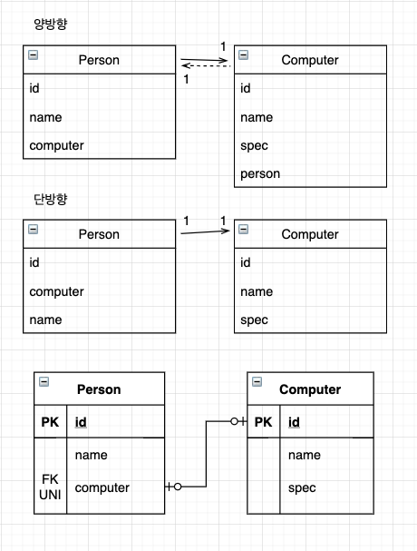

# 일대일



* 일대일의 특징
    1. 1:1 의 반대도 1:1 이다.
    2. N:1 에서 N 이 외래키를 가지지만, 1:1 에서는 둘중 어느곳이든 외래키를 가질 수 있다.
        * 즉, 주테이블이나 대상 테이블 둘중에 하나를 선택하여 외래키를 가질지 선택해야 한다.

## 주 테이블이 외래키를 가지는 경우

* 외래키를 객체 참조와 비슷하게 사용할 수 있다.
* 주 테이블만 확인해도 대상 테이블과 연관관계의 값을 확인할 수 있다.
* JPA 를 사용할 때, 편리하게 매핑할 수 있다.
* 1:1 관계를 나타내기 위해 unique 제약조건을 추가했다.

```java
@Entity
public class Person {
    ...
    
    @OneToOne
    @JoinColumn(name = "computer")
    private Computer computer;

    ...
}

@Entity
public class Computer {
    ...
    
    @OneToOne(mappedBy = "computer")
    private Person person;
    // 단방향일 경우, 해당 필드는 정의하지 않는다.

    ...
}
```

## 대상 테이블에 외래키를 가지는 경우

* 1:1 -> N:1 로 변경할 때 테이블 구조를 그대로 유지할 수 있다.
* 대상 테이블에 외래키를 가지는 단방향은 JPA 에서 지원하지 않는다.
    * 단방향 방향을 변경하거나, Computer 를 연관관계의 주인으로 설정해야 한다.
    * 참고로 JPA2.0 부터 1:N 단방향 관계 중, 대상 테이블에 외래 키가 있는 매핑을 허용한다.
* 대상 테이블에 외래키를 가지는 경우에는 양방향 관계만 가능하다.
    * 주 대상 테이블인 Person 이 아닌, 대상 엔티티인 Computer 가 연관관계 주인으로 만들어서 관계를 설정한다.
    
```java
@Entity
public class Person {
    ...
    
    @OneToOne(mappedBy = "person")
    private Computer computer;
    // 대상 테이블에 외래키를 가지는 경우, 해당 필드에 대해 지연로딩을 설정하여도 즉시 로딩된다.

    ...
}

@Entity
public class Computer {
    ...
    
    @OneToOne
    @JoinColumn(name = "person")
    private Person person;

    ...
}
```
