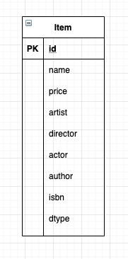
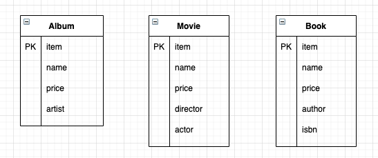

# 상속 관계 매핑


* 객체의 상속 관계를 데이터베이스에 어떻게 매핑하는가?
  * 관계형 데이터베이스에는 객체지향 언어에서의 다루는 상속 개념이 없다.
  * 비슷한 개념으로는 슈퍼타입-서브타입 관계 모델링 기법이 있다.
* 슈퍼타입-서브타입 관계 모델을 테이블로 구현할 때
  1. 각각의 테이블로 변환
     * 모든 객체를 테이블로 만들고, 조회할 때 조인을 통해 사용한다.
     * JPA 에서는 조인 전략이라고 한다.
  2. 통합 테이블로 변환
     * 모든 객체를 하나의 테이블로 통합해서 사용한다.
     * JPA 에서는 단일 테이블 전략이라고 한다.
  3. 서브타입 테이블로 변환
     * 서브타입마다 하나의 테이블을 만든다.
     * JPA 에서는 구현 클래스마다 테이블 전략이라고 한다.

## 조인 전략


* 엔티티 각각을 모두 테이블로 만들고, dtype 이라는 컬럼으로 구분해서 구분한다.
* 자식 테이블이 부모 테이블의 기본키를 이용하여 기본키와 외래키 두가지의 역할로서 사용한다.
  * 조회할 때 조인을 계속 사용해야 한다.
  
```java
@Entity
@Inheritance(strategy = InheritanceType.JOINED)
// JOINED 전략임을 명시해준다.
// 상속 매핑은 부모 클래스에 해당 어노테이션을 사용해야 한다.
@DiscriminatorColumn(name = "DTYPE")
// 해당 어노테이션을 통해 부모 클래스에서 구분되어질 컬럼을 명시해준다.
// 기본값은 DTYPE 이다.
public abstract class Item {
    @Id
    @GeneratedValue
    private Long id;
    ...
}

@Entity
@DiscriminatorValue("A")
// 엔티티를 저장할 때 구분 컬럼에 입력할 값을 넣는다.
// 자식 테이블의 기본 키 컬럼명을 @PrimaryKeyJoinColumn 을 통해 명시적으로 변경할 수 있다.
public class Album extends Item {
    // 별도로 item 필드는 작성하지 않아도 된다.
    ...
}

@Entity
@DiscriminatorValue("M")
public class Album extends Item {
    // 별도로 item 필드는 작성하지 않아도 된다.
    ...
}

@Entity
@DiscriminatorValue("B")
public class Album extends Item {
    // 별도로 item 필드는 작성하지 않아도 된다.
    ...
}
```

* 장점
  1. 테이블이 정규화 된다.
  2. 외래키 참조 무결성 제약조건을 활용할 수 있다.
  3. 저장공간을 효율적으로 사용한다.
* 단점
  1. 조회할 때 조인이 많이 사용되어서 성능 저하가 될 수 있다.
  2. 조회 쿼리가 복잡하다.
  3. 데이터 추가시, insert SQL 이 2번 실행된다.

## 단일 테이블 전략



* 하나의 테이블에 상속을 받는 모든 정보를 담는 형태이다.
* 조인이 필요없고, dtype 으로 구분한다.

```java
@Entity
@Inheritance(strategy = InheritanceType.SINGLE_TABLE)
// SINGLE_TABLE 전략임을 명시해준다.
@DiscriminatorColumn(name = "DTYPE")
// 구분 컬럼을 꼭 사용해야하며, 단일 테이블 전략에서 해당 어노테디션은 필수적으로 명시되어야 한다.
public abstract class Item {
    @Id
    @GeneratedValue
    private Long id;
    ...
}

@Entity
@DiscriminatorValue("A")
public class Album extends Item { ... }

@Entity
@DiscriminatorValue("M")
public class Movie extends Item { ... }

@Entity
@DiscriminatorValue("B")
public class Book extends Item { ... }
```

* 장점
    1. 조인이 필요 없으므로 일반적으로 조회 성능이 제일 빠르다.
    2. 조회 쿼리가 단순하다.
* 단점
    1. 자식 엔티티가 매핑한 컬럼은 모두 null 이다.
    2. 단일 테이블에 모든 것을 저장하므로 테이블이 커질 수 있다. 그로인해 조회속도가 느려질 수 있다.
    
## 구현 클래스마다 테이블 전략



* 자식 엔티티마다 테이블을 만들고, 자식테이블에서 별도로 필요한 컬럼들을 각 테이블에 추가한다.
* 구분 컬럼(dtype)을 사용하지 않는다.
* 일반적으로 추천하지 않는 방식이다.

```java
@Entity
@Inheritance(strategy = InheritanceType.TABLE_PER_CLASS)
// TABLE_PER_CLASS 전략임을 명시해준다.
public abstract class Item {
    @Id
    @GeneratedValue
    private Long id;
    ...
    // 공통된, 상속이 되어야 할 필드들을 정의해준다.
}

@Entity
@DiscriminatorValue("A")
public class Album extends Item { ... }
// 해당 테이블에만 존재하는 필드드만 적으면 된다.

@Entity
@DiscriminatorValue("M")
public class Movie extends Item { ... }

@Entity
@DiscriminatorValue("B")
public class Book extends Item { ... }
```

* 장점
    * 서브타입을 구분해서 처리할 때 효과적이다.
    * not null 제약조건을 사용할 수 있다.
* 단점
    * 여러 자식 테이블을 함께 조회할 때 성능이 느리다. (UNION 을 사용해야 한다.)
    * 자식 테이블을 통합해서 쿼리하기 어렵다.
