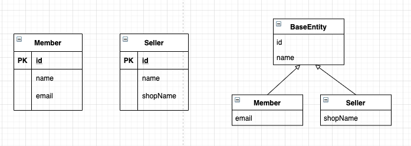

# @MappedSuperclass



* 부모 클래스는 테이블과 매핑하지 않고 부모 클래스를 상속받는 자식 클래스에게 매핑 정보만 제공하고 싶은 경우 사용한다.
* 단순히 매핑 정보를 상속할 목적으로만 사용한다.
* 위 어노테이션의 특징
    * 테이블과 매핑되지 않고 자식 클래스에 엔티티의 매핑 정보를 상속하기 위해 사용한다.
    * 해당 어노테이션이 있는 클래스는 엔티티가 아니므로, em.find()/JPQL 에서 사용할 수 없다.
    * 해당 클래스를 직접 사용할 일은 거의 없으므로, 추상 클래스로 만드는것을 권장한다.
    * Id, createAt, modifiedAt, owner, creator ... 등과 같은 여러 엔티티에서 공통적으로 사용하는 속성을 관리할 수 있다.
* 참고로 @Entity 는 @Entity 이거나, @MappedSuperclass 로 지정된 클래스만 상속받을 수 있다.

```java
@MappedSuperclass
// 해당 어노테이션을 통해 상속을 받으면 해당 필드를 엔티티에 추가할 수 있음을 알려준다.
public abstract class BaseEntity {
    @Id
    private Long id;
    
    private String name;
    ...
}
// 객체들이 주로 사용하는 공통 매핑 정보를 정의

@Entity
public class Member extends BaseEntity {
    // 상속을 통해 공통 정보를 그대로 사용할 수 있다.
    private String email;
    ...
}

@Entity
public class Seller extends BaseEntity {
    private String shopName;
}

// @AttributeOverride(s) 를 통해 물려받은 매핑 정보를 재정의 할 수 있다.
// @AssociationOverride 를 통해 물려받은 연관관계를 재정의 할 수 있다. 
```
