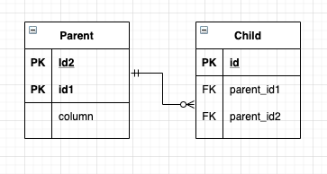
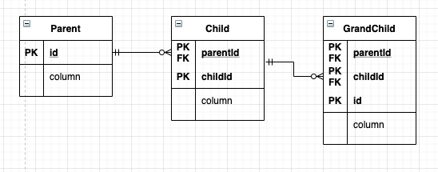
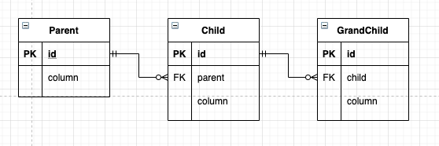
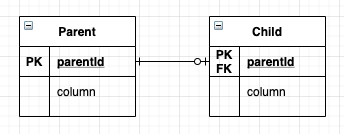

# 식별관계 vs 비식별관계


* 식별관계 - 부모 테이블의 기본키를 내려받아 자식 테이블의 기본키 + 외래키로 사용하는 관계
* 비식별관계 - 부모 테이블의 기본키를 받아서 자식 테이블의 외래키로만 사용하는 관계
    * 비식별관계에서 자식 테이블에 FK 컬럼의 nullable 의 허용(선택적 비식별 관계)과 불허용(필수적 비식별 관계)에 따라 종류가 나눠진다.

## 비식별 관계 매핑

* 둘 이상의 식별자를 단순히 @Id 로 매핑하면 매핑 오류가 발생한다.
    * JPA 영속성 컨텍스트에 엔티티를 보관할 때 엔티티의 식별자를 키로 사용한다.
    * 식별자 구분을 위해 equals 와 hashCode 를 사용하여 동등성 비교를 한다.
    * 위의 이유로 식별자 필드가 2개 이상이면, 별도의 식별자 클래스를 만들고 그곳에 equals 와 hashcode 를 구현해야 한다.
* JPA 에서 복합키를 지원하기 위해 @IdClass 와 @EmbeddedId 2가지 방법이 있다.
    * @IdClass 는 관계형 데이터베이스에 가까운 방법이다.
    * @EmbeddedId 는 객체지향에 가까운 방법이다.

### 비식별 @IdClass



* 비식별 관계 + 복합 기본키 erd

```java
public class ParentId implements Serializable {
    // @IdClass 에 쓰일 클래스의 조건
    // 1. 식별자 클래스의 속성명과 엔티티에서 사용하는 식별자의 속성명이 같아야 한다.
    // 2. Serializable 인터페이스를 구현해야 한다.
    // 3. eqauls, hashCode 를 구현해야 한다.
    // 4. 기본 생성자가 있어야 한다.
    // 5. 식별자 클래스는 public 이어야 한다.
    
    private Long id1;
    private Long id2;
    
    public ParentId() {}
    public ParentId(Long id1, Long id2) {...}
    
    @Override
    public boolean equals(Object o) {...}
    
    @Override
    public int hashCode() {...}
}

@Entity
@IdClass(ParentId.class)
public class Parent {
    @Id
    private Long id1;
    
    @Id
    private Long id2;
    
    ...
}

@Entity
public class Child {
    @Id
    private Long id;
    
    @ManyToOne
    @JoinColumns({
        @JoinColumn(name = "parentId1", referencedColumnName = "id1"),
        @JoinColumn(name = "parentId2", referencedColumnName = "id2")
    })
    private Parent parent;
}

...

Parent parent = new Parent();
parent.setId1(1);
parent.setId2(2);


em.persist(parent);
// ParentId 클래스를 따로 지정하지 않더라도,
// JPA 에서 알아서 내부적으로 셋팅하여 식별자 클래스인 ParentId 를 생성하여
// 영속성 컨텍스트의 키로 사용한다.

ParentId parentId = new ParentId(1, 2);
Parent parent = em.find(Parent.class, parentId);
// 식별자 클래스를 통해 엔티티를 조회할 수 있다.
```

### 비식별 @EmbeddedId


```java
@Embeddable
public class ParentId implements Serializable {
    // @Embeddable 어노테이션을 붙이고
    // 그 외에는 @classId 의 조건들을 모두 만족하는 형태이면
    // @EmbeddedId 로 복합키를 사용할 수 있다.
    ...
}

@Entity
public class Parent {
    @EmbeddedId
    private ParentId id;
    
    ...
    
}

// 생성, 조회 등은 @classId 와 똑같다.
```

### 복합키의 equals 와 hashCode

* 위 그림에서 키가 클래스로 분리되어 해당 클래스를 통해 동등성 비교 후 엔티티를 식별한다.
* 자바의 기본적인 equals 는 Object 의 equals 를 사용하는데, 이는 참조 비교인 == 을 리턴한다.

```java
ParentId parentId1 = new ParentId(1,2);
ParentId parentId2 = new ParentId(1,2);

parentId.getId1().eqauls(parentId2.getId1()); // true
parentId.getId2().eqauls(parentId2.getId2()); // true
parentId.eqauls(parentId2); // false
```

* 위와 같은 결과가 나오므로, 복합키를 JPA 에서 사용할 경우 equals 와 hashCode 를 잘 구현해야 한다.

### 참고

* 복합키에는 @GenerateValue 를 사용할 수 없다.

## 복합키 - 식별 관계 매핑

### @ClassId



```java
public class ChildId implements Serializable {
    private Long parentId;
    private Long childId;
    
    // equals, hashCode override
}

public class GrandChildId implements Serializable {
    private ChildId childId;
    private Long id;
    
    // equals, hashCode override
}

@Entity
public class Parent {
    @Id
    private Long id;
    ...
}

@Entity
@IdClass(ChildId.class)
public class Child {
    @Id
    @ManyToOne
    // 식별 관계는 기본키와 외래키를 같이 매핑해야 한다.
    // 따라서 식별자 매핑인 @Id 와 연관관계 매핑인 @ManyToOne 을 같이 사용한다.
    public Parent parent;
    
    @Id
    private Long childId;
    
    ...
}

@Entity
@IdClass(GrandChildId.class)
public class GrandChild {
    @Id
    @ManyToOne
    @JoinColumns({
        @JoinColumn(name = "parentId"),
        @JoinColumn(name = "childId")
    })
    private Child child;
    
    @Id
    private Long id;
    ...
}
```

### @EmbeddedId

```java
@Embeddable
public class ChildId implements Serializable {
    private Long parentId;
    private Long childId;
    
    // equals, hashCode override
}

@Embeddable
public class GrandChildId implements Serializable {
    private ChildId childId;
    private Long id;
    
    // equals, hashCode override
}

@Entity
public class Parent {
    @Id
    private Long id;
    ...
}

@Entity
public class Child {
    @EmbeddedId
    private Child id;
    
    @MapsId("parentId") // ChildId.parentId 매핑
    @ManyToOne
    @JoinColumn(name = "parentId")
    public Parent parent;
    
    ...
}

@Entity
public class Gran dChild {
    @EmbeddedId
    private GrandChildId id;
    
    @MapsId("childId") // GrandChildId.childId 매핑
    @ManyToOne
    @JoinColumns({
        @JoinColumn(name = "parentId"),
        @JoinColumn(name = "childId")
    })
    private Child child;
    
    ...
}

// @ClassId 와 다른점은 @MpasId 를 통해 매핑한 점이다.
// 해당 어노테이션은 외래키와 매핑한 연관관계를 기본키에도 매핑한다는 의미이다.
//. @EmbeddedId 의 속성에는 사용한 식별자 클래스의 기본키 필드를 지정해주면 된다.
```

## 비식별 관계로 구현



```java
@Entity
public class Parent {
    @Id
    @GeneratedValue
    private Long id;
    
    ...
}

@Entity
public class Child {
    @Id
    @GeneratedValue
    private Long id;
    
    @ManyToOne
    private Parent parent;
    
    ...
}

@Entity
public class GrandChild {
    @Id
    @GeneratedValue
    private Long id;
    
    @ManyToOne
    private Child child;
    
    ....
}
```

* 식별 관계의 복합키를 사용한 코드보다 훨씬 단순해진다.
* 복합키가 없으므로, 복합키 설정을 위한 별도의 클래스도 생성하지 않아도 된다.

## 일대일 식별관계



* 자식 테이블의 기본키 값으로 부모 테이블의 기본키 값만을 사용한다.
* 즉, 부모 테이블의 기본키가 복합키가 아니면 자식 테이블의 기본키는 복합키로 구성하지 않아도 된다.

```java
@Entity
public class Parent {
    @Id
    @GeneratedValue
    private Long parentId;
    ...
}

@Entity
public class Child {
    @Id
    private Long parentId;
    
    @MapsId // Child.parentId 매핑
    @OneToOne
    private Parent parent;
    
    ...
}

...

Parent parent = new Parent();
parent.setParentId(1);
em.persist(parent);

Child child = new Child;
child.setParent(parent);
em.persist(child);
```

## 식별/비식별 관계의 장단점

### 식별-비식별 관계에서의 차이점

* 식별 관계는 부모 테이블의 기본키를 자식 테이블로 전파하면서 자식 테이블의 기본키 컬럼이 점점 늘어난다.
* 결국, join 을 할 때 SQL 이 복잡해진다.
* 식별 관계는 2개 이상의 컬럼을 합해서 복합 기본키를 만들어야 하는 경우가 많다.
* 비즈니스 관계에서의 관점
    * 식별 관계를 사용할 경우 기본키로 비즈니스 의미가 있는 자연키 컬럼을 조합하는 경우가 많다.
    * 비식별 관계의 기본키는 비즈니스와 전혀 관계없는 대리키를 주로 사용한다.
    * 비즈니스 요구사항은 시간이 지남에 따라 변할 수 있고, 식별 관계의 자연키 컬럼들이 자식에 손자까지 전파되면 변경이 힘들다.
* 식별 관계는 부모 테이블의 기본키를 자식 테이블의 기본키로 사용하므로 비식별 관계보다 테이블 구조가 유연하지 못하다.
* 일대일 관계를 제외하고 식별 관계는 2개 이상의 컬럼을 묶은 복합 기본키를 사용한다.
    * JPA 에서 복합키는 별도의 클래스를 만들어서 사용해야 한다.
    * 즉, 기본키가 하나인 경우보다 매핑하는데 추가적인 노력이 필요하다.
* 비식별 관계의 기본키는 주로 대리키를 사용하는데 JPA 는 @GenerateValue 등과 같이 대리키 생성을 위한 편리한 방법이 제공된다.


### 식별 관계의 장점

* 기본키 인덱스 활용이 좋다.
* 상위 테이블들의 기본키 컬럼을 자식, 손자 테이블이 가지고 있으므로 특정 상황에서 조인없이 하위 테이블만으로 조회가 가능하다.
