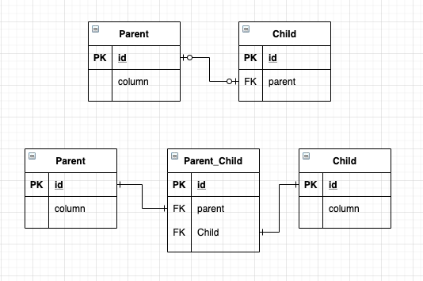

# 조인 테이블



* 테이블간의 연관관계를 설정하는 방법
    1. 조인 컬럼 사용 (FK)
    2. 조인 테이블 사용
* 컬럼 매핑은 @JoinColumn 으로, 조인 테이블은 @JoinTable 로 매핑한다.
* 조인 테이블은 주로 N:M -> 1:N, N:1 풀어내기 위해 사용하지만, 1:1, N:M 에서도 조인 테이블을 사용할 수는 있다.

## 1:1 조인 테이블

* 1:1 관계이므로, 조인 테이블의 FK 에 UNIQUE 제약 조건을 추가해줘야 한다.

```java
@Entity
public class Parent {
    @Id
    @GenerateValue
    private Long id;
    
    @OneToOne
    @JoinTable(
            name = "Parent_Child",
            joinColumn = @JoinColumn(name = "parent"),
            // 현재 엔티티를 참조하는 외래키
            inverseJoinColumns = @JoinColumn(name = "child")
            // 반대방향 엔티티를 참조하는 외래키
    )
    private Child child;
    
    ...
}

@Entity
public class Child {
    @Id
    @GenerateValue
    private Long id;
    
    @OneToOne(mappedBy = "child")
    // 단방향이면 해당 어노테이션은 제거해도 된다.
    private Parent parent;
    
    ...
}
```

## 1:N 조인 테이블

* 1:1 관계에서 N 쪽의 조인테이블 컬럼에 UNIQUE 제약조건을 없애야 한다.

```java
@Entity
public class Parent {
    ...
    
    @OneToMany
    @JoinTable(
            name = "Parent_Child",
            joinColumn = @JoinColumn(name = "parent"),
            inverseJoinColumns = @JoinColumn(name = "child")
    )
    private List<child> children = new ArrayList<Child>();
    
    ...
}
```

## N:1 조인 테이블

```java
@Entity
public class Parent {
    ...
    
    @OneToMany(mappedBy = "parent")
    private List<child> children = new ArrayList<Child>();
    
    ...
}

@Entity
public class Child {
    ...
    
    @ManyToOne
    @JoinTable(
            name = "Parent_Child",
            joinColumns = @JoinColumn(name = "child"),
            inverseJoinColumns = @JoinColumn(name = "parent")
    )
    private Parent parent;
}
```

## N:M 조인 테이블

```java
@Entity
public class Parent {
    ...
    
    @ManyToMany(
            name = "Parent_Child",
            joinColumns = @JoinColumn(name = "parent"),
            inverseJoinColumns = @JoinCOlumn(name = "child")
    )
    private List<child> children = new ArrayList<Child>();
    
    ...
}
```

## 참고

* 조인 테이블에 컬럼을 추가하면 @JoinTable 전략을 사용할 수 없다.
* 해당 상황에서는 새로운 엔티티를 만들어서 조인 테이블과 매핑해야 한다.
