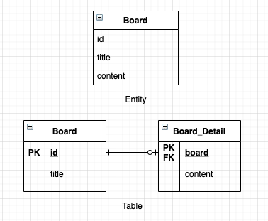

# 하나의 엔티티에 여러 테이블 매핑



* @SecondaryTable 어노테이션을 통해 하나의 엔티티에 여러 테이블을 매핑할 수 있다.

```java
@Entity
@Table(name = "Board")
@SecondaryTable(
            name = "Board_Detail",
            // 추가 매핑할 테이블의 이름
            pkJoinColumns = @PrimaryKeyJoinColumn(name = "board")
            // 매핑할 테이블의 기본 키 컬럼 속성
        )
// 해당 어노테이션을 통해, 추가 테이블 매핑 설정을 할 수 있다.
// @SecondaryTables 어노테이션을 통해, 여러 테이블을 매핑할 수 있다.
public class Board {
    ...
    
    private String title;
    // 따로 테이블을 지정하지 않으면, 기본 테이블인 Board 에 매핑이 된다.
    
    @Column(table = "Board_Detail")
    private String content;
    // Board_Detail 테이블과 매핑하여, 해당 테이블의 content 와 매핑된다.
}
```

* 하나의 엔티티에 여러 테이블을 매핑하는 @SecondaryTable 방식보다는, 테이블당 엔티티를 만들어서 관리하는 것을 권장한다.
    * @SecondaryTable 은 항상 두 테이블을 조회하므로 최적화 하기 어렵다.
    * 테이블당 엔티티를 만들어서 관리하는 경우에는 필요할 때 같이 조회하고 원하는 테이블만 조회할 수 있다. 
