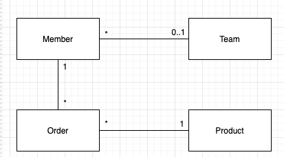

# 즉시/지연 로딩 기본 전략

* @ManyToOne/@OneToOne 의 기본값을 EAGER 이다.
* @OneToMany/@ManyToMany 의 기본값을 LAZY 이다

## 즉시 로딩

* 엔티티를 조회할 때 연관된 엔티티도 함께 조회한다.
* 즉시 로딩을 사용할 경우, 연관된 엔티티마다 별도로 select 요청을 하지 않는다.
    * 대부분의 JPA 구현체는 즉시 로딩을 최적화하기 위해 가능하면 조인 쿼리를 사용한다.

```SQL
SELECT
    E.field,
    C.field ...
FROM
    Entity E LEFT OUTER JOIN Child C ON E.id = C.entity
WHERE ...
```

### Null 제약조건과 JPA 조인 전략

* 연관관계가 nullable 수 있음을 JPA 는 고려한다.
* nullable 일 수 있으므로 JPA 는 LEFT OUTER JOIN 을 사용한다.
    * INNER JOIN 이 성능과 최적화에 더 유리하다.
    * 즉, INNER JOIN 을 사용하기 위해서 NOT NULL 임을 알려주면 된다.
        * @JoinColumn(nullable = false)
        * @ManyToOne(.., Optional = false)

## 지연 로딩

* 연관된 엔티티를 실제 사용할 때 조회한다.
* 참고로 조회 대상이 영속성 컨텍스트에 있으면 프록시 객체를 사용할 이유가 없으므로, 해당 객체를 Lazy 로 지연로딩 하더라도 실제 객체를 사용한다.

## 즉시 로딩과 지연 로딩의 정리

* 엔티티마다 상황에 따라 로딩 전략에 따라 최적일 수 있고, 최악이 될 수 있다.
    * 연관된 엔티티가 거의 대부분 같이 쓰인다면 Eager
    * 거의 같이 사용되지 않는다면 Lazy
    
### 지연 로딩의 활용



* 회원은 팀하나에만 소속할 수 있다. (N:1)
* 회원은 여러 주문내역을 가진다. (1:N)
* 주문내역은 상품정보를 가진다. (N:1)
* 위와 같은 구조에서 로직에 의해 다음과 같이 사용되어진다고 가정하자.
    1. 회원과 팀은 자주 함께 사용되고, 즉시 로딩으로 설정한다.
    2. 회원과 주문은 가끔 사용되고, 지연 로딩으로 설정한다.
    3. 주문과 상품은 자주 함께 사용되고, 즉시 로딩으로 설정한다.

```java
@Entity
public class Member {
    ...
    
    @ManyToOne(fetch = FetchType.Eager)
    private Team team;
    
    @OneToMany(mappedBy = "member", fetch = FetchType.LAZY)
    private List<Order> orders;
    
    ...
}
```

```SQL
-- 위의 멤버 엔티티 조회시
SELECT
    M.field,
    ...
    T.field,
    ...
FROM
    Member m
LEFT OUTER JOIN
    Team T on M.team = T.id
WHERE ...
```

* 멤버를 조회할 때, Eager 로 설정한 팀도 같이 조회된다.
* 주문은 Lazy 로 설정하여 바로 조회되지 않는다.
* getTeam() 을 할 경우, 이미 로딩된 팀 엔티티를 반환한다.
* 주문은 collection 에 보관되어 있는데, 해당 컬렉션은 org.hibernate.collection.internal.PersistentBag 를 사용한다.
    * 해당 컬렉션은 지연 로딩을 처리해주는 컬렉션 래퍼이다.
    * 해당 컬렉션도 프록시의 역할을 한다.
    * 컬렉션 프록시 자체를 get 한다고 해서 데이터베이스에서 조회하지 않는다.
        * collection.get(0) 와 같이 컬렉션에서 실제 데이터를 조회할 때, 해당 데이터만 데이터베이스에서 조회한다.
        * 추가적으로, 위의 관계에서 상세주문은 주문에 Eager 로 설정되어 있으므로 같이 조회된다.

### 팁

* 모든 연관관계에 지연 로딩을 사용하고, 어느정도 완성단계가 되었을 때 사용상황을 보고 필요한 곳에만 즉시 로딩으로 최적화 한다.
* 참고로 SQL 을 직접 사용하면, 이러한 최적화가 어렵다.
    * 각 테이블별로 SQL 을 작성하였다면, 해당 쿼리를 변경하기 위해 쿼리와 엔티티를 찾아서 변경을 하나하나 해줘야 하기 때문이다.

### FetchType.Eager 주의점

* 컬렉션을 하나 이상 즉시 로딩하는 것은 권장하지 않는다.
    * 컬렉션과 조인한다는 것은 데이터베이스 테이블로 보면 일대다 조인이다.
    * 1:N 조인 결과는 데이터가 N 쪽에 있는 수만큼 증가한다.
    * 즉, 컬렉션 2개 (N, M)를 즉시 조회를 한다면 N x M 수만큼 반환할 수 있고 그만큼 성능 저하가 있을 수 있다.
* 컬렉션 즉시 로딩은 항상 외부조인을 사용한다.
    * 위 구조에서 멤버 테이블에 팀을 NOT NULL 로 걸어두면, 모든 회원은 팀에 속하면서 INNER JOIN 사용해도 된다.
    * 반대로 팀 테이블에서 멤버를 조회시 한명도 없는 테이블을 INNER JOIN 할 시 에러가 발생한다.
    * 데이터베이스 제약조건으로는 위 상황을 막을 수 없고, 따라서 JPA 는 1:N 관계를 즉시 로딩할 때 항상 외부 조인을 사용한다.
* @ManyToOne @OneToOne
    * optional = false : 내부 조인
    * optional = true : 외부 조인
* @OneToMany, @ManyToMany
    * optional = false : 외부 조인
    * optional = true : 외부 조인
