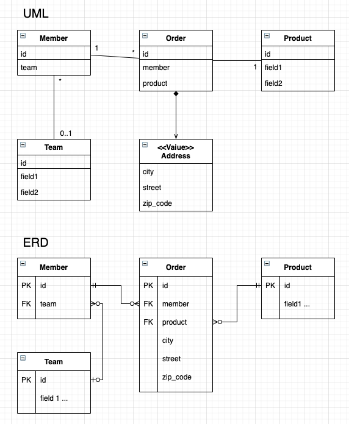
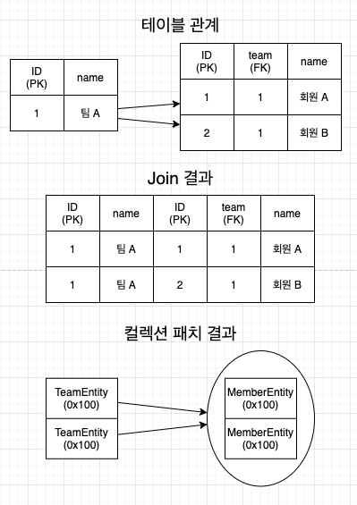

### JPQL 특징

1. JPQL 은 객체지향 쿼리 언어이다. 따라서 테이블을 대상으로 쿼리하는 것이 아닌, 엔티티 객체를 대상으로 쿼리한다.
2. JPQL 은 SQL 을 추상화해서 특정 데이터베이스 SQL 에 의존하지 않는다.
3. JPQL 은 결국 SQL 로 변환된다.

* 예제 도메인 모델



#### 기본 문법과 쿼리 API

* JPQL 는 SELECT, UPDATE, DELETE 가 존재하지만, em.persist() 때문에 INSERT 은 없다.
* select 문 사용
    * ex) SELECT m FROM Member AS m where m.field = ''
    * 엔티티와 속성은 대소문자를 구분한다.
        *  Member, field 등은 대소문자를 구분한다.
        * JPQL 키워드 (SELECT, FROM, AS ...) 에 해당하는 키워드들은 대소문자를 구분하지 않는다.
    * @Entity(name = "") 으로 짓지않으면, 클래스 명을 기본값으로 매핑한다.
    * ... Member AS m ... 과 같은 별칭은 필수이다. (AS 는 생략이 가능하다.)
    
#### TypeQuery, Query

* JPQL 을 실행하기 위해서는 쿼리 객체를 만들어줘야 한다.
* 쿼리 객체에 반활할 타입을 명학하게 지정할 때는 TypeQuery 객체를 사용한다.
* 반대로 타입을 명확하게 지정할 수 없으면 Query 객체를 사용한다.

```java
TypeQuery<Member> query = em.createQuery("SELECT m FROM Member m", Member.class);
// 결과를 예제로 반환한다. 만약 결과가 없다면 빈 컬렉션을 제줄한다.
Query query = em.createQuery("SELECT m FROM Member m", Member.class);
// Query 결과는 Object 배열을 제공한다.

// query.getSingleResult();
// 결과가 정확히 1개일 때 사용한다.
// 결과가 없으면 javax.persistence.NoResultException 예외 발생
// 결과가 1개보다 많으면 javax.persistence.NoUniqueResultException 이 발생한다.
```

#### 파라미터 바인딩

* 이름 기준 파라미터
    * 파라미터를 이름으로 구분하는 방법
    * 이름 기준 파라미터는 앞에 : 을 붙인다.

```java
String parameter = "param";

TypedQuery<Entity> query = em.createQuery("select ... from ... where m.column = :parameter", Entity.class);
query.setParameter("parameter", parameter);
List<Entity> results = query.getResultList();

// JPA 는 메소드 체인 방식으로 설계되어 있어서 다음과 같이 작성할 수 있다.

List<Entity> results = em.createQuery("select ... from ... where m.column = :parameter", Entity.class)
    .setParameter("parameter", parameter)
    .getResultList();
```

* 위치 기준 파라미터
    * ? 다음에 위치 값을 주면 된다.

```java
String parameter = "param";

List<Entity> results = em.createQuery("select ... from ... where m.column = ?1", Entity.class)
    .setParameter(1, parameter)
    .getResultList();
```

* 참고로 위치 기준 파라미터 방식보다는, 이름 기준 파라미터 바인딩 방식이 더 명확하다.

#### 프로젝션

* select 절에 조회할 대상을 지정하는 것을 프로젝션이라 한다.
    * ex) select e.field1, e.field2... from Entity e ... 에서 e.field1, e.field2... 가 프로젝션이다.
* 프로젝션 대상은 엔티티, 엠베디드 타입, 스칼라 타입(숫자, 문자 등의 기본 타입) 이 있다.
* 엔티티 프로젝션
    * select e.field1, e.field2... from Entity... 또는 select e from Entity... 와 같이 원하는 객체를 바로 조회한 경우.
    * 이렇게 조회한 엔티티는 영속성 컨텍스트에 관리된다.
* 임베디드 타입 프로젝션
    * JPQL 에서 임베디드 타입은 엔티티와 거의 비슷하게 사용된다.
    * 임베디드 타입은 조회의 시작점이 될 수 없다는 제약이 있다.
    * 위 UML 을 기준으로 다음과 같이 임베디드 타입이 시작됨이 될 수 없다.
        * select a from Address a
    * 임베디드 타입을 프로젝션으로 조회하려면 다음과 같이 사용하면 된다.
        * select o.address from Order o
    * 임베디드 타입은 엔티티 타입이 아닌 값 타입이므로, 임베디드 타입 프로젝션은 영속성 컨텍스트에 관리되지 않는다.
* 스칼라 타입 프로젝션
    * 숫자, 문자, 날짜와 같은 기본 데이터 타입들을 조회한 경우
    * 통계 쿼리(sum, avg...)는 주로 스칼라 타입으로 조회한다.
* 여러 값 조회
    * 프로젝션에 여러 값을 선택하면 TypeQuery 를 사용할 수 없고, Query 를 사용해야 한다.

```java
Query query = em.createQuery("select e.field1, e.field2, ... from Entity e");
List results = query.getResultList();

// 해당 값을 사용할 때는 Object[] 변경하고, 형변환을 해야 한다.

Iterator iterator = resultList.iterator();
while (iterator.hasNext()) {
    Object[] row = (Object[]) iterator.next();
    String field1 = (String) row[0];
    Integer field2 = (Integer) row[1];
    ChildEntity field3 = (ChildEntity) row[2];
    // 위와 같이 조회되더라도 ChildEntity 도 엔티티 컨텍스트에 저장된다.
    ...
}
```

* NEW 명령어
    * Query 를 통해 엔티티 프로젝션이 아닌 특정값 프로젝션을 사용했을 경우, Object 가 아닌 특정 데이터 형태로 바로 리턴받을 수 있다.
    * NEW 명령어를 사용할 때 다음과 같은 것을 주의해야 한다.
        1. 패키지 명을 포함한 전체 클래스 명을 입력해야 한다.
        2. 순서와 타입이 일치하는 생성자가 필요하다.

```java
public class SomeDTO {
    private String field1;
    private int field2;
    
    public SomeDTO(String field1, int field2) {
        this.field1 = field1;
        this.field2 = field2;
    }
    
    ...
}

TypedQuery<SomeDTO> query = em.createQuery("select new ...(패키지명).UserDTO(e.field1, e.field2) from Entity e where ...", SomeDTO.class);
List<SomeDTO> results = query.getResultList();

// new 를 통해 반환받을 클래스를 지정할 수 있는데, 이 클래스의 생성자에 JPQL 조회 결과를 넘겨줄 수 있다.
// new 명령어를 사용해서 TypedQuery 를 사용할 수 있는데, 이를 통해 객체 변환 작업을 줄일 수 있다.
```

#### 페이징 API

* JPA 는 페이징을 다음 2개의 API 로 추상화했다.
    1. setFirstResult(int startPosition) - 조회 시작 위치 (0부터 시작)
    2. setMaxResults(int maxResult): 조회할 데이터 수
    
```java
TypedQuery<Member> query = em.createQuery("select m from Member m order by m.id desc", Member.class);

query.setFirstResult(10);
// 10 을 넘겨줌으로써, 위에 10건 이후의 데이터부터 시작된다.
// 즉, 0 ~ 9 인덱스에 존재하는 멤버 데이터 이후 데이터가 시작점으로 셋팅된다.
query.setMaxResults(20);
// 20을 셋팅함으로써, 데이터가 20개가 불러와진다.
query.getResultList();
// 위 셋팅으로 결국에는 11 ~ 30 인덱스에 포함되는 값이 리턴되게 된다.
```

* 위와 같이 적용할 수 있는 이유는, 데이터베이스 방언덕분에 하나의 함수로 모든 데이터베이스에서 사용할 수 있는 것이다.
    * 즉, 위 함수를 통해 각 데이터베이스에 맞는 쿼리로 변경되어 전송된다.
    * HSQLDB : offset ? limit ?, MySQL limit ?, ? ... 와 같이 각 데이터베이스에 맞게 변경된다.
    
#### 집합과 정렬

* 집합함수를 통해 통계 정보를 구할 때 사용한다.

| 함수 | 설명 |
| ---- | ---- |
| COUNT | 결과 수를 구한다. <br/> 반환타입 : Long |
| MAX, MIN | 최대, 최소 값을 구한다. <br/> 문자, 숫자, 날짜 등에 사용한다. |
| AVG | 평균값을 구한다. <br/> 숫자타입만 사용할 수 있다. <br/> 반환 타입 : Double |
| SUM | 합을 구한다. 숫자 타입만 사용가능 하다. <br/> 반환타입 : 정수합 - Long, 소수합 - Double, BigInteger 합 - BigInteger, BigDecimal 합 - BigDecimal |

* 집합 함수 사용 시 참고사항
    1. NULL 값은 무시하므로 통계에 잡히지 않는다. (Distinct 가 정의되어 있어도 무시된다.)
    2. 만약 값이 없을 때 MAX, MIN, AVG, SUM 을 사용하면 NULL, COUNT 는 0 이 된다.
    3. DISTINCT 를 집합 함수 안에 사용해서 중복된 값을 제거하고 집합을 구할 수 있다.
    4. DISTINCT 를 COUNT 에서 사용할 때 임베디드 타입은 지원하지 않는다.
* Group by, Having
    * 통계 데이터를 구할 때 특정 그룹끼리 묶어준다.
    * Having 은 Group By 와 같이 사용하면 그룹화한 데이터를 기준으로 필터링을 한다.
* 정렬은 특정 컬럼을 기준으로 오름차순, 내림차순으로 데이터를 정렬할 수 있다.
* Order By (column) DESC|ASC 를 통해 할 수 있다.
    * DESC - 내림차순
    * ASC - 오름차순 (기본값)
    
```sql
SELECT COUNT(m.age), SUM(m.age), AVG(m.age), MAX(m.age), MIN(m.age)
FROM Member m
LEFT JOIN m.team t
GROUP BY t.id
HAVING AVG(m.age) >= 10
ORDER BY m.id DESC;

-- 각 집합을 사용한 예제이며, 연관관계인 team 으로 묶고, having 을 통해 특정 집합에 대한 조건을 사용한 예제이다.
```

#### JPQL 조인

* JPQL 을 통해 SQL 과 같은 조인기능을 사용할 수 있지만, 문법은 조금 다르다.
* 내부조인
    * INNER JOIN 을 통해 사용할 수 있으며, INNER 는 생략할 수 있다.

```
SELECT m
FROM Member m
[INNER] JOIN m.team t
WHERE t.name = :teamName
// JPQL 쿼리문

SELECT * (JPQL 을 통해 변환된 쿼리는 m.fiedl1, m.field2 ... 이다.)
FROM Member m
INNER JOIN Team t on m.team = t.id
WHERE t.name = ?
// SQL 쿼리문
```

* JPQL 의 조인의 가장 큰 특징은 연관 필드를 사용한다.
* 조인을 통해 조회를 하면 해당 결과는 다른 타입의 엔티티들을 조회하였으므로, 형변환을 통해 결과를 사용해야 한다.

```java
List<Object[]> results = em.createQuery(query).getResultList();

for (Object[] row : results) {
    Member member = (Member) row[0];
    Team team = (Team) row[1];
}
```

* 외부조인
    * OUTER JOIN 을 통해 사용할 수 있으며, OUTER 는 생략할 수 있다.

```
SELECT m
FROM Member m
LEFT [OUTER] JOIN m.team t
WHERE t.name = :teamName
// JPQL 쿼리문

SELECT * (JPQL 을 통해 변환된 쿼리는 m.fiedl1, m.field2 ... 이다.)
FROM Member m
LEFT OUTER JOIN Team t on m.team = t.id
WHERE t.name = ?
// SQL 쿼리문
```

* 컬렉션 조인
    * 일대다 관계, 또는 다대다 관계의 컬렉션을 사용하는 곳에 조인하는 것을 컬렉션 조인이라 한다.
    * 위 예제 스키마의 Member, Team 을 기준으로 하면 다음과 같다.
        * Member -> Team 의 조인은 N:1 조인이면서, 단일 값 연관 필드인 m.team 을 사용하면 된다.
        * Team -> Member 의 조인은 1:N 조인이면서, 컬렉션 값 연관 필드인 m.members 를 사용하면 된다.
* 세타 조인
    * WHERE 절을 사용해서 세타 조인을 할 수 있으며, 세타 조인은 내부 조인만 지원한다.
    * 전혀 관계없는 엔티티도 조인할 수 있다.

```
select count(m) from Member m, Team t where m.username = t.name
// JPQL
SELECT COUNT(m.id) FROM Member m CROSS JOIN Team t WHERE m.username = t.name
```

* JOIN ON 절 (JPA 2.1)
    * ON 절에서 필터링 조건을 JPA 2.1 부터 사용할 수 있다.
    * 참고로 내부 조인의 ON 은 WHERE 절을 사용할 때와 결과가 같으므로, ON 절은 외부 조인에서만 사용한다.

```
select m, t from Member m left join m.team t on t.name = 'foo'
// JQPL
select m.*, t.* from Member m left join team t on m.team = t.id and t.name = 'foo'
```

#### 페치 조인

* 페치 조인은 SQL 에서의 조인 종류 중 하나가 아닌, JPQL 에서 성능 최적화를 위해 제공하는 기능이다.
* 연관된 엔티티나 컬렉션을 한번에 같이 조회하는 기능인데, JOIN FETCh 명령어로 사용할 수 있다.

```
패치 조인 ::= [LEFT [OUTER] | INNER ] JOIN FETCH 조인 경로
```

##### 엔티티 패치 조인

```
select m from Member m join fetch m.team
```

* 위와 같이 사용하면 엔티티 페치 조인이 실행된다.
* 이렇게 사용하면 연관된 엔티티나 컬렉션을 함께 조회하는데, 위 예제에서는 회원과 팀을 함께 조회한다.
* 참고로 일반 조인을 사용할 떄, 조인되는 테이블에 별칭을 붙이지만 페치 조인은 별칭을 사용할 수 없다.
    * 하이버네이트는 페치 조인에도 별칭을 허용한다.

```SQL
SELECT m.*, t.*
FROM Member m
INNER JOIN Team t on m.team = t.id
// 위 패치 조인을 실행할 시, 변환되는 SQL문
```

* 위와같이 패치조인으로 사용된 엔티티도 한번에 조회가 되므로, 지연로딩되지 않고 바로 사용할 수 있다.
    * 즉, 객체 그래프 탐색을 통해 Member 의 Team 을 접근할 때, 해당 팀 객체에 데이터가 존재한다.

##### 컬렉션 패치 조인

```
select t from Team t join fetch t.members
// JPQL

SELECT t.*, m.*
FROM Team t
INNER JOIN Member m on t.id = m.team
// SQL
```



* 컬렉션 패치 조인을 하더라도, 엔티티 패치 조인과 같은 형태로 진행된다.
* 하지만, 조회 결과는 team 엔티티가 N 이므로, 연관된 멤버에 따라 같은 팀이 컬렉션으로 리턴될 수 있다.
* 위 사진처럼 팀은 1개이지만, 해당 팀에 속한 멤버가 여러명이면 여러 row 로 리턴된다.
    * 즉, team 의 결과는 collection 으로 나오지만, 해당 팀은 같은 엔티티를 바라보면서 내부 데이터도 같은 멤버들을 바라보게 된다.

##### 패치 조인과 DISTINCT

* DISTINCT 는 중복된 결과를 제거하는 명령어이다.
* JPQL 의 DISTINCT 는 SQL 에 DISTINCT 를 추가하고 애플리케이션에서 한번 더 중복을 제거한다.

```
select distinct t from Team t join fetch t.members
// JPQL
```

* 위의 JPQL 쿼리의 변환된 SQL 결과의 각 row 가 달라서 SQL 자체의 distinct 로 중복은 제거하지 못한다.
* 하지만, JPQL 에 DISTINCT 가 붙은 대상은 Team 엔티티이며, 팀의 데이터 자체는 같기 때문에 애플리케이션에서 중복이 제거된다.
    * 즉, JPQL 에서 distinct 를 통한 패치 조인을 하면, 위의 중복되던 team 이 제거된다.
    
##### 패치 조인과 일반 조인의 차이

* JPQL 은 결과를 반환할 때 연관관계까지 고려하지 않는다.
    * SELECT 절에 지정한 엔티티만 조회한다.
* 일반 조인을 사용하면 연관관계는 다음과 같은 시점에 조회된다.
    * 지연 : 지연된 엔티티를 사용하는 시점에 데이터베이스에서 조회한다.
    * 즉시 : 조회 엔티티를 데이터베이스에서 조회한 후 즉시로 설정된 연관관계 엔티티를 한번더 데이터베이스에서 조회한다.
    * 패치 : 연관된 엔티티도 함께 조회된다.
    
##### 패치 조인의 특징과 한계

* 패치 조인을 사용하면 SQL 한번에 연관된 테이블을 한번에 조회하여 SQL 호출 횟수를 줄여 성능 최적화가 가능하다.
* 또한, 즉시나 지연 로딩으로 설정하여도 패치 조인을 사용하면 해당 설정은 무시되고 패치 조인된다.
* 패치 조인의 한계
    1. 패치 조인 대상에는 별칭을 줄 수 없다.
        * 패치 조인에 별칭을 줄 수 없어서, 해당 조인 대상을 이용하여 select, where, subQuery 에서 사용할 수 없다.
        * JPA 표준이 아닌 하이버네이트 등과 같은 몇몇 구현체에서 별칭을 줄 수 있지만, 잘못 사용하면 데이터 무결성이 깨질 수 있다.
    2. 둘 이상의 컬렉션을 패치할 수 없다.
        * 구현체에 따라 될 수도 있다.
        * 하이버네이트에서는 예외가 발생한다.
    3. 컬렉션을 패치 조인하면 페이징을 사용할 수 없다.
        * 1:N 이 아닌 1:1/N:M 들은 패치 조인을 사용해도 페이징이 가능하다.
        * 하이버네이트에서 컬렉션을 패치 조인하고, 페이징 API 를 사용하면 경고 로그가 발생하면서 메모리에 페이징 처리를 한다.
            * 가능은 하지만, 데이터가 많아질 경우 성능 이슈와 메모리 초과 예외가 발생할 수 있다.
* 패치 조회를 통해 SQL 을 한번만 조회해서 성능적인 최적화에는 유용하지만, 모든 상황을 패치조인을 사용할 수 없다.
    * 객체 그래프를 유지해서 사용하면 효과적이다.
    * 여러 테이블을 조인해서 엔티티가 가진 모양이 아닌 다른 모양을 사용한다면, 필요한 데이를 DTO 형태로 반환하는게 더 효과적일 수 있다. 
