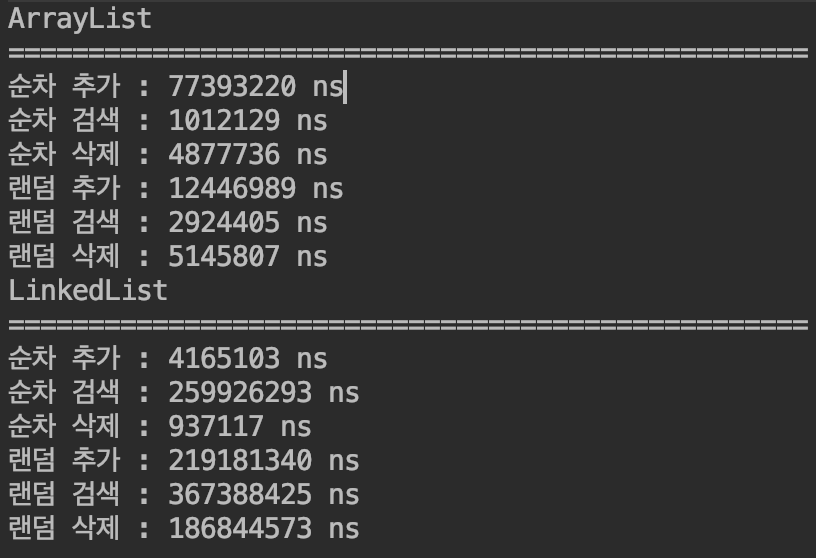

# collection (컬렉션)

### Array (배열)

* 여러 변수를 저장할 수 있는 모음(?) 의 역할을 하는 배열이 존재한다.
  * 자바에서 배열은 저장할 수 있는 객체의 수를 생성할 때 정해야 한다.
  * 넉넉하게 많은 공간을 초기에 만들어서 생성 할 수있지만, 초기화를 하기 때문에 그만큼 메모리 측면에서도 비효율 적이다.
  * 또한, 중간에 있었던 값을 제거하면 중간중간 빈 값을 가지는 배열이 되어서 사용함에 불편함이 많이 존재한다.

## Collection Framework

* 자료구조를 바탕으로 객체들을 효율적으로 추가, 삭제, 검색할 수 있도록 java.util 패키지에 컬렉션과 관련된 인터페이스와 클래스가 존재한다.
  * 컬렉션 - 요소를 수집해서 저장하는 것
  * 프레임워크 - 사용 방법을 미리 정해 놓은 라이브러리
* 컬렉션 객체는 자바 4 이전에 모든 객체를 저장할 수 있지만, 객체를 사용할 때 마다 원래 타입으로 일일이 변환시켜줘야 해서 실행 성능에 좋지 못한 영향을 미쳤었다.
  * 자바 5 에 제네릭을 도입하면서 모든 컬렉션 객체에 타입을 지정해서 사용할 수 있게 변경되었다.
* 컬렉션 프레임워크의 주요 인터페이스
  1. List
     * ArrayList
     * Vector
     * LinkedList
  2. Set
     * HashSet
     * TreeSet
  3. Map
     * HashMap
     * Hashtable
     * TreeMap
     * Properties
* List 와 Set 은 객체 추가, 삭제, 검색하는 방법에 많은 공톰점의 메소드를 모은 Collection 인터페이스가 존재한다.
* Map 은 Key, Value 를 한쌍으로 묶어서 관리하는 구조로 되어 있다.

| 인터페이스 분류          | 특징                                  | 구현 클래스                                  |
| ----------------- | ----------------------------------- | --------------------------------------- |
| Collection - List | - 순서를 유지하고 저장 <br/> - 중복 저장 가능      | ArrayList, Vector, LinkedList           |
| Collection - Set  | - 순서를 유지하지 않고 저장 <br/> - 중복 저장 안 됨  | HashSet, TreeSet                        |
| Map               | - 키와 값의 쌍으로 저장 <br/> - 키는 중복 저장 안 됨 | HashMap, Hashtable, TreeMap, Properties |

## List Colletion

* 객체를 인덱스로 관리하는 구조를 가지고 있다.
* 객체 자체를 저장하는 것이 아닌, 객체의 주소를 저장하여 접근할 때 주소로 객체를 접근한다.
* 리스트 컬렉션은 힙 영역에 존재한다.
* 리스트 컬렉션의 특징
  1. 객체를 저장하면, 자동으로 인덱스가 붙는다.
  2. 인덱스를 통해 객체를 검색, 삭제 할 수 있다.
  3. null 도 저장이 가능하며, 해당 인덱스는 객체를 참조하지 않는 형태가 된다.
  4. List 인터페이스는 제네릭 타입이며, 구현 객체를 생성할 때 구체적인 타입이 정해진다.
* 리스트 컬렉션의 공통적으로 사용 가능한 List 인터페이스

| 기능    | 메소드                        | 설명                          |
| ----- | -------------------------- | --------------------------- |
| 객체 추가 | boolean add(E e)           | 주어진 객체를 맨 끝에 추가             |
|       | void add(int index, E e)   | 주어진 인덱스에 객체를 추가             |
|       | E set(int index, E e)      | 주어진 인덱스에 저장된 객체를 주어진 객체로 변경 |
| 객체 검색 | boolean contains(Object o) | 주어진 객체가 저장되어 있는지 여부 판단      |
|       | E get(int index)           | 주어진 인덱스에 저장된 객체를 리턴         |
|       | boolean isEmpty()          | 컬렉션이 비어 있는지 여부 판단           |
|       | int size()                 | 저장되어 있는 전체 객체 수를 리턴         |
| 객체 삭제 | void clear()               | 저장된 모든 객체를 삭제               |
|       | E remove(int index)        | 주어진 인덱스에 저장된 객체를 삭제         |
|       | boolean remove(Object o)   | 주어진 객체를 삭제                  |

### ArrayList

* List 인터페이스의 구현 클래스이다.
* 배열은 생성할 때 크기가 고정되지만, ArrayLsit 는 자동으로 크기가 증가된다.

> List\<E> list = new ArrayList\<E>();

* 위와 같이 기본 생성자로ArrayList 를 생성하면, 기본적으로 10 개의 저장 공간을 가진 객체를 생성한다.
  * 생성할 때 () 안에 숫자를 넣으면, 초기에 그 숫자 용량을 가지는 ArrayList 를 생성한다.
* ArrayList 에 객체를 추가하면 0 번부터 차례대로 저장되고, 중간 객체가 제거되면 뒤의 객체들이 1개씩 당겨진다.
  * 객체 삽입과 삭제가 빈번이 일어나는 경우에는 ArrayList 의 사용은 바람직하지 않으며, 이럴때는 LinkedList 가 더 좋다.
  * 인덱스 검색이나, 맨 마지막에 객체를 추가하는 경우에는 ArrayList 를 사용하는게 좋다.

> Arrays.asList(T..a); 형태로 고정된 객체로 arrayList 를 만들 수 있다. </br>
> List\<String> list = Arrays.asList("Foo", "Bar", "FooBar");

### Vector

* Vector 는 ArrayList 와 동일한 내부 구조를 가지고 있다.
* 단, Vector 는 동기화된 메소드로 구성되어 있기에 멀티 스레드가 동시에 이 메소드들을 실행할 수 없고, 하나의 스레드가 실행을 완료해야만 다른 스레드를 실행할 수 있다.
  * 즉, 멀티 스레드 환경에서 안전하게 객체를 삭제, 추가가 가능한 Trhead Safe 를 보장한다.

### LinkedList

* LinkedList 는 ArrayList 와 사용방법은 같지만, 내부 구조는 서로 다르다.
* LinkedList 는 인접 참조를 링크해서 체인처럼 관리한다.
  * 즉, 특정 인덱스의 객체를 제거하거나 추가하면, 앞뒤 링크만 변경되고 나머지 링크는 변경되지 않는다.

> List\<E> list = new LinkedList\<E>();

```JAVA
// 추가, 삭제, 검색을 10,000 번 하는 예제

public class Main {
    public static void main(String[] args) {
        ArrayList list1 = new ArrayList<String>();
        LinkedList list2 = new LinkedList<String>();

        System.out.println("ArrayList");
        compareList(list1);

        System.out.println("LinkedList");
        compareList(list2);
    }

    private static void compareList(List list){
        long startTime;
        long endTime;

        System.out.println("==================================================");
        startTime = System.nanoTime();
        for (int i = 0; i < 10000; i++) {
            list.add(randomGenerateString());
        }
        endTime = System.nanoTime();
        System.out.println("순차 추가 : " + (endTime - startTime) + " ns");

        startTime = System.nanoTime();
        for (int i = 0; i < 10000; i++) {
            list.get(i);
        }
        endTime = System.nanoTime();
        System.out.println("순차 검색 : " + (endTime - startTime) + " ns");

        startTime = System.nanoTime();
        for (int i = 0; i < 10000; i++) {
            list.remove(0);
        }
        endTime = System.nanoTime();
        System.out.println("순차 삭제 : " + (endTime - startTime) + " ns");

        startTime = System.nanoTime();
        for (int i = 0; i < 10000; i++) {
            list.add(new Random().nextInt(i + 1), randomGenerateString());
        }
        endTime = System.nanoTime();
        System.out.println("랜덤 추가 : " + (endTime - startTime) + " ns");

        startTime = System.nanoTime();
        for (int i = 0; i < 10000; i++) {
            list.get(new Random().nextInt(i + 1));
        }
        endTime = System.nanoTime();
        System.out.println("랜덤 검색 : " + (endTime - startTime) + " ns");

        startTime = System.nanoTime();
        for (int i = 0; i < 10000; i++) {
            list.remove(new Random().nextInt(list.size()));
        }
        endTime = System.nanoTime();
        System.out.println("랜덤 삭제 : " + (endTime - startTime) + " ns");
    }

    private static String randomGenerateString() {
        int leftLimit = 97; // 'a'
        int rightLimit = 122; // 'z'
        return new Random().ints(leftLimit, rightLimit + 1)
                .limit(1)
                .collect(StringBuilder::new, StringBuilder::appendCodePoint, StringBuilder::append)
                .toString();
    }
}
```



| 구분         | 순차적으로 추가/삭제 | 랜덤 추가/삭제 | 검색  |
| ---------- | ----------- | -------- | --- |
| ArrayList  | 빠르다         | 느리다      | 빠르다 |
| LinkedList | 느리다         | 빠르다      | 느리다 |

* ~~위 표와 같이 된다고는 하는데.. 막상 해보니 표대로 동작하지 않네..~~

## Set Collection

* 저장 순서를 유지하지 않으며, 같은 객체, null 을 중복해서 저장할 수 없다.
* Set 의 공통으로 사용 가능한 인터페이스 메소드

| 기능    | 메소드                        | 설명                                                  |
| ----- | -------------------------- | --------------------------------------------------- |
| 객체 추가 | boolean add(E e)           | 주어진 객체를 저장 <br/> 객체가 성공적으로 저장되면 true, 중복 저장이면 false |
| 객체 검색 | boolean contains(Object o) | 주어진 객체가 저장되어 있는지 여부                                 |
|       | boolean isEmpty()          | 컬렉션이 비어 있는지 조사                                      |
|       | Iterator<E> iterator()     | 저장된 객체를 한 번씩 가져오는 반복자 리턴                            |
|       | int size()                 | 저장되어 있는 전체 객체 수 리턴                                  |
| 객체 삭제 | void clear()               | 저장된 모든 객체를 삭제                                       |
|       | boolean remove(Object o)   | 주어진 객체를 삭제                                          |

* Set 에는 인덱스로 객체를 검색하는 메소드가 없고, 모든 저장된 객체를 한번씩 반복해서 가져오는 Iterator 를 제공한다.

> Iterator<E> iterator = set.iterator();

* Iterator 인터페이스에 선언된 메소드

| 리턴 타입   | 메소드명      | 설명                                       |
| ------- | --------- | ---------------------------------------- |
| boolean | hasNext() | 가져올 객체가 있으면 true <br/> 가져올 객체가 없으면 false |
| E       | next()    | 컬렉션에서 하나의 객체를 가져온다.                      |
| void    | remove()  | Set 컬렉션에서 객체를 제거한다.                      |

* 즉, Set 은 특정 데이터나 인덱스를 통해 데이터에 접근하지 않고 전체 데이터를 사용하고 순서의 보장이 필요없을 때 사용한다.

### HashSet

> Set\<E> set = new HashSet\<E>(); <br/>
> HashSet set = new HashSet\<E>();

* HashSet 에 저장될 때 동일한 객체는 저장하지 않는다.
  * 동일한 객체란, 똑같은 객체를 뜻하지 않는다.
  * HashSet 저장 방식
    1. hashCode() 메소드를 호출해서 저장된 객체중 같은 해쉬값을 가진 객체를 확인한다.
    2. 같은 해쉬값이 있으면, 그 객체와 저장하려는 객체를 equal() 메소드로 비교한다.
    3. 위 과정이 true 이면 중복 객체로 처리되어 저장되지 않는다.

### LinkedHashSet

* 추가된 순서, 또는 가장 최근에 접근한 순서대로 접근 가능

### TreeSet

* 정렬된 순서대로 보관하며 정렬 방법을 지정할 수 있음
* Red-Black Tree 에 데이터가 담기며, HashSet 보다 성능상 느리다.

## Map Collection

* Key 와 Value 로 구성된 Entry 객체를 저장하는 구조를 가지고 있다.
  * Key, Value 모두 객체이다.
  * Key 는 중복 저장이 불가능, Value 는 중복 저장이 가능하다.
  * 중복된 Key 로 다시 객체 저장이 되면, 기존 값은 새로 넣는 값으로 덮어써진다.
* Map 에서 공통적으로 사용 가능한 메소드

| 기능    | 메소드                                 | 설명                                                                     |
| ----- | ----------------------------------- | ---------------------------------------------------------------------- |
| 객체 추가 | V put(K key, V value)               | 주어진 키로 값을 저장 <br/> 새로운 키일 경우 null 리턴 <br/> 동일한 키일 경우 값을 변경하고, 이전 값을 리턴 |
| 객체 검색 | boolean containsKey(Object key)     | 주어진 키가 있는지 확인                                                          |
|       | boolean containsValue(Object value) | 주어진 값이 있는지 확인                                                          |
|       | Set<Map.Entry<K,V>> entrySet()      | 키와 값의 쌍으로 구성된 모든 Map.Entry 객체를 Set 에 담아서 리턴                            |
|       | V get(Object key)                   | 주어진 키가 가지고 있는 값을 리턴                                                    |
|       | boolean isEmpty()                   | 컬렉션이 비어 있는지 여부                                                         |
|       | Set\<K> keySet()                    | 모든 키를 Set 객체에 담아서 리턴                                                   |
|       | int size()                          | 저장된 키의 총 수를 리턴                                                         |
|       | collection\<V> values()             | 저장된 모든 값을 Collection 에 담아서 리턴                                          |
| 객체 삭제 | void clear()                        | 모든 Map.Entry(키와 값)를 삭제                                                 |
|       | V remove(Object key)                | 주어진 키와 일치하는 Map.Entry 를 삭제하고 값을 리턴                                     |

* 키를 알면, 키를 통해 값을 찾아서 사용 할 수도 있고, entrySet() 이나 keySet, collection\<V> 등을 이용해서 전체 데이터를 사용할 수 있다.

### HashMap

> Map<K, V> map = new HashMap<K, V>(); <br/>
> HashMap map = new HashMap<K, V>();

* HashMap 의 키로 사용될 객체는 hashCode() 와 equals() 메소드를 재정의하여 동등 객체가 될 조건을 정해야 한다.
  * 대부분 Key 로 String 타입을 많이 사용한다.

### HashTable

> Map<K, V> map = new HashTable<K, V>(); <br/>
> HashTable map = new HashTable<K, V>();

* HashMap 과 동일한 내부 구조를 가지고 있다.
* Vector 처럼 동기화된 메소드로 구성되어 있어서 멀티 스레드가 동시에 접근하여 실행할 수 없다.
  * 즉, thread safe 하다.

### Properties

* HashTable 의 하위 클래스이다.
* HashTable 의 모든 특징을 그대로 가져가지만, Properties 의 키와 값은 String 으로 제한된다.
* 주로 .properties 파일을 읽을 떄 주로 사용된다.
  * 프로퍼티 파일은 ISO 8859-1 문자셋으로 **KEY=VALUE** 형태로 저장된 파일이다.
  * ISO 8859-1 의 경우 한글과 같이 직접 표현될 수 없는 문자셋은 유니코드로 변환되어 저장된다.
* 프로퍼티 파일은 일반적으로 클래스 파일과 함께 저장된다.
* 프로퍼티 메소드
  * getResource() : 클래스 파일을 기준으로 상대 경로를 이용하여 프로퍼티 경로를 얻는다.
  * getProperty() : Properties 객체에서 해당 키의 값을 읽는다.
    * get() 을 통해 값을 얻을 수 있지만, get() 으로 얻어낸 객체는 Object 이다.

```JAVA
Properties properties = new Properties();
Properties.load(new FileReader("file 위치"));
```

## 검색 특화 컬렉션

* TreeSet, treeMap 이 존재하며 이진 트리를 이용해서 계층적 구조를 가지면서 객체를 저장한다.
* 트리가 검색에 특화된 이유는 값들이 정렬되어 있으며, 그 값들을 그룹핑 하기도 쉽기 때문이다.

### BinaryTree (이진트리)

* 처음 시작되는 최상단 노드를 Root Node 라고 한다.
* root node 에서 시작되어 최대 2개의 자식 노드를 가질 수 있는 형태의 트리이다.
* 알고리즘을 구현하기에 따라서 여러 종류의 트리들이 존재한다.
  1. 완전 이진 트리
  2. 포화 이진 트리
  3. 정 이진 트리
  4. 편향 이진 트리
* 저장되는 위치에 따라 다양한 종류가 있다.
  1. 큰 값을 어디에 저장하는지
  2. 레벨 또는 깊이를 어떤식으로 할것인지...
* 자바에서의 트리는 루투를 기준으로 마지막 리프 노드까지 비교하면서 왼쪽에는 작은 값을, 오른쪽에는 큰 값을 저장한다.
  * 숫자가 아닌 문자의 경우 유니코드 값으로 비교한다.
  * 왼쪽 -> 부모 -> 오른쪽 노드 순으로 읽으면, 내림차순이 된 값을 얻는다.
  * 오른쪽 -> 부모 -> 왼쪽 노드 순으로 읽으면, 오름차순이 된 값을 얻는다.

### TreeSet

* 이진트리 기반 Set 컬렉션이다.
* TreeSet 에는 값을 저장하는 value 와 왼쪽과 오른쪽 노드를 가르키는 Set 데이터들을 트리 형태로 저장한다.
* TreeSet 에 값을 저장하면, 루트의 value 부터 비교하며 왼쪽 또는 오른쪽에 정렬되어 저장된다.

> TreeSet\<E> treeSet = new TreeSet\<String>();

* Set 인터페이스에 없는 다음과 같은 메소드들을 TreeSet 에서 제공한다.

| 리턴 타입 | 메소드          | 설명                                                |
| ----- | ------------ | ------------------------------------------------- |
| E     | first()      | 제일 낮은 객체를 리턴                                      |
| E     | last()       | 제일 큰 객체를 리턴                                       |
| E     | lower(E e)   | 주어진 객체보다 바로 아래 객체를 리턴                             |
| E     | higher(E e)  | 주어진 객체보다 바로 위 객체를 리턴                              |
| E     | floor(E e)   | 주어진 객체와 동등한 객체가 있으면 리턴, 없다면 주어진 객체의 바로 아래의 객체를 리턴 |
| E     | ceiling(E e) | 주어진 객체와 동등한 객체가 있으면 리턴, 없다면 주어진 객체의 바로 위 객체를 리턴   |
| E     | pollFirst()  | 제일 낮은 객체를 꺼내오고 컬렉션에서 제거함                          |
| E     | pollLast()   | 제일 큰 객체를 꺼내오고 컬렉션에서 제거함                           |

* TreeSet 에 제공되는 정렬과 관련된 메소드

| 리턴 타입            | 메소드                  | 설명                           |
| ---------------- | -------------------- | ---------------------------- |
| Iterator\<E>     | descendingIterator() | 내림차순으로 정렬된 Iterator 를 리턴     |
| NavigableSet\<E> | descendingSet()      | 내림차순으로 정렬된 NavigableSet 을 리턴 |

* NavigableSet 은 TreeSet 과 마찬가지로 first(), last(), lower(), higher(), floor(), ceiling() 및 정렬 순서를 바꾸는 descendingSet() 을 제공한다.
* TreeSet 을 오름차순으로 얻고 싶다면 다음과 같이 하면 된다.

> NavigableSet\<E> ascendingSet = treeSetObject.descendingSet().descendingSet();

* TreeSet 이 가지고 있는 범위 검색과 관련된 메소드

| 리턴 타입 | 메소드 | 설명 |
| ---- | ---- | ---- |
| NavigableSet\<E> | headSet(E toElement, boolean inclusive) | 주어진 객체보다 낮은 객체들을 NavigableSet 으로 리턴 <br/> 주어진 객체 포함 여부는 두 번째 매개값에 따라 달라짐 |
| NavigableSet\<E> | tailSet(E fromElement, boolean inclusive) | 주어진 객체보다 높은 객체들을 NavigableSet 으로 리턴 <br/> 주어진 객체 포함 여부는 두 번째 매가값에 따라 달라짐 |
| NavigableSet\<E> | subSet(E fromElement, boolean fromInclusive, E toElement, boolean toInclusive) | 시작과 끝으로 주어진 객체 사이의 객체들을 NavigableSet 으로 리턴 <br/> 시작과 끝 객체의 포함 여부는 두 번째, 네 번째 매개값에 따라 달라짐 |

### TreeMap

* 이진트리 기반 Map 컬렉션이다.
* 키와 값이 저장된 Map.Entry 를 저장한다.
* 이때 값을 비교하는게 아닌, key 의 값들을 비교하여 정렬하고 저장한다.

> TreeMap\<K, V> treeMap = new TreeMap\<K, V>();

* Map 인터페이스에 없는 TreeMap 클래스에서 제공되는 메소드

| 리턴 타입 | 메소드 | 설명 |
| ---- | ---- | ---- |
| Map.Entry<K, V> | firstEntry() | 제일 낮은 Map.Entry 를 리턴 |
| Map.Entry<K, V> | lastEntry() | 제일 높은 Map.Entry 를 리턴 |
| Map.Entry<K, V> | lowerEntry(K key) | 주어진 키보다 바로 아래 Map.Entry 를 리턴 |
| Map.Entry<K, V> | higherEntry(K key) | 주어진 키보다 바로 위 Map.Entry 를 리턴 |
| Map.Entry<K, V> | floorrEntry(K key) | 주어진 키와 동등한 키가 있으면 해당 Map.Entry 를 리턴 <br/> 없다면 주어진 키 바로 아래의 Map.Entry 를 리턴 |
| Map.Entry<K, V> | ceilingEntry(K key) | 주어진 키와 동등한 키가 있으면 해당 Map.Entry 를 리턴 <br/> 없다면 주어진 키 바로 위의 Map.Entry 를 리턴 |
| Map.Entry<K, V> | pollFirstEntry() | 제일 낮은 Map.Entry 를 꺼내오고 컬렉션에서 제거 |
| Map.Entry<K, V> | pollLastEntry() | 제일 큰 Map.Entry 를 꺼내오고 컬렉션에서 제거 |

* TreeMap 에 제공되는 정렬과 관련된 메소드

| 리턴 타입 | 메소드 | 설명 |
| ---- | ---- | ---- |
| 리턴 타입 | 메소드 | 설명 |
| NavigableSet\<K> | descendingKeySet() | 내림차순으로 정렬된 키의 NavigableSet 을 리턴 |
| NavigableMap\<K, V> | descendingMap() | 내림차순으로 정렬된 Map.Entry 의 NavigableMap 을 리턴 |

* [위 TreeMap 에 제공되는 정렬 관련 메소드들은 TreeSet 과 똑같다.](https://github.com/Sung-jin/study/blob/master/java/study/collection.md#treeset-1)
* TreeMap 이 가지고 있는 범위 검색과 관련된 메소드

| 리턴 타입 | 메소드 | 설명 |
| ---- | ---- | ---- |
| NavigableMap\<K, V> | headMap(K toKEy, boolean inclusive) | TreeSet 의 NavigableSet 범위 검색 메소드 설명과 같다. |
| NavigableMap\<K, V> | tailMap(K fromKey, boolean inclusive) | TreeSet 의 NavigableSet 범위 검색 메소드 설명과 같다. |
| NavigableMap\<K, V> | subMap(K fromKey, boolean fromInclusive, K toKey, boolean toInclusive) | TreeSet 의 NavigableSet 범위 검색 메소드 설명과 같다. |

### Comparable 과 Comparator

* TreeSet, TreeMap 은 저장과 동시에 오름차순으로 저장된다.
  * number type : 값으로 비교
  * string type : 유니코드로 비교
* 자동 정렬은 java.lang.Comparable 을 구현한 객체가 있으면 그 구현부를 바탕으로 저장할 수 있다.
  * 기본으로 Comparable 이 구현되어 있는 Integer, Double, String 외에 Ciomparable 을 직접 구현하면 트리에 저장할 수 있다.
* Comparable 의 compareTo() 메소드를 오버라이딩 하면 된다.

| 리턴 타입 | 메소드 | 설명 |
| ---- | ---- | ---- |
| int | compareTo(T o) | 주어진 객체와 같으면 0 <br/> 주어진 객체보다 작으면 음수 <br/> 주어진 객체보다 크면 양수 |

```JAVA
@Construcotr
public class Person implements Compareable<Person> {
    public String name;
    public Integer age;

    @Override
    public int compareTo(Person o) {
        return age.compareTo(o.age);
        /*
        if (age < o.age) return -1;
        else if(age == o.age) return 0;
        else return 1;
        */
    }
    // 내림 차순으로 정렬된 Tree 를 얻고 싶다면, compareTo 를 반대로 해도 되겠.. 지만.. 일반적인 compareTo 가 아니기 때문에 좋은 방법은 아니다.
}

public static void main(String[] args) {
    TreeSet<Person> treeSet = new TreeSet<Person>();

    treeSet.add(new Person("Foo", 30));
    treeSet.add(new Person("Bar", 20));
    treeSet.add(new Person("FooBar", 45));
    // Bar -> Foo -> FooBar 순으로 저장됨

    // TreeSet<Foo> invalidTreeSet = new TreeSet<Foo>();
    // comparable 을 구현하지 않은 클래스를 저장하면 ClassCastException 발생
    TreeSet<Foo> validTreeSet = new TreeSet<Foo>(new DescendingComparator());
    // 내림|오름 차순 정렬자로 제공해도 가능하다.
}
```

## LIFO(Last In First Out) & FIFO(First In First Out)

* LIFO
  * 후입선출
  * 나중에 넣은 객체가 먼저 빠져나가는 자료구조
  * LIFO 의 대표적인 자료구조 - Stack
* FIFO
  * 선입선출
  * 먼저 넣은 객체가 먼저 빠져나가는 자료구조
  * FIFO 의 대표적인 자료구조 - Queue

### Stack

* 대표적인 예로는 JVM 스택 메모리가 있다.
* 스택 메모리에 저장된 변수는 나중에 저장된 것부터 제거된다.
* Stack 의 주요 메소드

| 리턴 타입 | 메소드 | 설명 |
| ---- | ---- | ---- |
| E | push(E item) | 주어진 객체를 스택에 넣는다. |
| E | peek() | 스택의 맨 위 객체를 가져온다. <br/> 객체를 스택에서 제거하지 않는다. |
| E | pop() | 스택의 맨 위 객체를 가져온다. <br/> 객체를 스택에서 제거한다. |

> Stack\<E> stack = new Stack\<E>()


### Queue

* 대표적인 예로는 ExecutorService(스레드 풀) 의 작업 큐가 존재한다.
* 먼저 들어온 작업부터 처리한다.
  * 위 특성으로 메시지 처리에 사용된다.
* Queue 의 주요 메소드

| 리턴 타입 | 메소드 | 설명 |
| ---- | ---- | ---- |
| boolean | offer(E e) | 주어진 객체를 넣는다. |
| E | peek() | 객체 하나를 가져온다. <br/> 객체를 큐에서 제거하지 않는다. |
| E | poll() | 객체 하나를 가져온다. <br/> 객체를 큐에서 제거한다. |

* LinkedList 는 List 구현체이면서 Queue 의 구현체이다

> Queue\<E> queue = new LinkedList\<E>();

## 동기화된 컬렉션

* 컬렉션 프레임워크의 대부분은 싱글 스레드 환경에서 사용할 수 있도록 설계되어 있다.
  * 즉, 멀티 스레드 환경에서 동시에 컬렉션에 접근하면 의도하지 않은 값 변경이 이뤄질 가능성이 크다.
* 동기화된 컬렉션 클래스
  1. Vector
  2. Hashtable
* 동기화되지 않은 컬렉션 클래스
  1. ArrayList
  2. HashSet
  3. HashMap
* 위와 같이 동기화되지 않은 컬렉션 클래스를 사용하다가, synchronized 메소드가 필요할 경우 비동기 메소드 -> 동기화 메소드로 래핑하는 Collections 의 synchronizedXXX() 메소드를 제공한다.

| 리턴 타입 | 메소드(매개 변수) | 설명 |
| ---- | ---- | ---- |
| List\<T> | synchronizedList(List\<T> list) | List 를 동기화된 List 로 리턴 |
| Map\<K, V> | synchronizedMap(Map\<K, V> set) | Map 을 동기화된 Map 으로 리턴 |
| Set\<E> | synchronizedSet(Set\<E> set) | Set 을 동기화된 Set 으로 리턴 |

> List\<T> list = Collections.synchronizedList(new ArrayList\<T>) <br/>
> Map\<K, V> map = Collections.synchronizedMap(new HashMap\<K, V>) <br/>
> Set\<T> set = Collections.synchronizedSet(new HashSet\<E>) <br/>

## 병렬 처리를 위한 컬렉션

* synchronized 컬렉션은 멀티 스레드 환경에서 하나의 스레드가 요소를 안전하게 처리하도록 도와주지만, 전체 요소를 빠르게 처리하지 못한다.
* 하나의 스레드가 요소를 처리할 떄, 객체 전체가 잠금이 발생하여 그 객체에 접근하는 다른 스레드는 대기 상태가 된다.
* 멀티 스레드가 컬렉션의 요소를 병렬적으로 처리할 수 있도록 특별한 컬렉션을 제공한다.
  * java.util.concurrent
    1. ConcurrentHashMap
    2. ConcurrentLinkedQueue
       * lock-free 알고르짐을 구현한 컬렉션이다.
       * 여러 개의 스레드가 동시에 접근할 경우, 잠금을 사용하지 않고 최소한 하나의 스레드가 안전하게 요소를 저장하거나 얻도록 해준다.
* 병렬적으로 멀티 스레드에서 동작할 수 있는 이유는, 전체 객체가 아닌 현재 접근하고 있는 그 요소 한개만 lock 을 걸고 그 외의 다른 요소들은 사용할 수 있기 때문이다.

> Map\<K, V> map = new ConcurrentHashMap\<K, V>(); <br/>
> Queue\<E> queue = new ConcurrentLinkedQueue\<E>();
