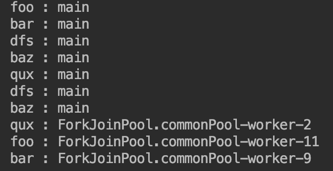

# Stream (스트림)

* Java 8 부터 추가된 배열을 포함한 컬렉션의 저장 요소를 하나씩 참조해서 함수적 스타일로 처리할 수 있도록 해주는 반복자이다.
* Java 7 이전에는 List 의 컬렉션에서 요소를 순차적으로 처리하기 위해서 Iterator 반복자를 사용하였다.

```JAVA
List<String> list = Array.asList("Foo", "Bar", "FooBar");
Iterator<String iterator = list.iterator();
while(iterator.hasNext()) print(iterator.next());

/////////////////////////////////////////////

List<String> list = Array.asList("Foo", "Bar", "FooBar");
Stream<String> stream = list.stream();
stream.forEach( name -> print(name) );
```

## 스트림의 특징

1. 람다식으로 요소 처리 코드를 제공한다.
   * stream 이 제공하는 대부분의 요소 처리 메소드는 함수적 인터페이스 매개 타입을 가지기 때문에 람다식 또는 메소드 참조를 이용해서 요소 처리 내용을 매개값으로 전달할 수 있다.
2. 내부 반복자를 사용하여 병렬 처리가 쉽다.
   * 외부 반복자 - 개발자가 코드로 직접 컬렉션의 요소를 반복해서 가져오는 코드 패턴
     * index 를 이용하는 for, Iterator 를 이용하는 while
   * 내부 반복자 - 컬렉션 내부에서 요소들을 반복시키고, 개발자는 요소당 처리해야 할 코드만 제공하는 코드 패턴
     * 컬렉션 내부에서 어떻게 요소를 반복시킬 것인가는 컬렉션에게 맡겨두고, 개발자는 요소 처리 코드에만 집중할 수 있게 해준다.
     * 반복 순서를 변경하거나, 멀티 코어 CPU 를 최대한 활용하기 위해 요소들을 분배시켜 병렬작업을 할 수 있다.
   * 스트림은 람다식으로 요소 처리 내용만 전달할 뿐, 반복은 컬렉션 내부에서 일어나므로 코드도 간결해지고, 요소의 병렬 처리가 컬렉션 내부에서 처리되므로 여러 이점이 있다.
     * 병렬처리 - 한 가지 작업을 서브 작업으로 나누고, 서브 작업들은 분리된 스레드에서 병렬적으로 처리하는 것을 말한다.
     * 즉, 런타임에 하나의 작업을 서브 작업으로 자동으로 나누고, 서브 작업의 결과를 자동으로 결합해서 최종 결과물을 생성한다.

```JAVA
public static void main(String args[]) {
    public void parallelTest() {
        List<String> list = Arrays.asList("foo", "bar", "dfs", "baz", "qux");

        Stream<String> sequentialStream = list.stream();        // 순차 처리 스트림
        Stream<String> parallelStream = list.parallelStream();  // 병렬 처리 스트림

        sequentialStream.forEach(ParallelExample::print);
        parallelStream.forEach(ParallelExample::print);
    }

    private static void print(String str) {
        System.out.println(str + " : " + Thread.currentThread().getName());
    }
}
```



3. 중간 처리와 최종 처리 작업을 할 수 있다
    * 중간 처리 -> 매핑, 필터링, 정렬을 수행할 수 있다.
    * 최종 처리 -> 반복, 카운팅, 평균, 총합 등의 집계 처리가 가능하다.

```JAVA
public static void main(String args[]) {
    List<Student> studuents = Arrays.asList(
        new Student("Foo", 20),
        new Student("Bar", 40),
        new Student("Baz", 30)
    );

    double avg = studuents
                    .stream()
                    .mapToInt(Student::getScore)
                    .average()
                    .getAsDouble();

    print(avg); // 30.0
}
```

