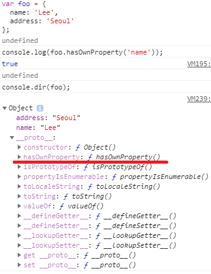
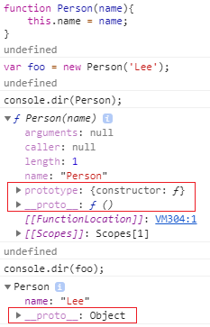
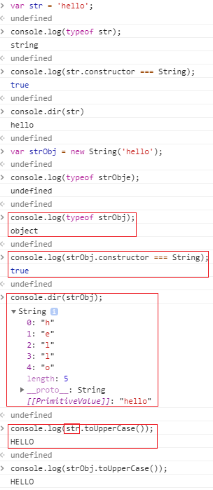

# JavaScript 8
[와 여긴 정리 싹 하고 몇번 공부 해야겠다.. 어렵다](https://poiemaweb.com/js-prototype)

**자바스크립트는 프로토타입 기반 객체지향 프로그래밍 언어이다**

C, Java 등과 같은 클래스 기반 객체지향 프로그래밍 언어는 객체 생성 이전에 클래스를 정의하고 이를 통해 객체를 생성한다

프로토타입 기반 객쳊향 프로그래밍 언어는 클래스 없이도 객체를 생성할 수 있다
> ECMAScript 6에서 클래스가 추가되었다

* 자바스크립트의 모든 객체는 자신의 부모 역할을 담당하는 객체와 연결되어 있다
* 상속 개념과 같이 부모 객체의 프로퍼티 또는 메소드를 상속받아 사용할 수 있게 한다
* 부모의 객체를 Prototype 객체라고 한다
* Prototype 객체는 생성자 함수에 의해 생성된 각각의 객체에 공유 프로퍼티를 제공하기 위해 사용한다


foo에 hasOwnProperty라는 메소드는 없지만 사용가능하다

* foo 객체의 \___proto__는 자신의 부모 객체인 Object.prototype을 가리키고 있다
* 객체를 생성할 때 프로토타입은 결정된다
  * 이렇게 결정된 프로토타입 객체는 다른 임의의 객체로 변경할 수 있다
  * 부모 객체인 프로토타입을 동적으로 변경할 수 있다
  * 이러한 특징을 이용하여 객체의 상속을 구현할 수 있다

```JavaScript
console.log(foo.__proto__ === Object.prototype);//true
```

* [[Prototype]] vs prototype
  * [[Prototype]]은 자신의 프로토타입 객체를 가리키는 숨겨진 프로퍼티
  * [[Prototype]] === \___proto__
  * 함수도 객체이므로 [[Prototype]]을 가지고 있으며, 일반 객체와 다르게 prototype 프로퍼티도 소유한다
  * 즉, 함수에서 [[Prototype]]과 prototype 모두 프로토타입 객체를 가리키지만 관점의 차이가 존재한다



  * [[Prototype]]
    * 객체의 입장에서 자신의 부모 역할을 하는 프로토타입 객체를 가리킨다
    * 함수는 Function.prototype을 가리킨다
  * prototype
    * 함수 객체만 가지는 프로퍼티
    * 함수 객체가 생성자로 사용될 때 이 함수를 통해 생성될 객체의 부모 역할을 하는 객체를 가리킨다
```JavaScript
function Person(name){
  this.name = name;
}
var foo = new Person('Lee');
console.log(Person.prototype === foo.__proto__);//ture
```

* constructor
  * 프로토타입 객체는 constructor 프로퍼티를 가지며 객체의 입장에서 자신을 생성한 객체를 가리킨다

```JavaScript
function Person(name) {
  this.name = name;
}

var foo = new Person('Lee');

// Person() 생성자 함수에 의해 생성된 객체를 생성한 객체는 Person() 생성자 함수이다.
console.log(Person.prototype.constructor === Person);

// foo 객체를 생성한 객체는 Person() 생성자 함수이다.
console.log(foo.constructor === Person);

// Person() 생성자 함수를 생성한 객체는 Function() 생성자 함수이다.
console.log(Person.constructor === Function);
```

* Prototype chain
  * 특정 객체의 프로퍼티나 메소드에 접근하려 할 때 해당 객체에 프로퍼티 또는 메소드가 없다면 [[Prototype]]프로퍼티가 가리키는 링크를 따라 부모 역할을 하는 프로토타입 객체의 프로퍼티나 메소드를 차례대로 검색한다


  * 위 사진에서 foo는 hasOwnProperty는 없지만 [[Prototype]]프로퍼티에 존재하는 hasOwnProperty 메소드를 참고하여 호출하였다

```JavaScript
console.log(foo.hasOwnProperty('name'));  //true
console.log(foo.__proto__ === Object.prototype);  //true
console.log(Object.prototype.hasOwnProperty('hasOwnProperty')); //true
```

  * 객체 리터럴 생성 방법
  > 객체 리터럴<br>
  생성자 함수<br>
  Object() 생성자 함수<br>

  * 객체 리터럴 방식은 Built-in인 Object()생성자 함수로 객체를 생성하는 것을 단순화 시킨 것
  * Object()도 함수이다
    * Object()로 생성하면 일반 객체와 달리 prototype 프로퍼티가 존재한다
    * prototype 프로퍼티는 함수 객체가 생성자로 사용될 때 이 함수를 통해 생성된 객체의 부모 역할을 하는 객체, 프로토타입 객체를 가리킨다
    * [[Prototype]]은 객체의 입장에서 자신의 부모 역할을 하는 객체인 프로토타입 객체를 가리킨다

```JavaScript
var person = {
  name: 'Lee',
  gender: 'male',
  sayHello: function(){
    console.log('Hi! my name is ' + this.name);
  }
};

console.dir(person);

console.log(person.__proto__ === Object.prototype);   // ① true
console.log(Object.prototype.constructor === Object); // ② true
console.log(Object.__proto__ === Function.prototype); // ③ true
console.log(Function.prototype.__proto__ === Object.prototype); // ④ true
```

[](https://poiemaweb.com/js-prototype#41-%EA%B0%9D%EC%B2%B4-%EB%A6%AC%ED%84%B0%EB%9F%B4-%EB%B0%A9%EC%8B%9D%EC%9C%BC%EB%A1%9C-%EC%83%9D%EC%84%B1%EB%90%9C-%EA%B0%9D%EC%B2%B4%EC%9D%98-%ED%94%84%EB%A1%9C%ED%86%A0%ED%83%80%EC%9E%85-%EC%B2%B4%EC%9D%B8)

  * 함수를 정의 방식
  > 함수선언식<br>
  함수표현식<br>
  Function() 생성자 함수<br>

  * 함수선언 / 함수표현 모두 함수 리터럴 방식으로(함수선언은 엔진 내부적으로) 사용하고, 함수 리터럴 방식은 Function() 생성자 함수로 함수를 생성하는 것을 단순화 시킨 것이다
  * 결국 함수를 정의하면 Function() 생성자 함수를 통해 객체를 생성한다
  * 그러므로 모든 함수 객체의 prototype 객체는 Function.prototype이다
  * 생성자 함수도 함수 객체이므로 생성자 함수의 prototype 객체는 Function.prototype이다

|    객체 생성 방식    |   엔진의 객체 생성   |  인스턴스의 prototype 객체 |
|:--------------------:|:--------------------:|:--------------------------:|
|      객체 리터럴     | Object() 생성자 함수 |      Object.prototype      |
| Object() 생성자 함수 | Object() 생성자 함수 |      Object.prototype      |
|      생성자 함수     |      생성자 함수     | 생성자 함수 이름.prototype |

```JavaScript
function Person(name, gender) {
  this.name = name;
  this.gender = gender;
  this.sayHello = function(){
    console.log('Hi! my name is ' + this.name);
  };
}

var foo = new Person('Lee', 'male');

console.dir(Person);
console.dir(foo);

console.log(foo.__proto__ === Person.prototype);                // ① true
console.log(Person.prototype.__proto__ === Object.prototype);   // ② true
console.log(Person.prototype.constructor === Person);           // ③ true
console.log(Person.__proto__ === Function.prototype);           // ④ true
console.log(Function.prototype.__proto__ === Object.prototype); // ⑤ true
```
[](https://poiemaweb.com/js-prototype#42-%EC%83%9D%EC%84%B1%EC%9E%90-%ED%95%A8%EC%88%98%EB%A1%9C-%EC%83%9D%EC%84%B1%EB%90%9C-%EA%B0%9D%EC%B2%B4%EC%9D%98-%ED%94%84%EB%A1%9C%ED%86%A0%ED%83%80%EC%9E%85-%EC%B2%B4%EC%9D%B8)

  * 위 그림에서 객체 리터럴 방식이나 생성자 함수 방식이나 결국 모든 객체의 부모 객체인 Object.prototype 객체에서 프로토타입 체인이 끝나며, Object.prototype 객체를 프로토타입 체인의 종점이라 한다

* 프로토타입 객체의 확장
  * 프로토타입 객체도 객체이므로 프로퍼티를 추가/삭제가 가능하다
  * 추가/삭제된 프로퍼티는 즉시 프로토타입 체인에 반영된다

```JavaScript
function Person(name) {
  this.name = name;
}

var foo = new Person('Lee');

Person.prototype.sayHello = function(){
  console.log('Hi! my name is ' + this.name);
};

foo.sayHello(); //Hi! my name is Lee
```

  * 생성자 함수 Person은 Person.prototype과 prototype 프로퍼티에 의해 바인딩되어 있다
  * Person.prototype 객체는 프로퍼티를 추가/삭제가 가능하다
  * Person.prototype에 프로퍼티를 추가/삭제가 가능하므로 sayHello가 추가되며 프로토타입 체인에 반영된다
  * 즉, 생성자 함수 Person에 의해 생성된 모든 객체는 프로토타입 체인에 의해 부모객체인 Person.prototype에 있는 sayHello를 사용할 수 있게 된다

* 원시 타입의 확장
  * 원시타입이란 number, string, boolean, null, undefined



  * 원시 타입 문자열과 String() 생성자로 생성한 문자열 객체의 타입은 다르다
  * 하지만 원시 타입도 프로퍼티나 메소드를 호출할 때 원시 타입과 연관된 객체로 일시적으로 변환되어 프로토타입 객체를 공유하게 된다
  * 원시 타입은 객체가 아니므로 프로퍼티나 메소드를 직접 추가할 수 없다
  * 하지만 String.prototype에 메소드를 추가하면 원시 타입, 객체 모두 메소드를 사용할 수 있다

```JavaScript
var str = 'hello';

// 에러가 발생하지 않는다.
str.myMethod = function () {
  console.log('str.myMethod');
};

str.myMethod(); // Uncaught TypeError: str.myMethod is not a function

String.prototype.myMethod = function () {
  return 'myMethod';
};

console.log(str.myMethod());      // myMethod
console.log('string'.myMethod()); // myMethod
```

* Object.prototype
  * 결국 모든 객체는 프로토타입 체인에 의해 Object.prototype 객체의 메소들 사용할 수 있다
  * Object.prototype 객체는 프로토타입 체인의 종점으로 모든 객체가 사용할 수 있는 메소드를 가진다
  * Built-in object(내장 객체)의 Global objects(Standard built-in Objects)인 String, Number, Array 객체 등이 가지고 있는 표준 메소드는 프로토타입 객체인 String.prototype, Number.prototype, Array.prototype 등에 정의되어 있다
  * 이들 프로토타입 객체 또한 Object.prototype를 프로토타입 체인에 의해 자신의 프로토타입 객체로 연결한다
  * 자바스크립트는 표준 내장 객체의 프로토타입 객체에 개발자가 정의한 메소드의 추가를 허용한다

* 프로토타입 객체의 변경
  * 프로토타입 객체를 변경할때
    * 변경 시점 이전에 생성된 객체는 기존 프로토타입 객체를 [[Prototype]]프로퍼티에 바인딩한다
    * 변경 시점 이후에 생성된 객체는 변경된 프로토타입 객체를 [[Prototype]]프로퍼티에 바인딩한다

```JavaScript
function Person(name) {
  this.name = name;
}

var foo = new Person('Lee');

// 프로토타입 객체의 변경
Person.prototype = { gender: 'male' };

var bar = new Person('Kim');

console.log(foo.gender); // undefined
console.log(bar.gender); // 'male'

console.log(foo.constructor); // ① Person(name)
console.log(bar.constructor); // ② Object()
//1은 constructor가 Person() 생성자 함수를 가리킨다
//2는 Person() 생성자 함수의 Prototype 프로퍼티가 가리키는 프로토타입 객체를
//일반 객체로 변경하면서 Person.prototype.constructor 프로퍼티도 삭제되었다
//따라서 프로토타입 체인에 의해 bar.constructor의 값은 프로토타입 체이닝에 의해
//Object.prototype.consstrucotr인 Object() 생성자 함수가 된다
```

* 프로토타입 체인 동작 조건
  * 해당 객체에 프로퍼티가 없을 경우 프로토타입 체인이 동작된다
  * 객체의 프로퍼티에 값을 할당하는 경우 프로토타입 체인이 동작하지 않는다
    * 객체가 해당 프로퍼티가 있는 경우, 값을 재할당한다
    * 객체가 해당 프로퍼티에 없을 경우, 해당 객체에 프로퍼티를 동적으로 추가한다

```JavaScript
function Person(name) {
  this.name = name;
}

Person.prototype.gender = 'male'; // ①

var foo = new Person('Lee');
var bar = new Person('Kim');

console.log(foo.gender); // ① 'male'
console.log(bar.gender); // ① 'male'

// 1. foo 객체에 gender 프로퍼티가 없으면 프로퍼티 동적 추가
// 2. foo 객체에 gender 프로퍼티가 있으면 해당 프로퍼티에 값 할당
foo.gender = 'female';   // ②

console.log(foo.gender); // ② 'female'
console.log(bar.gender); // ① 'male'
//foo 객체의 gender 프로퍼티에 값을 할당하면 프로토타입 체인이 발생하여
//Person.prototype 객체의 gender 프로퍼티에 값을 할당하는 것이 아니라
//foo 객체에 프로퍼티를 동적으로 추가한다
```

[](https://poiemaweb.com/js-prototype#8-%ED%94%84%EB%A1%9C%ED%86%A0%ED%83%80%EC%9E%85-%EC%B2%B4%EC%9D%B8-%EB%8F%99%EC%9E%91-%EC%A1%B0%EA%B1%B4)
