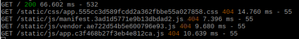

##  Vue.js와 express를 이용했을 때 정적파일 때문에 삽질한 것

전체 프로젝트 구조


* 웹서버 루트 접근시 routes에 index.js를 통해 라우팅을 함
* index.js에서 projectName/server/dist/index.html을 반환해줌
* 이 반환까지는 되지만 index.html은 그 경로 안에 존재하는 static파일들을 불러와야 함
* index.html은 불려지지만 static 파일들이 404로 불려오질 않음
* 불려질 때 경로가 /static/~~ 404 이렇게 나옴

* 당연히 index.js는 projectName/server/routes라는 경로를 가지고 있고 저 경로에서 /static/~~ 을 가려고하니 projectName/server/routes/static/~~ 이렇게 될 것이다
* 상대경로로도 바꾸고 해봤지만 잘 조합해서 했다면 됬을지도 모르지만 이럴때 사용되는 미들웨어가 static
* express에 대한 설정을 projectName/app.js에서 했으므로 app.js 다음을 추가
```javascript
~~~
app.use('/static', express.static(path.join(__dirname, 'server', 'dist', 'static')));
~~~
```
* 사진에서 /static/~ 가져오려고 하니 /static에 대한 경로를 app.js를 기준으로 줘버려서 정적파일을 사용 할 수 있게 만들어 준다
* 그저 static을 이용하면 정적파일을 가져온다 생각해서 그냥 이미지를 가져오는건가 생각했지만 프론트와 백엔드를 나누고, 나눈거에서 경로가 다 다르므로 정적파일에 대한 경로설정을 static 미들웨어를 통해 할 수 있다는 것을 배움
