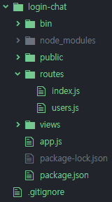
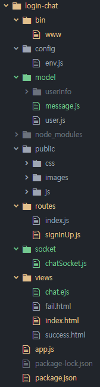

Node.js 5주차
=============

##  1. 프로젝트!

* 세션과 socketIO를 사용해 본적이 없으니 간단한 로그인과 채팅을 만들어 보자!
* 일주안에 다 하기는 힘들지 모르니 1차 목표는 세션 및 정말 간단한 로그인, 몽고디비 배웠으니 몽고디비 연동
* 2차 목표는 로그인하고 로그인을 한 사람들이 전체 다 채팅하는 간단한 채팅웹으로 만들어보자

------------------------------------------------------------------------------

##  2. express-generator를 통해 기본 템플릿 및 폴더 구조 생성

* npm install express-generator -g
* express 'project-name' <- project-name으로 템플릿 생성
* cd 'project-name' && npm install
* npm install을 통해 기본 템플릿 구조 및 필요 모듈(package.json)을 설치
* npm install supervisor --save
* supervisor는 소스코드가 변경되었을 때 자동으로 애플리케이션을 재시작할 수 있는 모듈
* supervisor / nodemon / forerver / pm2 등등이 있다
  * https://npmcompare.com/compare/forever,nodemon,pm2,supervisor
* package.json에서 아래 내용을 추가하면 코드가 변경 될 때마다가 자동으로 재시작 된다

```json
"scripts": {
  "start": "supervisor ./bin/www"
}
```

* npm install mongodb mongoose --save
* npm start를 하면 기본적으로 3000번포트에 서버가 시작된다.
* 전체구조
  * public에는 정적파일, view폴더에는 뷰단 파일
  * 그 외에는 노드 프로젝트 (server폴더를 만들어서 따로 관리해도 되지만 뷰가 주가 아니니 간단하게)


------------------------------------------------------------------------------

##  3. 로그인 / 회원가입 템플릿 만들기

* 정말 간단하게 만듭시다.
* bootstrap을 이용, bootstrap css, js파일을 public폴더에 넣어서 사용합시다
* http://getbootstrap.com/docs/4.1/getting-started/download/

```html
<!-- views폴더에 index.html을 만들고 -->
<link href="../public/css/bootstrap.min.css" rel="stylesheet">
<!-- 얘는 헤더에 -->
<script src="https://ajax.googleapis.com/ajax/libs/jquery/1.11.2/jquery.min.js"></script>
<script src="../public/js/bootstrap.min.js"></script>
<!-- 얘는 바디에 -->
<!-- 이렇게 html에 넣어서 부트스트랩을 사용할 준비를 하고 -->
```
```Javascript
//app.js에서
//public을 붙여줘서 저기에 있는 정적 파일을 불러올 수 있게 세팅
app.use('/public', express.static(path.join(__dirname, 'public')));

//routes에 있는 index.js에서
router.get('/', function(req, res, next) {
  res.sendFile(path.join(
    __dirname, '..', 'views', 'index.html'));
});
//이렇게 수정해서 루트에 접근시 만들어둔 index.html을 반환하게 세팅하면 끗
```

* 이건 프론트가 목적이 아니므로 간단히 템플릿을 이용합시다
* https://bootsnipp.com/snippets/featured/login-and-register-tabbed-form
* 이걸 활용해서 회원가입과 로그인 템플릿을 사용하고 css와 js파일을 public폴더에 추가 및 필요없는 것들 삭제
* 몽고디비와 연동하여 로그인, 회원가입 간단히 만들고 각각 성공 및 실패에 따른 html파일 및 라우팅

------------------------------------------------------------------------------

##  4. 몽구스를 이용하여 스키마 및 패스워드 암호화

* 몽구스를 이용하여 virtual 스키마를 통해 패스워드 암호화 완료
* DB관련 환경설정 및 스키마를 model 디렉토리에 분할
* express-session을 이용하여 로그인 성공시 이름을 세션에 저장
* 회원가입시 이름에 unique 인덱스를 줘서 중복X
* 로그아웃시 logout url로 넘어가서 세션 삭제 후 루트(로그인 페이지)로 리다이렉트

------------------------------------------------------------------------------

##  5. 소켓을 이용하여 간단한 채팅 웹 만들기

* npm install soket.io --save를 통해 소켓 설치
* express-generator와 socketIo 연동 https://stackoverflow.com/questions/37114391/socket-io-with-express-generator
* express-generator + socketIo + MongoDB https://dotblogs.com.tw/explooosion/2018/01/27/170320
* socket.io를 사용 할 때 소켓과 http를 연결한 후 소켓에 이벤트를 만들어서 그 이벤트에 따라 1:1 / broad 가 가능
* 노드 라우팅에서 데이터를 html로 보내기 위해 템플릿 엔진 ejs 사용
  * 템플릿을 읽어 엔진으 ㅣ문법과 설정에 따라서 파일을 HTML 형식으로 변환시키는 모듈
  * HTML에서 <% %>를 이용해서 서버의 데이터를 사용하거나 코드를 실행 할 수 있음
* socket폴더에 소켓과 관련된 몽고DB 클래스 파일

```Javascript
//www파일에서 소켓을 http와 연결
var app = require('../app');
var debug = require('debug')('login-chat:server');
var http = require('http');
var port = normalizePort(process.env.PORT || '3000');
app.set('port', port);
var server = http.createServer(app);
var io = app.io
io.attach(server);
//app에서 socket.io세팅을 하였고 이를 http와 연결

//소켓 연결 (app.js)
app.io.on('connection', async function(socket){
  console.log('A user connected');
  //소켓에 접속하였을 때의 이벤트

  socketHandler = new SocketHandler();
  socketHandler.connect();
  //연결 후 소켓관련 몽고 DB 클래스를 생성 및 DB연결

  socket.on('disconnect', function(){
    console.log('A user disconnect');
  });
  //소켓 연결 해제시 이벤트

  socket.on('chat message', function(data){
    socketHandler.storeMessages(data);
    app.io.emit('chat message', data);
  });
  //소켓에 chat message라는 이벤트가 발생 시 소켓에 연결되어 있는 모든 사람에게 chat message라는 이벤트로 데이터를 보냄

});

//뷰에서 소켓에 들어오는 이벤트에 따라 처리(chat.ejs)
```
```HTML
<script>
$('form').submit(function(){
  msgData.name = name;
  //세션을 통해 로그인한 사람의 이름을 넣는다
  msgData.msg = $('#m').val();
  //텍스트 박스 안에 있는(입력한) 내용을 넣는다
  socket.emit('chat message', msgData);
  //chat message 이벤트 발생
  $('#m').val('');
  return false;
});
//버튼 클릭시 텍스트에 있는 내용을 소켓에 넣어서 보냄

socket.on('chat message', function(msgData){
  $('#messages').append($('<li>').text(msgData.name + ' : ' + msgData.msg));
  //chat message 이벤트 발생 시 받아온 메시지를 추가
  let h = document.querySelector('.chats');
  window.scrollTo(0, h.scrollHeight);
  //채팅의 전체 길이를 알아낸 후 제일 아래 요소로 스크롤을 옮기기
});
</script>
```

* 데이터베이스 연동부분에서 데이터를 비동기로 받아와야 처리가 빠른데 그렇게하면 데이터를 어떻게 받아오는지, 그리고 데이터베이스를 닫는 함수가 어떤건지에 대해 나의 실력 부족으로 채팅창에 들어갈 때 데이터베이스 처리부분에서 느린게 보임
* 소켓이랑 세션이랑 노드에서 html로 데이터를 넘기고 자바스크립트 쓰고 등등 꼬이고 꼬여서 알아보기가 힘듬.. 구조 잡는걸 더 잘하고 싶다
* css는 정말 개같은것 디자인적 감각이 생겼으면 좋겠다. css는 할때마다 암걸리네





* 최종구조 형태
  * bin에 www는 메인, www를 실행하면 서버가 실행된다
  * config에는 데이터베이스 접속에 관련된 설정을 넣어뒀다
  * model에는 데이터베이스를 사용할 때, 여기서는 몽고디비 스키마 및 쿼리를 모아뒀다
  * public에는 정적파일들, 뷰에서 사용되는 정적 파일들의 집합
  * routes는 라우팅에 관련된 파일들
  * socket에는 소켓에 관련된 몽고디비 설정이 들어있다
  * views에는 말그대로 뷰. 처음 로그인, 실패와 성공(간단한 말 한줄) 및 채팅에 대한 뷰가 있다
  * app.js는 서버 설정에 대한 파일
