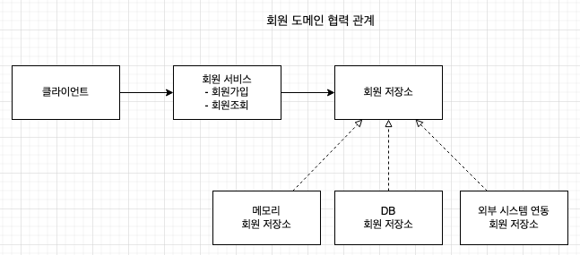
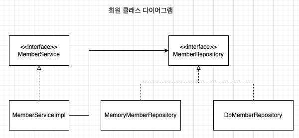
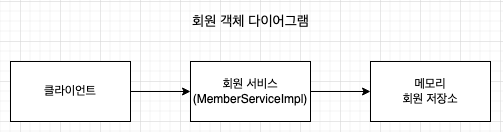
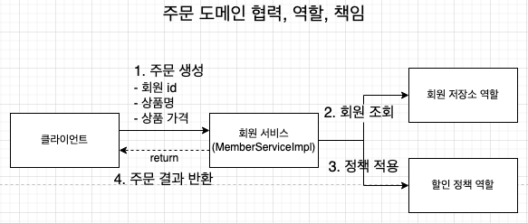
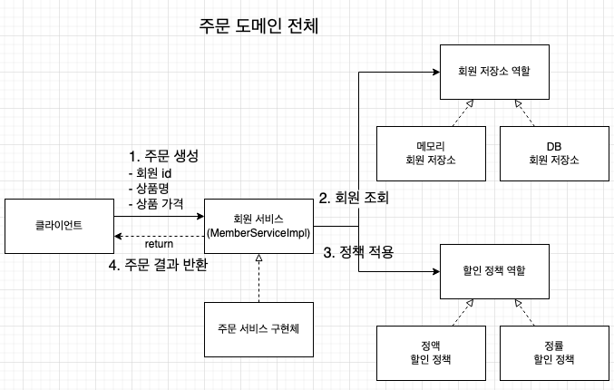
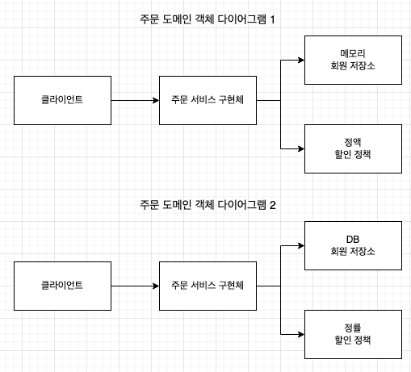

## 비즈니스 요구사항과 설계

### 회원
* 회원을 가입하고 조회할 수 있다
* 회원은 일반과 VIP 등급이 있다
* 회원 데이터는 자체 DB 를 구축할 수 있고, 외부 시스템과 연동할 수 있다 (미확정)

* 위와 같이 나중에 어떠한 저장소를 선택하여도 쉽게 변경 가능하게 설계를 하여 추후 변경을 쉽게 대응할 수 있다
* 도메인 협력 관계의 경우 기획자가 볼 수 있다

* 도메인 협력 관계를 통해 클래스 다이어그램을 작성할 수 있다

* 서버가 실제 실행되어 클라이언트가 실제로 사용하는 것을 보여준다

#### 회원 설계의 문제점

* 의존관계가 인터페이스 뿐만 아니라 구현까지 모두 의존하는 문제가 있음

### 주문과 할인 정책

* 회원은 상품을 주문할 수 있다
* 회원 등급에 따라 할인 정책을 적용할 수 있다
* 할인 정책은 VIP 인 경우 1,000 원을 고정으로 할인한다
  * 상세한 할인 정책은 정해지지 않았으며, 추후 변경 가능성이 존재한다

1. 주문 생성: 클라이언트는 주문 서비스에 주문 생성을 요청한다
1. 회원 조회: 할인을 위해서는 회원 등급이 필요하다.
    * 주문 서비스는 회원 저장소에서 회원을 조회한다
1. 할인 적용: 주문 서비스는 회원 등급에 따른 할인 여부를 할인 정책에 위임한다
1. 주문 결과 반환: 주문 서비스는 할인 결과를 포함한 주문 결과륿 반환한다

* 역할과 구현을 분리해서 자유롭게 구현 객체를 조립할 수 있게 설계할 수 있다
  * 결과적으로 회원 저장소와 할인 정책은 유연하게 변경될 수 있다

* 위와 같이 회원을 메모리나 DB 어떤것으로 조회를 하고, 어떠한 할인 정책을 적용하더라도 주문 서비스를 변경하지 않아도 된다
    * 역할들의 협력 관계를 그대로 사용할 수 있다

### 좋은 객체 지향 설계의 5가지 원칙의 적용

#### SRP 단일 책임 원칙

* 한 클래스는 하나의 책임만 가져야 한다
    * 클라이언트 객체는 직접 구현 객체를 생성하고, 연결하고, 실행하는 다양한 책임을 가지고 있다
    * SRP 단일 책임 원칙을 따르면서 관심사를 분리
    * 구현 객체를 생성하고 연결하는 책임은 AppConfig 가 담당
    * 클라이언트 객체는 실행하는 책임만 담당
    
#### DIP 의존관계 역전 원칙

* 프로그래머는 "추상화에 의존해야지, 구체화에 의존하면 안된다" 의존성 주입은 이 원칙을 따르는 방법 중 하나이다
* 새로운 할인 정책을 개발하고, 적용하려고 할 때 클라이언트 코드도 함께 변경을 해야하는 경우가 발생했다
    * 기존 클라이언트 코드인 `OrderServiceImpl` 은 DIP 를 지키며, `DiscountPolicy` 추상화 인터페이스에 의존하는 것 같았지만, `FixDiscountPolicy` 라는 구체화 구현 클래스에도 의존했었다
    * 이러한 구조에서 `DiscountPolicy` 추상화 인터페이스에만 의존하도록 코드를 변경하였으나, 클라이언트 코드는 인터페이스만으로는 실행이 불가능했다
    * `AppConfig` 를 통해 추상화 인터페이스에 실제 구현된 객체를 주입함으로 클라이언트 코드에 의존관계를 주입하여 DIP 원칙을 따르면서 문제를 해결하였다
    
#### OCP

* 소프트웨어 요소는 확장에는 열려 있으나 변경에는 닫혀 있어야 한다
* 다형성을 사용하여 클라이언트가 DIP 를 지켰다
* 애플리케이션을 사용 영역과 구성 영역으로 나누었다
* `AppConfig` 가 의존관계를 `FixDiscountPolicy` -> `RateDiscountPolicy` 로 변경해서 클라이언트 코드에 주입하므로 클라이언트 코드는 변경하지 않아도 된다
* 즉, 소프트웨어 요소를 새롭게 확장해도 사용 영역의 변경은 닫혀있게 되었다

#### 제어의 역전 (IoC - Inversion of Control)

* 기존 프로그램은 클라이언트 구현 객체가 스스로 필요한 서버 구현 객체를 생성하고, 연결하고, 실행하였다
    * 구현 객체가 프로그램의 제어 흐름을 스스로 조종하였다
    * 이는 개발자 입장에서 자연스러운 흐름이다
* 하지만 `AppConfig` 가 등장한 후 구현 객체는 자신의 로직을 실행하는 역할만 담당하게 되었다
    * 프로그램의 제어 흘므은 이제 `AppConfig` 가 가져간다
* 프로그램에 대한 제어 흐름에 대한 권한은 모두 `AppConfig` 가 가지고 있다
* 프레임 워크 vs 라이브러리
    * 내가 작성한 코드를 제어하고 대신 실행하면 그것은 프레임워크이다 (JUnit...)
    * 내가 작성한 코드가 직접 제어의 흐름을 담당하면 라이브러리이다

#### 의존 관계 주입 (DI - Dependency Injection)

* 의존관계는 **정적인 클래스 의존 관계와, 실행 시점에 결정되는 동적인 객체(인스턴스) 의존 관계** 들을 분리해서 생각해야 한다
* 정적인 클래스 의존관계
    * `import` 코드를 통해 의존관계를 쉽게 판단할 수 있다
    * 정적인 의존관계는 애플리케이션을 실행하지 않아도 분석할 수 있다
* 동적인 객체 인스턴스 의존 관계
    * 애플리케이션 실행 시점에 실제 생성된 객체 인스턴스의 참조가 연결된 의존 관계이다
    * 애플리케이션 실행 시점(런타임) 에 외부에서 실제 구현 객체를 생성하고 클라이언트에 전달해서 클라이언트와 서버의 실제 의존관계가 연결 되는 것을 **의존관계 주입** 이라고 한다
    * 객체 인스턴스를 생성하고, 그 참조값을 전달해서 연결된다
    * 의존관계 주입을 사용하면 클라이언트 코드를 변경하지 않고, 클라이언트가 호출하는 대상의 타입 인스턴스를 변경할 수 있다
    * 의존관계 주입을 사용하면 정적인 클래스 의존관계를 변경하지 않고, 동적인 객체 인스턴스 의존관계를 쉽게 변경할 수 있다

### 스프링 컨테이너

* `ApplicationContext` 를 스프링 컨테이너라고 한다
* 기존에는 개발자가 `AppConfig` 를 사용해서 직접 객체를 생성하고 DI 를 하였지만, 스프링 컨테이너를 통해 DI 를 할 수 있게 된다
* 스프링 컨테이너는 `@Configuration` 이 붙은 설정 정보를 사용한다
    * `@Bean` 이라는 메서드를 모두 호출해서 반환된 객체를 스프링 컨테이너에 등록한다
    * 이렇게 스프링 컨테이너에 등록된 객체를 스프링 빈이라고 한다
* 스프링 빈은 `@Bean` 이 붙은 메서드의 명을 스프링 빈의 이름으로 사용한다
    * 스프링 컨테이너를 통해 필요한 스프링 빈(객체)를 찾아서 사용할 수 있다
    * 이러한 스프링 빈은 `applicationContext.getBean()` 메서드로 찾을 수 있다
* 기존에는 개발자가 직접 자바코드로 모든 것을 했지만, 이제부터는 스프링 컨테이너에 객체를 스프링 빈으로 등록하고 스프링 컨테이너에서 스프링 빈을 찾아서 사용하도록 변경되었다
