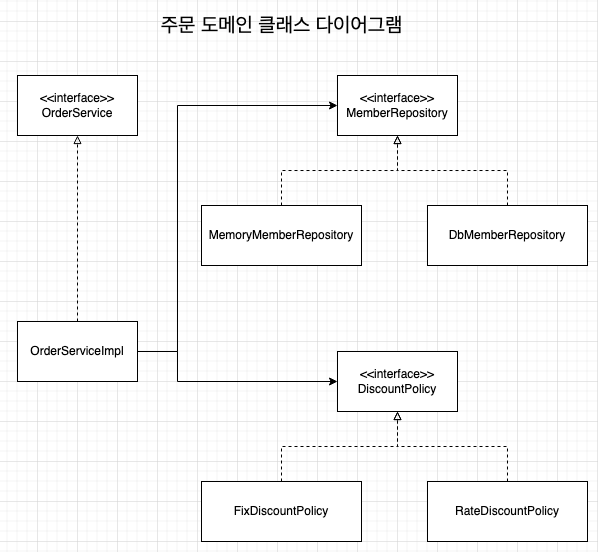

## 비즈니스 요구사항과 설계

### 회원
* 회원을 가입하고 조회할 수 있다
* 회원은 일반과 VIP 등급이 있다
* 회원 데이터는 자체 DB 를 구축할 수 있고, 외부 시스템과 연동할 수 있다 (미확정)


* 위와 같이 나중에 어떠한 저장소를 선택하여도 쉽게 변경 가능하게 설계를 하여 추후 변경을 쉽게 대응할 수 있다
* 도메인 협력 관계의 경우 기획자가 볼 수 있다


* 도메인 협력 관계를 통해 클래스 다이어그램을 작성할 수 있다


* 서버가 실제 실행되어 클라이언트가 실제로 사용하는 것을 보여준다

#### 회원 설계의 문제점

* 의존관계가 인터페이스 뿐만 아니라 구현까지 모두 의존하는 문제가 있음

### 주문과 할인 정책

* 회원은 상품을 주문할 수 있다
* 회원 등급에 따라 할인 정책을 적용할 수 있다
* 할인 정책은 VIP 인 경우 1,000 원을 고정으로 할인한다
  * 상세한 할인 정책은 정해지지 않았으며, 추후 변경 가능성이 존재한다


1. 주문 생성: 클라이언트는 주문 서비스에 주문 생성을 요청한다
1. 회원 조회: 할인을 위해서는 회원 등급이 필요하다.
    * 주문 서비스는 회원 저장소에서 회원을 조회한다
1. 할인 적용: 주문 서비스는 회원 등급에 따른 할인 여부를 할인 정책에 위임한다
1. 주문 결과 반환: 주문 서비스는 할인 결과를 포함한 주문 결과륿 반환한다


* 역할과 구현을 분리해서 자유롭게 구현 객체를 조립할 수 있게 설계할 수 있다
  * 결과적으로 회원 저장소와 할인 정책은 유연하게 변경될 수 있다




* 위와 같이 회원을 메모리나 DB 어떤것으로 조회를 하고, 어떠한 할인 정책을 적용하더라도 주문 서비스를 변경하지 않아도 된다
    * 역할들의 협력 관계를 그대로 사용할 수 있다

### 좋은 객체 지향 설계의 5가지 원칙의 적용

#### SRP 단일 책임 원칙

* 한 클래스는 하나의 책임만 가져야 한다
    * 클라이언트 객체는 직접 구현 객체를 생성하고, 연결하고, 실행하는 다양한 책임을 가지고 있다
    * SRP 단일 책임 원칙을 따르면서 관심사를 분리
    * 구현 객체를 생성하고 연결하는 책임은 AppConfig 가 담당
    * 클라이언트 객체는 실행하는 책임만 담당
    
#### DIP 의존관계 역전 원칙

* 프로그래머는 "추상화에 의존해야지, 구체화에 의존하면 안된다" 의존성 주입은 이 원칙을 따르는 방법 중 하나이다
* 새로운 할인 정책을 개발하고, 적용하려고 할 때 클라이언트 코드도 함께 변경을 해야하는 경우가 발생했다
    * 기존 클라이언트 코드인 `OrderServiceImpl` 은 DIP 를 지키며, `DiscountPolicy` 추상화 인터페이스에 의존하는 것 같았지만, `FixDiscountPolicy` 라는 구체화 구현 클래스에도 의존했었다
    * 이러한 구조에서 `DiscountPolicy` 추상화 인터페이스에만 의존하도록 코드를 변경하였으나, 클라이언트 코드는 인터페이스만으로는 실행이 불가능했다
    * `AppConfig` 를 통해 추상화 인터페이스에 실제 구현된 객체를 주입함으로 클라이언트 코드에 의존관계를 주입하여 DIP 원칙을 따르면서 문제를 해결하였다
    
#### OCP

* 소프트웨어 요소는 확장에는 열려 있으나 변경에는 닫혀 있어야 한다
* 다형성을 사용하여 클라이언트가 DIP 를 지켰다
* 애플리케이션을 사용 영역과 구성 영역으로 나누었다
* `AppConfig` 가 의존관계를 `FixDiscountPolicy` -> `RateDiscountPolicy` 로 변경해서 클라이언트 코드에 주입하므로 클라이언트 코드는 변경하지 않아도 된다
* 즉, 소프트웨어 요소를 새롭게 확장해도 사용 영역의 변경은 닫혀있게 되었다

#### 제어의 역전 (IoC - Inversion of Control)

* 기존 프로그램은 클라이언트 구현 객체가 스스로 필요한 서버 구현 객체를 생성하고, 연결하고, 실행하였다
    * 구현 객체가 프로그램의 제어 흐름을 스스로 조종하였다
    * 이는 개발자 입장에서 자연스러운 흐름이다
* 하지만 `AppConfig` 가 등장한 후 구현 객체는 자신의 로직을 실행하는 역할만 담당하게 되었다
    * 프로그램의 제어 흘므은 이제 `AppConfig` 가 가져간다
* 프로그램에 대한 제어 흐름에 대한 권한은 모두 `AppConfig` 가 가지고 있다
* 프레임 워크 vs 라이브러리
    * 내가 작성한 코드를 제어하고 대신 실행하면 그것은 프레임워크이다 (JUnit...)
    * 내가 작성한 코드가 직접 제어의 흐름을 담당하면 라이브러리이다

#### 의존 관계 주입 (DI - Dependency Injection)

* 의존관계는 **정적인 클래스 의존 관계와, 실행 시점에 결정되는 동적인 객체(인스턴스) 의존 관계** 들을 분리해서 생각해야 한다
* 정적인 클래스 의존관계
    * `import` 코드를 통해 의존관계를 쉽게 판단할 수 있다
    * 정적인 의존관계는 애플리케이션을 실행하지 않아도 분석할 수 있다
* 동적인 객체 인스턴스 의존 관계
    * 애플리케이션 실행 시점에 실제 생성된 객체 인스턴스의 참조가 연결된 의존 관계이다
    * 애플리케이션 실행 시점(런타임) 에 외부에서 실제 구현 객체를 생성하고 클라이언트에 전달해서 클라이언트와 서버의 실제 의존관계가 연결 되는 것을 **의존관계 주입** 이라고 한다
    * 객체 인스턴스를 생성하고, 그 참조값을 전달해서 연결된다
    * 의존관계 주입을 사용하면 클라이언트 코드를 변경하지 않고, 클라이언트가 호출하는 대상의 타입 인스턴스를 변경할 수 있다
    * 의존관계 주입을 사용하면 정적인 클래스 의존관계를 변경하지 않고, 동적인 객체 인스턴스 의존관계를 쉽게 변경할 수 있다

### 스프링 컨테이너

* `ApplicationContext` 를 스프링 컨테이너라고 한다
* 기존에는 개발자가 `AppConfig` 를 사용해서 직접 객체를 생성하고 DI 를 하였지만, 스프링 컨테이너를 통해 DI 를 할 수 있게 된다
* 스프링 컨테이너는 `@Configuration` 이 붙은 설정 정보를 사용한다
    * `@Bean` 이라는 메서드를 모두 호출해서 반환된 객체를 스프링 컨테이너에 등록한다
    * 이렇게 스프링 컨테이너에 등록된 객체를 스프링 빈이라고 한다
* 스프링 빈은 `@Bean` 이 붙은 메서드의 명을 스프링 빈의 이름으로 사용한다
    * 스프링 컨테이너를 통해 필요한 스프링 빈(객체)를 찾아서 사용할 수 있다
    * 이러한 스프링 빈은 `applicationContext.getBean()` 메서드로 찾을 수 있다
* 기존에는 개발자가 직접 자바코드로 모든 것을 했지만, 이제부터는 스프링 컨테이너에 객체를 스프링 빈으로 등록하고 스프링 컨테이너에서 스프링 빈을 찾아서 사용하도록 변경되었다

### 스프링 컨테이너 생성

```java
ApplicationContext applicationContext = new ApplicationConfigApplicationContext(AppConfig.class);
// 스프링 컨테이너 생성
// 해당 코드에서는 AppConfig 를 기반으로 스프링 컨테이너를 생성함
// ApplicationConfigApplicationContext 은 ApplicationContext 인터페이스의 구현체이다
```

* `ApplicationContext` 를 스프링 컨테이너라고 한다
    * `ApplicationContext` 는 인터페이스이다
    * 자세히는 `BeanFactory` 와 `ApplicationContext` 로 구분해서 스프링 컨테이너라고 해야 하지만, 대부분 `BeanFactory` 를 직접 사용하는 경우가 없다
* 스프링 컨테이너는 XML 이나 어노테이션 기반으로 생성할 수 있다

#### 스프링 컨테이너의 생성 과정

1. 스프링 컨테이너 생성
    * 스프링 컨테이너를 생성할 때는 구성 정보를 지정해줘야 한다
2. 스프링 빈 등록
    * 스프링 컨테이너는 파라미터로 넘어온 설정 클래스 정보를 사용해서 스프링 빈을 등록한다
    * 빈 이름은 메서드 이름을 사용하나, `@Bean(name=xxx)` 와 같은 형태로 따로 지정해줄 수 있다
    * 빈 이름은 항상 다른 이름을 부여해야 한다 (같은 빈 이름이 존재하면 덮어씌워지는 등의 문제가 발생한다)
3. 스프링 빈 의존관계 설정
    * 스프링 컨테이너는 설정 정보를 참고해서 의존관계를 주입(DI)한다
    * 스프링은 빈을 생성하고, 의존관계를 주입하는 단계가 나누어져 있다

### 스프링 빈 조회 - 상속관계

* 부모 타입으로 조죄하면, 자식 타입도 함께 조회된다
    * 이렇게 때문에 모든 자바 객체의 최고 부모인 `Object` 타입으로 조죄하면. 모든 스프링 빈을 조회한다
  
### BeanFactory 와 ApplicationContext

* BeanFactory
    * 스프링 컨테이너의 최상위 인터페이스
    * 스프링 빈을 관리하고 조회하는 역할을 담당
    * `getBean()` 을 제공한다
* ApplicationContext
    * BeanFactory 기능을 모두 상속받아 제공한다
    * 빈을 관리하고 검색하는 기능을 BeanFactory 가 제공하고, ApplicationContext 는 애플리케이션을 개발할 때 더 많은 기능을 제공한다
    * ApplicationContext 가 제공하는 기능
        * 메시지소스를 활용한 국제화 기능
        * 환경변수 - 로컬/개발/운영 등을 구분하여 처리
        * 애플리케이션 이벤트 - 이벤트를 발생하고 구독하는 모델을 편리하게 지원
        * 편리한 리소스 조회 - 파일/클래스패스/외부 등에서 리소스를 편리하게 조회
* 정리
    * ApplicationContext 는 BeanFactory 의 기능을 상속받는다
    * ApplicationContext 는 빈 관리지능 + 편리한 부가 기능을 제공한다
    * BeanFactory 를 직접 사용할 일은 거의 없다.
        * 부가기능이 포함된 ApplicationContext 를 사용한다
    * BeanFactory 나 ApplicationContext 를 스프링 컨테이너라고 한다

### 다양한 설정 형식 지원

* 스프링 컨테이너는 다양한 형식의 설정 정보를 받아드릴 수 있게 유연하게 설계되어 있다
  * Java/XML/Groovy 등
  
#### Annotation 기반 자바 코드 설정 사용

* `new AnnotationConfigApplicationContextr(xxx.class)` 와 같은 형태로 사용한다
* `AnnotationConfigApplicationContext` 클래스를 사용하면서 자바 코드로된 설정 정보를 넘기면 된다

#### XML 설정 사용

* 최근에는 스프링 부트를 많이 사용하면서 XML 기반의 설정은 잘 사용하지 않는다
    * 많은 레거시 프로젝트 들이 XML 로 되어있고, XML 로 사용시 컴파일 없이 빈 설정 정보를 변경할 수 있는 장점이 존재한다
* `GenericXmlApplicationContext` 를 사용하여 `xml` 설정 파일을 넘기면 된다

### 스프링 빈 설정 메타 정보 - BeanDefinition

* 스프링은 다양한 설정 형식을 지원하는 중심에는 `BeanDefinition` 이라는 추상화가 존재한다
    * 이는 **역할과 구현을 개념적으로 나눈 것**이다
        * XML/Java 등을 읽어서 BeanDefinition 을 만들면 된다
* `BeanDefinition` 을 빈 설정 메타정보라고 한다
    * `@Bean`/`<bean>` 당 각각 하나씩 메타 정보가 생성된다
* 스프링 컨테이너는 이러한 메타정보를 기반으로 스프링 빈을 생성한다
* `AnnotationConfigApplicationContext` 는 `AnnotatedBeanDefinitionReader` 를 사용해서 java 설정 파일을 읽고 `BeanDefinition` 을 생성한다
* `GenericXmlApplicationContext` 는 `XmlBeanDefinitionReader` 를 사용해서 xml 설정 파일을 읽고 설정 정보를 읽고 `BeanDefinition` 을 생성한다
* 새로운 형식의 설정 정보가 추가되면, xxxBeanDefinitionReader 를 만들어 `BeanDefinition` 을 생성하면 된다

#### BeanDefinition 정보

* BeanClassName: 생성할 빈의 클래스 명 (자바 설정 처럼 팩토리 역할의 빈을 사용하면 없음)
* factoryBeanNAme: 팩토리 역할의 빈을 사용할 경우
* factoryMethodNAme: 빈을 생성할 팩토리 메서드 지정
* Scope: 싱글톤(기본값)
* lazyInit: 스프링 컨테이너를 생성할 때 빈을 생성하는 것이 아니라, 실제 빈을 사용할 때 까지 최대한 생성을 지연처리 하는지 여부
* InitMethodName: 빈을 생성하고, 의존관계를 적용한 뒤에 호출되는 초기화 메서드 명
* DestroyMethodName: 빈의 생명주기가 끝나서 제거하기 직전에 호출되는 메서드 명
* Constructor arguments, Properties: 의존관계 주입에서 사용 (자바 설정 처럼 팩토리 역할의 빈을 사용하면 없음)

#### BeanDefinition 정리

* BeanDefinition 을 직접 설정해서 스프링 컨테이너에 등록할 수 있다
    * 하지만 BeanDefinition 을 직접 정의하거나 사용할 일은 거의 없다
* BeanDefinition 에 대해 너무 깊이있게 이해보다는 스프링이 다양한 형태의 설정 정보를 BeanDefinition 으로 추상화해서 사용하는 것 정도만 이해하면 된다

### 웹 애플리케이션과 싱글톤

* 스프링은 기업용 온라인 서비스 기술을 지원하기 위해 탄생하였다
    * 대부분의 스프링 애플리케이션은 웹 애플리케이션이다
    * 웹 애플리케이션은 보통 여러 고객이 동시에 요청을 한다
    * `AppConfig` 의 경우 요청을 할 때 마다 객체를 새로 생성한다
    * 이러한 문제점을 해결하기 위한 해결방안으로, 해당 객체가 1개만 생성되고 공유되도록 설계하면 된다 (싱글톤 패턴)

### 싱글톤 패턴

* 클래스의 인스턴스가 1개만 생성되는 것을 보장하는 디자인 패턴이다
    * 객체 인스턴스를 2개 이상 생성하지 못하도록 막아야 한다
    * 즉, `private` 생성자를 사용해서 외부에서 임의로 `new` 를 통해 생성하지 못해야 한다
* 싱글톤 패턴 문제점
    * 싱글톤 패턴을 구현하는 코드 자체가 많이 들어간다
    * 의존관계상 클라이언트가 구체 클래스에 의존한다 (DIP 위반)
    * 클라이언트가 구체 클래스에 의존해서 OCP 원칙을 위반할 가능성이 높다
    * 테스트 하기가 어렵다
    * 내부 속성을 변경하거나 초기화 하기 어렵다
    * private 생성자로 자식 클래스를 만들기 어렵다
    * 결론적으로 유연성이 떨어지며, 안티패턴으로 불리기도 한다

### 싱글톤 컨테이너

* 스프링 컨테이너는 싱글톤 패턴의 문제점을 해결하면서, 객체 인스턴스를 싱글톤으로 관리한다
* 스프링 컨테이너는 싱글톤 패턴을 적용하지 않아도 객체 인스턴스를 싱글톤으로 관리한다
* 스프링 컨테이너는 싱글톤 컨테이너 역할을 한다
    * 싱글톤 객체를 생성하고 관리하는 기능을 싱글톤 레지스트리라 한다
* 스프링 컨테이너의 이러한 기능 때문에 싱글턴 패턴의 모든 단점을 해결하면서 객체를 싱글톤으로 유지할 수 있다
    * 싱글톤 패턴을 위한 추가적인 코드가 필요없다
    * DIP, OCP, 테스트, private 생성자로부터 자유롭게 싱글톤을 사용할 수 있다

### 싱글톤 방식의 주의점

* 싱글톤 패턴이든, 스프링 같은 싱글톤 컨테이너를 사용하든, 객체 인스턴스를 하나만 생성해서 공유하는 싱글톤 방식은 여러 클라이언트가 하나의 같은 객체 인스턴스를 공유하기 때문에 싱글톤 객체는 상태를 유지(stateful) 하게 설계하면 안된다
* 무상태(stateless)로 설계해야 한다
    * 특정 클라이언트에 의존적인 필드가 존재하면 안된다
    * 특정 클라이언트가 값을 변경할 수 있는 필드가 존재하면 안된다
    * 가급적 읽기만 가능해야 한다
    * 필드 대신 자바에서 공유되지 않는, 지역변수, 파라미터, ThreadLocal 등을 사용해야 한다
* 스프링 빈의 필드에 공유 값을 설정하면 정말 큰 장애가 발생할 수 있다
    * **공유필드는 항상 조심해야 하며, 스프링 빈은 항상 무상태로 설정해야 한다**

#### 싱글톤 정리

* `@Bean` 만 사용해도 스프링 빈으로 등록되지만, 싱글톤을 보장하지 않는다
* `Configuration` 을 사용하면 스프링은 바이트코드 조작 라이브러리를 활용하여 해당 설정 파일을 상속받은 `CGLIB` 를 활용해서 스프링 빈을 등록한다
    * `CGLIB` 은 빈을 등록할 때, 기존에 등록된 빈을 호출할 경우 등록된 빈을 리턴한다
    * 즉, 싱글톤을 보장한다
    * 스프링의 설정을 할 때  `@=Configuration` 을 사용하자

### 컴포넌트  스캔과 의존관계 자동 주입 시작하기

* 등록해야 할 스프링 빈이 많아질수록 등록하기 힘들고, 설정 정보도 커지고, 누락하는 문제가 발생한다
    * 스프링은 설정 정보가 없어도 자동으로 스프링 빈을 등록하는 컴포넌트 스캔이라는 기능을 제공한다
    * 의존관계를 자동으로 주입하는 `@Autowired` 라는 기능을 제공한다
* `ComponentScan` 어노테이션을 사용하면 `@Component` 가 붙은 어노테이션 클래스를 스캔하여 스프링 빈으로 등록한다
    * 스프링 빈의 기본 이름은 클래스명을 사용하되, 맨 앞글자만 소문자를 사용한다
        * 빈 이름 기본 전략: MemberServiceImpl 클래스 -> memberServiceImpl
        * 빈 이름 직접 지정: @Component("memberService2") 와 같이 직접 지정할 수 있다
  * 각 컴포넌트 안에서 의존관계 주입이 필요한 곳에 `@Autowired` 어노테이션을 사용하면, 자동으로 여러개의 모든 의존관계를 주입받을 수 있다
      * 기본 조회 전략은 타입이 같은 빈을 찾아서 주입한다

### 탐색 위치와 기본 스캔 대상

* 탐색할 패키지의 시작 위치 지정이 가능하다
    * 모든 자바 클래스의 컴포넌트를 스캔하려면 시간이 오래 걸리기 때문에, 필요한 위치부터 탐색하도록 시작 위치를 지정할 수 있다
  
```java
@ComponentScan(
        basePackages = "some.path"
)
```

* basePackages: 탐색할 패키지의 시작 위치를 지정
    * `basePackages = {"some.path1", "some.path2"}` 와 같이 여러개를 지정할 수 있다
* basePackageClasses: 지정한 클래스의 패키지를 탐색 시작 위로 지정
* 별도의 패키지를 지정하지 않으면, `@ComponentScan` 이 붙은 설정 정보 클래스와 패키지가 시작 위치가 된다
* 별도의 패키지를 지정하지 않고, 프로젝트 최상단에 두는 것을 권장하며 스프링 부트도 이러한 방법으로 기본적으로 제공된다
    * 기본적으로 `SpringBootApplication` 이라는 어노테이션이 스프링 부트 프로젝트 시작 루트에 있으며, 해당 어노테이션에 `@ComponentScan` 이 들어있다
  
#### 컴포넌트 스캔 기본 대상

* 컴포넌트 스캔은 아래 내용이 모두 스캔 대상에 포함된다
    1. `@Component`: 컴포넌트 스캔에서 사용
    1. `@Controller`: 스프링 MVC 컨트롤러에서 사용되며, 스프링 MVC 컨트롤러로 인식
    1. `@Service`: 스프링 비즈니스 로직에서 사용되며, 해당 어노테이션이 특별히 동작하는 것은 없으나 비즈니스 로직 구분을 할 때 해당 어노테이션이 있으면 쉽게 인식이 된다
    1. `@Repository`: 스프링 데이터 접근 계층에서 사용되며, 스프링 데이터 접근 계층으로 인식되고 데이터 계층의 예외를 스프링 예외로 변경해준다
    1. `@Configuration`: 스프링 설정 정보에서 사용되며, 스프링 설정 정보로 인식하고 스프링 빈이 싱글톤을 유지하도록 추가 처리를 한다
* 참고로 어노테이션은 상속관계라는 것은 없으며, 어노테이션이 특정 어노테이션을 들고 있는 것을 인식할 수 있는 것은 자바 언어가 지원하는 기능은 아니며, 스프링이 지원하는 기능이다

### 필터

* `includeFilters`: 컴포넌트 스캔 대상을 추가로 지정
* `excludeFilters`: 컴포넌트 스캔에서 제외할 대상을 지정
* FilterType 옵션
    1. ANNOTATION: 기본값, 어노테이션을 인식해서 동작한다
    1. ASSIGNABLE_TYPE: 지정한 타입과 자식 타입을 인식해서 동작한다 (ex> `org.example.SomeClass`)
    1. ASPECTJ: AspectJ 패턴 사용 (ex> `org.example..*Service+`)
    1. REGEX: 정규 표현식 (ex> `org\.example\.Default.*`)
    1. CUSTOM: `TypeFilter` 이라는 인터페이스를 구현해서 처리 (ex> `org.example.MyTypeFilter`)
* 참고로 `@Component` 만으로도 충분하기 때문에, `includeFilters` 를 사용할 일은 거의 없다

### 중복 등록과 충돌

1. 자동 빈 등록 vs 자동 빈 등록
    * 컴포넌트 스캔에 의해 자동으로 스프링 빈이 등록되는데, 이름이 같은 경우 스프링은 `ConflictingBeanDefinitionException` 예외가 발생한다
1. 수동 빈 등록 vs 자동 빈 등록
    * 수동 빈 등록과 자동 빈 등록에서 빈 이름이 충돌되면 수동 빈 등록이 우선권을 가지고 수동 빈이 자동 빈을 오버라딩을 한다
    * 하지만 개발자가 의도적으로 설정해서 이러한 결과가 만들어지는 경우보다, 설정이 꼬여서 발생되는 부분이 대부분이다
        * 이러한 상황에서 발생하는 버그는 찾기가 정말 힘들다
        * 최근 스프링 부트에서는 충돌 시 오류가 발생하도록 기본 값이 변경되었다
